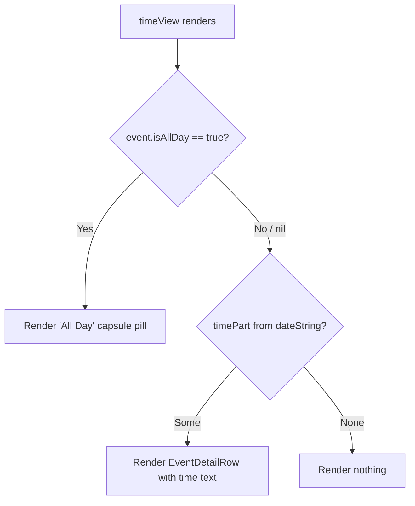

# Technical Specification: 37 - Display "All Day" Indicator on Event Detail Page

**Status:** Draft
**Author:** Tech Lead Agent
**Created:** 2026-07-15

---

## 🎯 Problem

### Context

Berkeley Mobile's Events feature displays campus events to UC Berkeley students. Events are fetched from Firestore, decoded into `BerkeleyEvent` structs, and mapped to `BMEventCalendarEntry` model objects. Each entry carries an `isAllDay: Bool?` flag sourced directly from Firestore (`EventsViewModel.swift:31,67`).

### Current State

`EventDetailView` renders the detail page for a selected event. Inside `BMDetailHeaderView`, the `timeView` computed property (`EventDetailView.swift:154–157`) unconditionally takes the time portion of `event.dateString` — the text after ` / ` — and passes it as a plain `String` to `EventDetailRow`:

```swift
// EventDetailView.swift:154-157
@ViewBuilder
private var timeView: some View {
    if let timePart = event.dateString.components(separatedBy: " / ").last {
        EventDetailRow(systemImageName: "clock", text: timePart)
    }
}
```

The `dateString` computed property (on the `BMCalendarEvent` protocol extension, `BMCalendarEvent.swift:38–65`) detects all-day events via a **time-component heuristic**: `startDate` at 00:00:00 AND `end` at 23:59:59 → returns `"All Day"` as the time portion. However:

1. This heuristic only fires when `end` is non-nil and equals 23:59:59. Events where `end` is `nil` or `end` is some other time will not match, even if `isAllDay == true`.
2. The `isAllDay: Bool?` flag on `BMEventCalendarEntry` (`BMEventCalendarEntry.swift:61`) is populated from Firestore but is **not consulted** by `dateString` or by `timeView`. This means events that are explicitly flagged `isAllDay = true` but whose `end` time does not exactly match 23:59:59 fall through to display the raw `startDate` time — which defaults to 12:00 AM when no meaningful start time exists.

The `EventsView` list (`EventsView.swift:25`) already uses `event.isAllDay == true` as the authoritative gate to render `AllDayEventBannerView` instead of `EventRowView`. The `timeView` in `EventDetailView` has not been updated to match this established pattern.

### Desired State

When `event.isAllDay == true`, the time row on the Event Detail Page must display a capsule/pill-shaped "All Day" label instead of any time text. When `event.isAllDay` is `false` or `nil`, the time row must display the existing time string exactly as today.

The "All Day" visual is already implemented as `AllDayEventBannerView` (`AllDayEventBannerView.swift`) for the events list — a `Capsule()` fill with "All Day" text. The detail page needs a standalone capsule badge (without the event name, which is shown separately) reusing the same visual language.

### Authoritative All-Day Signal

**Resolution of the open question from BR-001**: The `isAllDay: Bool?` flag on `BMEventCalendarEntry` (sourced from Firestore via `EventsViewModel.swift:67`) is the authoritative signal, consistent with how `EventsView` already discriminates all-day events. The `dateString` time-component heuristic is a secondary fallback used for list display; it must not drive the detail view's rendering. Pass-through is preferred: the upstream Firestore document sets `isAllDay`, `EventsDataService` passes it through unchanged, and the view reads it directly from the model.

### Impact

- **User confusion**: Students see "12:00 AM" for all-day events (e.g., campus holidays, multi-day exhibits) and may misread it as a scheduled event time.
- **Trust**: Misleading data reduces confidence in the app's Events feature.
- **Scope**: Change is isolated to `EventDetailView.swift` — specifically `BMDetailHeaderView.timeView`. No model, data layer, or DI changes are required.

---

## 📋 Architectural Decisions

### AD-01: All-Day Signal Source — `isAllDay` flag vs. `dateString` heuristic

**Context**: Two signals can indicate an all-day event: the `isAllDay: Bool?` property on `BMEventCalendarEntry` (sourced from Firestore), and the `dateString` time-component heuristic in `BMCalendarEvent` (start at 00:00:00 + end at 23:59:59).

#### Option A — Use `isAllDay` flag (recommended)

Read `event.isAllDay == true` directly in `timeView`.

- **Pros**: Consistent with `EventsView.swift:25` which already gates `AllDayEventBannerView` on `isAllDay`. The upstream Firestore document owns the truth. Not sensitive to end-time variations. No string parsing.
- **Cons**: `isAllDay` is `Bool?` (optional) — a `nil` value is treated as non-all-day, which is correct per EC-005.
- **Effort**: Minimal — single conditional in `timeView`.
- **Alignment**: Follows established pass-through pattern (`docs/api-standards.md` — prefer pass-through when upstream system performs the computation).

#### Option B — Parse `dateString` for "All Day" string

Check `event.dateString.components(separatedBy: " / ").last == "All Day"`.

- **Pros**: No model changes needed; works without touching the flag.
- **Cons**: String-matching against a protocol extension output is fragile. The heuristic only fires when `end` is 23:59:59 and non-nil; events marked `isAllDay = true` with no end date will NOT match. Violates single-responsibility — the view would re-implement business logic already encoded upstream.
- **Effort**: Same as A but with hidden fragility.
- **Alignment**: Poor — duplicates business logic that the model already owns.

#### Option C — Extend `BMCalendarEvent` protocol with an `isAllDay` computed property

Add `var isAllDay: Bool { get }` to the `BMCalendarEvent` protocol extension, synthesized from the time heuristic. Override in `BMEventCalendarEntry` to use its stored `isAllDay` flag.

- **Pros**: Centralised logic; other `BMCalendarEvent` conformers benefit automatically.
- **Cons**: No other `BMCalendarEvent` conformers exist today. Adds protocol surface area for a UI-scoped fix. `BMCalendarEvent` is a data capability protocol in `Data/ItemProtocols/` — embedding display logic there violates the layer boundary.
- **Effort**: Medium — protocol change with potential for unintended consequences.
- **Alignment**: Poor — over-engineers a small change; `docs/code-conventions.md` warns against adding abstractions beyond what the task requires.

**Decision: Option A — `isAllDay` flag.**

Rationale: Exactly the same gate already used in `EventsView`. The flag is populated from Firestore, unchanged by any intermediate layer (pass-through), and is the clearest, most maintainable signal. The optionality is semantically correct: `nil` means "unknown, treat as timed."

---

### AD-02: "All Day" Capsule Rendering — Reuse `AllDayEventBannerView` vs. New Inline Capsule

**Context**: `AllDayEventBannerView` is an existing component that renders a `Capsule()` with "All Day" + the event name in a grey pill. The detail page needs a pill for just "All Day" text, no event name (which is displayed separately above).

#### Option A — Reuse `AllDayEventBannerView` as-is

Drop `AllDayEventBannerView(event: event)` into `timeView`.

- **Pros**: Zero new code.
- **Cons**: `AllDayEventBannerView` shows both "All Day" and `event.name` side-by-side inside the capsule. In the detail context, the event name is already rendered prominently above — repeating it in the pill is redundant and visually incorrect. It also injects `eventsViewModel` via `@InjectedObservable`, which is unnecessary for a label.
- **Effort**: Low, but wrong visual output.

#### Option B — Inline capsule in `timeView` (recommended)

Add the capsule directly inside `timeView` using a small SwiftUI composition — `Text("All Day").padding(...).background(Capsule().fill(...))` — matching the visual language of `AllDayEventBannerView` (grey tint, same font scale).

- **Pros**: Precise control over content (no event name). No unnecessary ViewModel injection. Small, self-contained, easy to read. Consistent visual style with `AllDayEventBannerView` because it uses the same SwiftUI capsule pattern.
- **Cons**: The fill color and font must be chosen to match the existing banner visually — this is a one-line decision, not a risk.
- **Effort**: ~5 lines of SwiftUI in `EventDetailView.swift`.
- **Alignment**: `docs/code-conventions.md` — "Don't add features, refactor, or introduce abstractions beyond what the task requires."

#### Option C — Extract a shared `AllDayCapsuleLabel` view in `Common/`

Create `Common/AllDayCapsuleLabel.swift` with a reusable capsule text label, then use it in both `AllDayEventBannerView` and `timeView`.

- **Pros**: DRY.
- **Cons**: Premature abstraction — there is currently no proven reuse case beyond two sites with different content requirements. Adding a file to `Common/` for a 5-line composition violates the "three similar lines" rule from `docs/code-conventions.md`.
- **Effort**: Medium (new file, refactor of `AllDayEventBannerView`, DI wiring check).
- **Alignment**: Poor — over-engineering a small change.

**Decision: Option B — inline capsule in `timeView`.**

Rationale: Matches the visual identity of `AllDayEventBannerView` without coupling to its unrelated content (event name, `eventsViewModel`). Keeps the change to the minimum blast radius: only `EventDetailView.swift` is modified.

---

## 🔄 Decision Flow



---

## 🏗️ Architecture and Implementation

### Architectural Pattern

MVVM — no change to the pattern. The fix is a pure View layer change. The model already carries `isAllDay`; the ViewModel already exposes the event; only the View rendering needs updating.

### Key Components

| Component | Path | Role | Change? |
|---|---|---|---|
| `BMDetailHeaderView` | `berkeley-mobile/Events/EventDetailView.swift:104` | Renders the header card on the Event Detail Page | **Modified** — `timeView` updated |
| `EventDetailRow` | `berkeley-mobile/Events/EventDetailView.swift:177` | Renders a single icon+text row | **Unchanged** — still used for timed events |
| `BMEventCalendarEntry` | `berkeley-mobile/Events/EventDataSource/BMEventCalendarEntry.swift` | Event model | **Unchanged** — `isAllDay` already present |
| `AllDayEventBannerView` | `berkeley-mobile/Events/AllDayEventBannerView.swift` | Existing list banner | **Unchanged** — provides visual reference only |

No DI wiring changes. No new files. No ViewModel changes. No model changes.

### Data Flow

```
Firestore document { isAllDay: true }
        ↓
BerkeleyEvent.isAllDay  (EventsViewModel.swift:31)
        ↓
BMEventCalendarEntry.isAllDay  (EventsDataService passes through, line 67)
        ↓
EventDetailView receives event: BMEventCalendarEntry
        ↓
BMDetailHeaderView.timeView reads event.isAllDay
        ↓
  isAllDay == true → render AllDay capsule pill
  isAllDay != true → render EventDetailRow with dateString time part
```

---

## 💻 Implementation

### Single file modified: `berkeley-mobile/Events/EventDetailView.swift`

Only the `timeView` computed property in `BMDetailHeaderView` changes. Everything else in the file is untouched.

#### Current `timeView` (lines 153–157)

```swift
@ViewBuilder
private var timeView: some View {
    if let timePart = event.dateString.components(separatedBy: " / ").last {
         EventDetailRow(systemImageName: "clock", text: timePart)
    }
}
```

#### Replacement `timeView`

```swift
@ViewBuilder
private var timeView: some View {
    if event.isAllDay == true {
        HStack {
            Image(systemName: "clock")
                .font(.system(size: 16))
            Text("All Day")
                .font(Font(BMFont.bold(12)))
                .padding(.horizontal, 10)
                .padding(.vertical, 4)
                .background(Capsule().fill(.gray.opacity(0.5)))
                .accessibilityLabel("All day event")
        }
    } else if let timePart = event.dateString.components(separatedBy: " / ").last {
        EventDetailRow(systemImageName: "clock", text: timePart)
    }
}
```

**Design notes:**
- The `HStack` with `Image(systemName: "clock")` mirrors the layout of `EventDetailRow` so the clock icon column remains visually aligned with the date and location rows.
- `Capsule().fill(.gray.opacity(0.5))` directly matches `AllDayEventBannerView.swift:19` — same fill.
- `BMFont.bold(12)` matches the font scale used in `BMDetailHeaderView` (the surrounding VStack uses `.font(Font(BMFont.light(12)))`), with bold weight to distinguish the badge label.
- `accessibilityLabel("All day event")` satisfies NFR-002 (accessibility) — screen readers announce the semantic meaning rather than just the visible text.
- The `else if` branch preserves all existing timed-event display behavior (BR-003, EC-005).
- `event.isAllDay == true` — comparing an optional `Bool?` against `true` is idiomatic Swift; `nil` is treated as non-all-day (correct per EC-005 and EC-001).

#### Impact surface

- **Lines changed**: ~8 lines in `timeView`, net zero new files.
- **Behavior preserved**: All timed event display paths, date row, location row, description, buttons, toolbar item — all untouched.
- **Preview**: The `#Preview` at the bottom of `EventDetailView.swift` uses `BMEventCalendarEntry.sampleEntry` which has `isAllDay: nil` (default), so the preview continues to render the timed path. To preview the all-day path, set `isAllDay: true` in the sample entry temporarily.

#### Optional: Update `sampleEntry` for preview coverage

`BMEventCalendarEntry.swift:136–147` — the `sampleEntry` static property does not include `isAllDay`. Add a second static for preview convenience (not required for shipping):

```swift
static let sampleAllDayEntry = BMEventCalendarEntry(
    name: "Cal Day",
    date: Date().getStartOfDay(),
    end: nil,
    descriptionText: "Annual open house.",
    location: "UC Berkeley Campus",
    isAllDay: true
)
```

This is optional and only for SwiftUI `#Preview` use — it does not affect production behavior.

---

## ✅ Testing Strategy

As documented in `docs/testing-standards.md`, no automated test target exists in this repository. Quality assurance relies on `#if DEBUG` tooling and SwiftUI `#Preview` macros.

### SwiftUI Preview Verification

The `#Preview` block at `EventDetailView.swift:212–214` exercises the detail view. The implementer must verify the following preview scenarios manually before merging:

| Scenario | Setup | Expected Visual |
|---|---|---|
| All-day event | `event.isAllDay = true`, any `startDate` | Clock icon + "All Day" capsule pill (grey, rounded) |
| Timed event (start + end) | `event.isAllDay = nil`, `startDate` + `end` set | Clock icon + "h:mm a - h:mm a" text |
| Timed event (start only) | `event.isAllDay = nil`, `end = nil` | Clock icon + "h:mm a" text |
| All-day event, no location | `event.isAllDay = true`, `location = nil` | Capsule visible, location row absent |
| Midnight timed event | `event.isAllDay = nil`, start at 00:00 | Clock icon + "12:00 AM" (not capsule) |

Add a second preview entry using `sampleAllDayEntry` (see Implementation section) to keep both paths visible simultaneously:

```swift
#Preview {
    Group {
        EventDetailView(event: BMEventCalendarEntry.sampleEntry)
        EventDetailView(event: BMEventCalendarEntry.sampleAllDayEntry)
    }
}
```

### Manual QA Checklist

Because the repository has no XCTest suite, manual device/simulator testing covers the acceptance criteria:

- [ ] **AC-1**: Open an all-day event → time row shows "All Day" capsule, no clock time.
- [ ] **AC-2**: Open a timed event → time row shows start and end time, no capsule.
- [ ] **AC-3**: Open a timed event with no end → time row shows start time only, no capsule.
- [ ] **AC-4**: Capsule is visually pill-shaped and grey, distinguishable from surrounding text rows.
- [ ] **AC-5**: All-day event with a location → date row and location row display correctly.
- [ ] **AC-6**: All-day event without a location → location row absent, capsule unaffected.
- [ ] **EC-005**: Event with `isAllDay = nil` that starts at midnight → shows "12:00 AM", not capsule.
- [ ] **NFR-002**: Enable VoiceOver; navigate to all-day event detail page; VoiceOver announces "All day event" for the time row.
- [ ] **NFR-004**: No regression on timed events for event name, date, location, description, action buttons, calendar add/remove toolbar item.

---

## 🔒 Security Considerations

- **No network calls introduced**: The change is purely in the View layer. No new Firestore reads, no URL construction, no user input handling.
- **No secrets or credentials**: Not applicable. The `isAllDay` flag is a boolean read from an already-fetched model object.
- **No user input**: The "All Day" label is a hardcoded UI string — no injection risk.
- **No XSS or injection surface**: SwiftUI `Text` views do not interpret HTML or markdown by default.
- **Accessibility**: `accessibilityLabel` is set to a static string; no user-controlled data flows into it.

No security review is required for this change.

---

## ✅ Definition of Done

### Implementation
- [ ] `timeView` in `BMDetailHeaderView` (`EventDetailView.swift`) updated to the replacement template above.
- [ ] `event.isAllDay == true` used as the gate — not `dateString` string parsing.
- [ ] Capsule style matches `AllDayEventBannerView` (`.gray.opacity(0.5)`, `Capsule()` shape).
- [ ] Clock icon preserved in the all-day capsule row for layout consistency with date and location rows.
- [ ] `accessibilityLabel("All day event")` set on the "All Day" `Text`.
- [ ] No other computed properties, methods, or files modified beyond `EventDetailView.swift`.

### Testing
- [ ] Both preview paths (all-day and timed) visually verified in SwiftUI Preview.
- [ ] All five manual QA scenarios above pass on simulator (or device).
- [ ] VoiceOver accessibility spot-check passes.

### Quality
- [ ] No compiler warnings introduced.
- [ ] No new files added (unless optional `sampleAllDayEntry` is added to `BMEventCalendarEntry.swift`).
- [ ] Code follows `lowerCamelCase` property naming and `BMFont`/`BMColor` token conventions per `docs/code-conventions.md`.

### Documentation
- [ ] No inline comments added beyond what exists (per `docs/code-conventions.md` — no comments for obvious behavior).
- [ ] PR description references this spec and the acceptance criteria from the business requirements.

---

## 🚫 Out of Scope

Per the business requirements (`specs/37/business-requirements.md` §8):

- Changes to the Events list page, `EventRowView`, `AllDayEventBannerView`, or `EventsView`.
- Changes to the `CalendarView` or any calendar rendering path.
- Modifying how all-day events are determined, stored, or fetched from Firestore.
- Adding an "All Day" indicator to the event row/card in the events list.
- Changing how timed events display time information on any view.
- Push notification or EventKit/calendar integration behavior for all-day events.
- Changes to `BMCalendarEvent.dateString` heuristic logic.
- Any changes to `EventsViewModel`, `EventsDataService`, or `BMEventCalendarEntry` beyond the optional preview-only `sampleAllDayEntry`.

---

## 📚 References

### Internal Docs Consulted
- `docs/tech.md` — SwiftUI + UIKit hybrid, Factory DI, `@Observable` state management
- `docs/structure.md` — Events feature module structure (`berkeley-mobile/Events/`), `Common/` shared components
- `docs/code-conventions.md` — MVVM pattern, `BM` prefix conventions, `@InjectedObservable`, no premature abstraction
- `docs/api-standards.md` — Pass-through preference when upstream system owns the computation
- `docs/testing-standards.md` — No automated test suite; SwiftUI Preview and manual QA

### Source Files Referenced
- `berkeley-mobile/Events/EventDetailView.swift` — file to modify
- `berkeley-mobile/Events/AllDayEventBannerView.swift` — visual reference (capsule style)
- `berkeley-mobile/Events/EventDataSource/BMEventCalendarEntry.swift` — `isAllDay: Bool?` model field
- `berkeley-mobile/Data/ItemProtocols/BMCalendarEvent.swift` — `dateString` heuristic (not used as gate)
- `berkeley-mobile/Events/EventsView.swift:25` — established precedent for `isAllDay == true` gate
- `berkeley-mobile/Events/EventDataSource/EventsViewModel.swift:31,67` — `isAllDay` sourced from Firestore

### Related Issues
- Business Requirements: `specs/37/business-requirements.md`
- Issue: [Events Page] Display (All Day) Indicator Instead of Time on Event Detail Page (issue #37)
