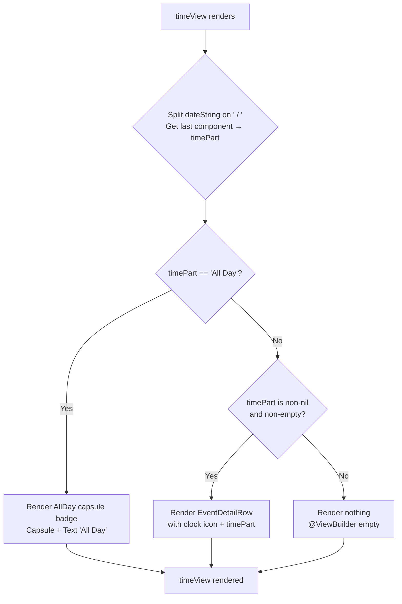

# Technical Specification: ASDLC-498 - Display "All Day" Indicator on Event Detail Page

**Status:** Draft
**Author:** Tech Lead Agent
**Created:** 2026-08-03

---

## 🎯 Problem

### Context

The Berkeley Mobile iOS app displays campus events on a dedicated Events section. Each event has a detail page (`EventDetailView`) that shows a header card (`BMDetailHeaderView`) containing the event's name, date, time, and optional location.

### Current State

`BMDetailHeaderView` (`berkeley-mobile/Events/EventDetailView.swift:104`) renders a `timeView` computed property (line 154–158) that always displays the time portion of `event.dateString` via an `EventDetailRow`:

```swift
@ViewBuilder
private var timeView: some View {
    if let timePart = event.dateString.components(separatedBy: " / ").last {
         EventDetailRow(systemImageName: "clock", text: timePart)
    }
}
```

The `dateString` property is computed by the `BMCalendarEvent` protocol extension (`berkeley-mobile/Data/ItemProtocols/BMCalendarEvent.swift:38–65`). For all-day events — where `startDate` has hour/minute/second = 0 and `end` has hour/minute/second = 23:59:59 — the computed property returns `"<DatePart> / All Day"`. The time portion extracted by `last` after splitting on `" / "` is therefore the string `"All Day"`.

However, the current `timeView` renders it as plain `Text("All Day")` inside `EventDetailRow`, indistinguishable from a regular time string. Furthermore, for events where the `end` time is not stored or does not match the all-day sentinel (11:59:59 PM), the `startDate` defaults to midnight (00:00:00), causing the time portion to be formatted as `"12:00 AM"` — a meaningless value that misleads the user.

### Desired State

When the time portion of `event.dateString` resolves to the string `"All Day"`, the `timeView` in `BMDetailHeaderView` must render a capsule/pill-shaped badge with the text "All Day" instead of a plain-text `EventDetailRow`. This matches the visual treatment already established by `AllDayEventBannerView` (`berkeley-mobile/Events/AllDayEventBannerView.swift`) used in the events list.

For all non-all-day events (time portion ≠ `"All Day"`), the existing `EventDetailRow` display is unchanged.

### Root Cause

The `timeView` in `BMDetailHeaderView` does not branch on the value of the time portion before rendering. It always passes the string to `EventDetailRow` regardless of whether it is `"All Day"` or a formatted time range.

### Impact

- **UX correctness**: Every all-day event (holidays, academic deadlines, full-day exhibits) currently shows "12:00 AM" or plain "All Day" text without the expected capsule styling, creating confusion about scheduling.
- **Design consistency**: `AllDayEventBannerView` establishes a capsule-based "All Day" treatment in the events list. The detail page does not match this convention.
- **Scope**: Affects all events where the all-day sentinel times are correctly stored. No data model or backend changes are required.

### Key Existing Artifacts

| Artifact | Path | Relevance |
|---|---|---|
| `BMDetailHeaderView` | `berkeley-mobile/Events/EventDetailView.swift:104` | Contains `timeView` to be modified |
| `EventDetailRow` | `berkeley-mobile/Events/EventDetailView.swift:177` | Existing icon+text row component |
| `BMCalendarEvent.dateString` | `berkeley-mobile/Data/ItemProtocols/BMCalendarEvent.swift:38` | Produces `"… / All Day"` for all-day events |
| `BMEventCalendarEntry.isAllDay` | `berkeley-mobile/Events/EventDataSource/BMEventCalendarEntry.swift:61` | Optional `Bool?` flag — nullable, not the authoritative signal per BR-002 |
| `AllDayEventBannerView` | `berkeley-mobile/Events/AllDayEventBannerView.swift` | Existing capsule `Capsule().fill(.gray.opacity(0.5))` "All Day" treatment |

---

## 📋 Architectural Decisions

### Decision 1: Signal used to determine "All Day" for display

The business specification (BR-002, EC-002) is explicit: the **time portion of `event.dateString`** is the authoritative signal. The `isAllDay: Bool?` flag on `BMEventCalendarEntry` is nullable and may be absent on older records. Using the computed `dateString` is a pure pass-through from the data layer with no re-implementation of detection logic.

**Options considered:**

| Option | Description | Pros | Cons |
|---|---|---|---|
| **A — `dateString` time part == "All Day"** | Split `event.dateString` on `" / "` and check if `.last == "All Day"` | Authoritative per BR-002; consistent with `timeView` which already does the same split; handles EC-002 (flag absent, string correct) | String literal comparison — brittle if the format string changes |
| **B — `event.isAllDay == true`** | Check the explicit flag | Semantically clear intent | Flag is `Bool?` (nullable); per EC-002 when the flag is nil but the string says "All Day", this would show time instead of badge; not authoritative |
| **C — Both A and B (OR logic)** | Show badge if either `isAllDay == true` OR time part == "All Day" | Catches more cases | Business spec (EC-003) says use the date string as authoritative; ORing adds inconsistency risk |

**Decision: Option A — compare the `dateString` time portion to the string `"All Day"`.**

Rationale: Directly aligns with BR-002, EC-002, and EC-003. The `timeView` already splits `event.dateString` on `" / "` to obtain `timePart`; adding a conditional on `timePart == "All Day"` is a minimal, zero-duplication change. It is the pass-through approach mandated by the business spec's "Transformation ownership" note (Section 4 of business-requirements.md).

---

### Decision 2: Where to introduce the "All Day" capsule view

**Options considered:**

| Option | Description | Pros | Cons | Effort |
|---|---|---|---|---|
| **A — Inline in `timeView` inside `BMDetailHeaderView`** | Add a branch directly inside the existing `@ViewBuilder var timeView` | Smallest possible change; no new types; contained to the one view that needs it | Slightly more logic in `BMDetailHeaderView`; capsule style would be duplicated if reused elsewhere | XS |
| **B — Extract a new reusable `AllDayBadgeView` in `Common/`** | Create `berkeley-mobile/Common/AllDayBadgeView.swift` as a standalone SwiftUI view | Reusable; consistent if other detail views ever need it; follows the `Common/` pattern for shared UI components | Adds a file for a ~4-line view; slightly over-engineered for a Small complexity issue | S |
| **C — Reuse `AllDayEventBannerView` directly** | Use the existing `AllDayEventBannerView` for the badge in `timeView` | No new code | `AllDayEventBannerView` expects a full `BMEventCalendarEntry` and renders the event name alongside "All Day" — not appropriate as a standalone time-row badge; it also injects `eventsViewModel` which is unnecessary overhead | N/A — rejected |

**Decision: Option A — inline branch inside `timeView` in `BMDetailHeaderView`.**

Rationale: The change is scoped to a single `@ViewBuilder` property. The capsule style is a 3-line SwiftUI expression (`Capsule().fill(…).overlay(Text(…))`). Introducing a new `Common/` file for a view this small contradicts the project principle of not designing for hypothetical future requirements (code-conventions.md: "Don't add features … beyond what the task requires"). If the badge is needed elsewhere in a future ticket, extraction can happen at that point.

---

### Decision 3: Capsule visual style

`AllDayEventBannerView` uses:
```swift
Capsule()
    .fill(.gray.opacity(0.5))
    .frame(height: 30)
    .overlay(
        HStack(spacing: 10) {
            Text("All Day")
                .font(Font(BMFont.bold(15)))
            ...
        }
    )
```

For the detail page time row, the badge must be visually distinct from plain text (BR-004) and consistent with the "All Day" visual treatment used elsewhere (BR-006, Section 7 of business-requirements.md). However, the list banner also includes the event name alongside "All Day" and has a fixed height of 30 for list-row usage. The detail page time row uses `BMFont.regular(12)` for row text (`EventDetailRow`).

**Decision**: Use the same `Capsule().fill(.gray.opacity(0.5))` background, but render only `Text("All Day")` inside — without the event name — at a consistent font size (`BMFont.bold(12)`) to match the existing `EventDetailRow` font scale. The capsule wraps the text with horizontal padding; no fixed height is needed (height derives from text + padding).

This preserves the design language of `AllDayEventBannerView` while fitting naturally in the compact `VStack` of `BMDetailHeaderView`.

---

## 🔄 Decision Flow



---

## 🏗️ Architecture and Implementation

### Architectural Pattern

This is a pure **presentation-layer change** in the SwiftUI view layer. No data model, ViewModel, DataSource, or DI wiring changes are required. The change is entirely contained within `BMDetailHeaderView`, a private inner struct of `EventDetailView.swift`.

### Affected Components

| Component | File | Change Type |
|---|---|---|
| `BMDetailHeaderView.timeView` | `berkeley-mobile/Events/EventDetailView.swift:154` | Modify — add conditional branch for "All Day" |

No new files are created. No DI registration changes are needed. No model changes are needed.

### Data Flow (unchanged)

```
Firestore → EventsViewModel → BMEventCalendarEntry
  → BMCalendarEvent.dateString (computed)
  → EventDetailView receives event: BMEventCalendarEntry
  → BMDetailHeaderView.timeView reads event.dateString
  → splits on " / ", extracts last component
  → [NEW] branches: if "All Day" → capsule badge; else → EventDetailRow
```

The `BMCalendarEvent.dateString` protocol extension already resolves the time portion to `"All Day"` when `startDate` is midnight and `end` is 23:59:59. No new transformation is introduced.

---

## 💻 Implementation

### Step 1: Modify `timeView` in `BMDetailHeaderView`

**File**: `berkeley-mobile/Events/EventDetailView.swift`  
**Location**: Lines 153–158 (the `@ViewBuilder private var timeView` property inside `BMDetailHeaderView`)

**Current code** (lines 153–158):
```swift
@ViewBuilder
private var timeView: some View {
    if let timePart = event.dateString.components(separatedBy: " / ").last {
         EventDetailRow(systemImageName: "clock", text: timePart)
    }
}
```

**Replacement code**:
```swift
private static let allDayString = "All Day"

@ViewBuilder
private var timeView: some View {
    if let timePart = event.dateString.components(separatedBy: " / ").last {
        if timePart == BMDetailHeaderView.allDayString {
            Capsule()
                .fill(.gray.opacity(0.5))
                .frame(height: 24)
                .overlay(
                    Text(BMDetailHeaderView.allDayString)
                        .font(Font(BMFont.bold(12)))
                        .foregroundStyle(.primary)
                        .padding(.horizontal, 8)
                )
                .fixedSize(horizontal: true, vertical: false)
                .accessibilityLabel("All Day event")
        } else {
            EventDetailRow(systemImageName: "clock", text: timePart)
        }
    }
}
```

**Design notes**:
- `frame(height: 24)` — compact height that fits within the `VStack(alignment: .leading, spacing: 4)` alongside `dateView` and `locationView`. The list `AllDayEventBannerView` uses `height: 30`; 24 is appropriate for the tighter detail-card context.
- `.fixedSize(horizontal: true, vertical: false)` — ensures the capsule shrinks to hug the "All Day" text rather than stretching to full width.
- `BMDetailHeaderView.allDayString` — a `static let` constant avoids a magic string literal appearing twice and makes a future string change (e.g., localization) a single-point edit. Named after the pattern `fileprivate let k<Name>` used in DataSource files (code-conventions.md), adapted here as a `static let` on the enclosing type since `BMDetailHeaderView` is a `struct` (not a file-level constant).
- `.foregroundStyle(.primary)` — inherits the system adaptive color (dark in light mode, light in dark mode), consistent with `EventDetailRow`'s `Text` which also inherits foreground color.
- `.accessibilityLabel("All Day event")` — satisfies the accessibility requirement (Section 7 of business-requirements.md).

**No other files require modification.**

### Step 2: Update `BMEventCalendarEntry.sampleEntry` (optional, for preview accuracy)

**File**: `berkeley-mobile/Events/EventDataSource/BMEventCalendarEntry.swift:136`

The existing `sampleEntry` uses `date: Date()` and `end: Date().addingTimeInterval(7200)`, which is a 2-hour timed event. To verify the "All Day" path in `#Preview`, a second sample can be added:

```swift
static let sampleAllDayEntry = BMEventCalendarEntry(
    name: "Academic Holiday",
    date: Calendar.current.startOfDay(for: Date()),
    end: {
        var comps = Calendar.current.dateComponents([.year, .month, .day], from: Date())
        comps.hour = 23; comps.minute = 59; comps.second = 59
        return Calendar.current.date(from: comps) ?? Date()
    }(),
    descriptionText: "Campus closed for academic holiday.",
    location: nil,
    type: "Holiday",
    isAllDay: true
)
```

This is for preview/development purposes only and does not affect production behavior.

### Step 3: Update `#Preview` in `EventDetailView.swift`

```swift
#Preview {
    Group {
        EventDetailView(event: BMEventCalendarEntry.sampleEntry)
        EventDetailView(event: BMEventCalendarEntry.sampleAllDayEntry)
    }
}
```

This enables visual verification of both paths (timed event and all-day event) directly in Xcode Previews without running the full simulator.

---

## ✅ Testing Strategy

> **Context**: Per `docs/testing-standards.md`, this repository has no unit-test target, no test files, no XCTest imports, and no test framework configured. There is no established test convention to follow. The testing strategy below reflects what **should** be done and documents the XCTest approach to adopt when a test target is added, as well as the Xcode Previews-based manual verification available today.

### Immediate: Manual / Xcode Previews Verification

Since no automated test target exists, verification is done via:

1. **Xcode Previews** — the `#Preview` block in `EventDetailView.swift` is updated to show both `sampleEntry` (timed) and `sampleAllDayEntry` (all-day) side by side, enabling instant visual confirmation in the Xcode canvas.

2. **Simulator smoke test** — launch the app in the iOS Simulator and navigate to an all-day event detail page. Confirm:
   - The time row shows a capsule badge labeled "All Day".
   - No "12:00 AM" text is shown.
   - The date row still shows the event date.
   - A timed event detail page still shows the formatted time range in `EventDetailRow`.

3. **VoiceOver test** — enable VoiceOver in the Simulator and navigate to an all-day event detail. Confirm the badge reads "All Day event" (the `accessibilityLabel` set in the implementation).

### Future: Unit Tests (when test target is added)

The following test cases represent the XCTest structure to implement when a `berkeley-mobileTests` target is created:

<details>
<summary>Test case outlines</summary>

```swift
// BMCalendarEventDateStringTests.swift
// Tests BMCalendarEvent.dateString protocol extension — no UI involved

class BMCalendarEventDateStringTests: XCTestCase {

    // Scenario: All-day event (midnight start, 23:59:59 end) produces "All Day" time part
    func testDateString_allDayEvent_producesAllDayTimePart() {
        let start = Calendar.current.startOfDay(for: Date())
        var endComps = Calendar.current.dateComponents([.year, .month, .day], from: Date())
        endComps.hour = 23; endComps.minute = 59; endComps.second = 59
        let end = Calendar.current.date(from: endComps)!

        let entry = BMEventCalendarEntry(name: "Test", date: start, end: end)
        let timePart = entry.dateString.components(separatedBy: " / ").last

        XCTAssertEqual(timePart, "All Day")
    }

    // Scenario: Timed event with start and end produces formatted time range
    func testDateString_timedEvent_producesFormattedTimeRange() {
        let start = Calendar.current.date(bySettingHour: 15, minute: 0, second: 0, of: Date())!
        let end   = Calendar.current.date(bySettingHour: 17, minute: 0, second: 0, of: Date())!

        let entry = BMEventCalendarEntry(name: "Test", date: start, end: end)
        let timePart = entry.dateString.components(separatedBy: " / ").last

        XCTAssertNotEqual(timePart, "All Day")
        XCTAssertTrue(timePart?.contains("PM") ?? false)
    }

    // Scenario: Timed event with only start time (no end) produces start time only
    func testDateString_timedEventNoEnd_producesStartTimeOnly() {
        let start = Calendar.current.date(bySettingHour: 15, minute: 0, second: 0, of: Date())!

        let entry = BMEventCalendarEntry(name: "Test", date: start, end: nil)
        let timePart = entry.dateString.components(separatedBy: " / ").last

        XCTAssertNotEqual(timePart, "All Day")
        XCTAssertFalse(timePart?.contains(" - ") ?? false)
    }

    // EC-002: isAllDay flag nil but dateString resolves "All Day"
    func testDateString_isAllDayNilButTimesMatchSentinel_producesAllDay() {
        let start = Calendar.current.startOfDay(for: Date())
        var endComps = Calendar.current.dateComponents([.year, .month, .day], from: Date())
        endComps.hour = 23; endComps.minute = 59; endComps.second = 59
        let end = Calendar.current.date(from: endComps)!

        let entry = BMEventCalendarEntry(name: "Test", date: start, end: end, isAllDay: nil)
        let timePart = entry.dateString.components(separatedBy: " / ").last

        XCTAssertEqual(timePart, "All Day",
            "dateString must be authoritative; nil isAllDay flag must not prevent 'All Day' resolution")
    }
}
```

</details>

### Coverage Targets (when test target exists)

| Area | Target Coverage | Notes |
|---|---|---|
| `BMCalendarEvent.dateString` extension | ≥ 80% line coverage | All-day path, timed path, today/tomorrow date labels |
| `BMDetailHeaderView.timeView` branching | Manual via Previews (no SwiftUI unit test infra yet) | Both branches exercised in `#Preview` |

---

## 🔒 Security Considerations

| Check | Status | Notes |
|---|---|---|
| No new network calls | ✅ Pass | Change is entirely in the presentation layer; no Firestore or networking calls added |
| No new data storage | ✅ Pass | No `UserDefaults`, Keychain, or file writes |
| No user input processed | ✅ Pass | `event.dateString` is read-only data from an authenticated Firestore source |
| No new DI registrations | ✅ Pass | No new `Factory` entries; no injection-surface expansion |
| No credential or secret handling | ✅ Pass | Not applicable to this change |
| Input string used as display only | ✅ Pass | The `timePart` string is compared against a constant and displayed via SwiftUI `Text`; no HTML rendering, no dynamic code execution |
| XSS / injection not applicable | ✅ Pass | Native SwiftUI — `Text()` does not interpret HTML or scripts |

---

## ✅ Definition of Done

### Implementation

- [ ] `BMDetailHeaderView.timeView` in `berkeley-mobile/Events/EventDetailView.swift` modified to branch on `timePart == "All Day"`
- [ ] Capsule badge rendered with `Capsule().fill(.gray.opacity(0.5))`, `Text("All Day")`, and `.accessibilityLabel("All Day event")` when branch is taken
- [ ] `EventDetailRow` path preserved unchanged for non-all-day events
- [ ] `static let allDayString = "All Day"` constant added to `BMDetailHeaderView` to avoid magic string duplication
- [ ] `BMEventCalendarEntry.sampleAllDayEntry` static property added for preview use
- [ ] `#Preview` in `EventDetailView.swift` updated to show both timed and all-day event paths

### Testing / Verification

- [ ] Xcode Previews canvas shows both paths: timed event shows `EventDetailRow` with clock icon; all-day event shows capsule badge
- [ ] Simulator smoke test confirms all-day event detail shows capsule, not "12:00 AM"
- [ ] Simulator smoke test confirms timed events are unaffected
- [ ] VoiceOver: badge announces "All Day event"
- [ ] All-day event with location: both location row and "All Day" badge visible simultaneously (EC-004)
- [ ] No regression on event date row (still shows date string correctly)
- [ ] No regression on event description section
- [ ] No regression on "Learn More" / "Register" buttons
- [ ] No regression on calendar add/remove toolbar button

### Quality

- [ ] Code follows SwiftUI `@ViewBuilder` pattern consistent with `dateView` and `locationView` in `BMDetailHeaderView`
- [ ] No force-unwraps introduced
- [ ] No new `import` statements required (only SwiftUI, already imported)
- [ ] File header comment present (Xcode standard format per code-conventions.md)
- [ ] `// MARK:` comment added to `BMDetailHeaderView` if section grows beyond ~5 properties

### Design Review

- [ ] "All Day" badge visual reviewed against `AllDayEventBannerView` capsule style for consistency (SM-005)
- [ ] Badge height (24pt) confirmed appropriate within the detail card `VStack` layout

---

## 🚫 Out of Scope

Per `specs/ASDLC-498/business-requirements.md` Section 9, the following are explicitly excluded:

- Changes to how all-day status is determined or stored in Firestore or the data model
- Changes to `EventRowView` (event list row display)
- Changes to `CalendarView` or `CalendarSectionView`
- Changes to `AllDayEventBannerView` (used in the events list)
- Adding new all-day detection logic (the `dateString` computation in `BMCalendarEvent` is unchanged)
- Handling the case where `isAllDay = true` but `dateString` does not resolve to "All Day" (data quality issue)
- Any changes to `BMEventManager`, calendar export, or event creation flows
- Localization of the "All Day" string (no localization infrastructure exists in this repository currently)
- Adding a formal unit-test target to the Xcode project

---

## 📚 References

### Internal Documentation Consulted

- `docs/tech.md` — Swift 5 / SwiftUI / UIKit hybrid; FactoryKit DI; no linter config
- `docs/structure.md` — `Events/` feature folder; `Common/` for shared UI; `Utils/` for extensions
- `docs/code-conventions.md` — `BM` prefix convention; `View` suffix; `static let k<Name>` file-level constants; nested `Constants` struct pattern; Xcode file header format
- `docs/api-standards.md` — read-only Firestore; `BMCalendarEvent` as internal protocol contract
- `docs/testing-standards.md` — no test target exists; XCTest patterns documented for future adoption

### Key Source Files

- `berkeley-mobile/Events/EventDetailView.swift` — primary file to modify
- `berkeley-mobile/Data/ItemProtocols/BMCalendarEvent.swift` — `dateString` computed property (pass-through, no changes)
- `berkeley-mobile/Events/EventDataSource/BMEventCalendarEntry.swift` — event model (`isAllDay: Bool?`)
- `berkeley-mobile/Events/AllDayEventBannerView.swift` — reference for capsule visual style
- `berkeley-mobile/Events/EventsView.swift` — shows `isAllDay == true` check pattern used in list view

### Business Specification

- `specs/ASDLC-498/business-requirements.md` — BR-001 through BR-006; EC-001 through EC-005; Acceptance Criteria; Out of Scope
