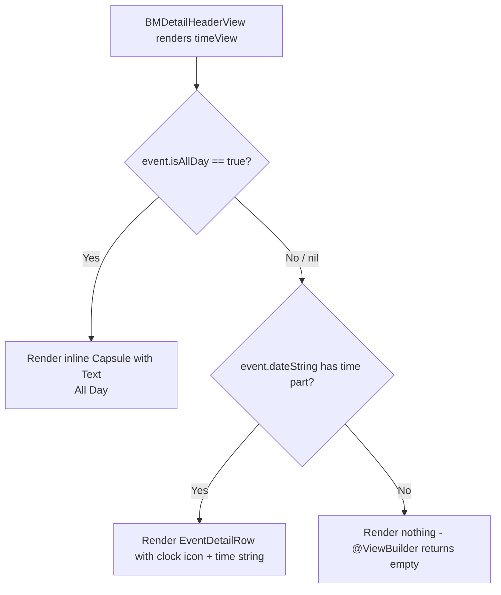

# Technical Specification: ASDLC-510 - Display "All Day" Indicator on Event Detail Page

**Status:** Draft
**Author:** Tech Lead Agent
**Created:** 2026-08-05

---

## 🎯 Problem

### Context

The Berkeley Mobile iOS app displays a campus events calendar. Each event can be an all-day event (no specific start/end time) or a timed event. The Event Detail Page (`EventDetailView.swift`) renders a header card (`BMDetailHeaderView`) with three rows: a date row, a time row, and an optional location row.

### Current State

The time row in `BMDetailHeaderView` (`EventDetailView.swift:153–158`) is implemented as:

```swift
@ViewBuilder
private var timeView: some View {
    if let timePart = event.dateString.components(separatedBy: " / ").last {
         EventDetailRow(systemImageName: "clock", text: timePart)
    }
}
```

`dateString` is a computed property defined in the `BMCalendarEvent` protocol extension (`Data/ItemProtocols/BMCalendarEvent.swift:38–65`). It uses a **time-range heuristic** to detect all-day events: it only returns `"All Day"` if `startDate` has components `(hour: 0, minute: 0, sec: 0)` **and** `end` is non-nil with components `(hour: 11, minute: 59, sec: 59)`.

The event data model `BMEventCalendarEntry` (`Events/EventDataSource/BMEventCalendarEntry.swift:61`) carries an explicit backend-provided `isAllDay: Bool?` flag, populated from Firestore via `BerkeleyEvent.isAllDay` in `EventsDataService` (`Events/EventDataSource/EventsViewModel.swift:67`). When the backend sets `isAllDay = true`, the event's `startDate` is set to `Date().getStartOfDay()` (midnight) but `end` may be `nil`. In this case the `dateString` heuristic's `let end` guard fails, so it falls through to format `startDate` as a time string — producing **"12:00 AM"**.

### Desired State

When `event.isAllDay == true`, the time row on the Event Detail Page must display an **"All Day" capsule/pill badge** in place of any time value. Timed events (where `isAllDay` is false or nil) must continue to display `EventDetailRow` with the existing `dateString` time part, with no regression.

### Root Cause

Two all-day detection mechanisms coexist and diverge:

| Mechanism | Location | Logic |
|---|---|---|
| `isAllDay: Bool?` flag | `BMEventCalendarEntry.swift:61` | Explicit backend field; set to `true` by Firestore data |
| `dateString` heuristic | `BMCalendarEvent.swift:52–55` | Midnight start **and** 11:59:59 end both required |

`EventsView` already uses `event.isAllDay == true` as the authoritative check for all-day rendering in the list (line 25), while `BMDetailHeaderView.timeView` delegates entirely to `dateString`, which can disagree when `end` is nil. The detail page was never updated to respect the `isAllDay` flag.

### Impact

- **All users** who open any all-day event's detail page see "12:00 AM" — a factually wrong time that erodes trust in the app's event data (Business Requirement BR-002, BR-003).
- The existing `EventsView` list correctly hides all-day events behind `AllDayEventBannerView`, so the inconsistency is immediately visible when a user taps through from the list.

### Affected Files

| File | Role |
|---|---|
| `berkeley-mobile/Events/EventDetailView.swift` | Contains `BMDetailHeaderView.timeView` — the only site requiring change |
| `berkeley-mobile/Events/AllDayEventBannerView.swift` | Existing capsule component to use as visual reference |
| `berkeley-mobile/Data/ItemProtocols/BMCalendarEvent.swift` | `dateString` heuristic — read-only reference, no changes needed |
| `berkeley-mobile/Events/EventDataSource/BMEventCalendarEntry.swift` | `isAllDay: Bool?` field — authoritative signal, no changes needed |

---

## 📋 Architectural Decisions

### AD-1: Which all-day detection signal to use in `BMDetailHeaderView`

The business requirement (BR-006, OQ-001) asks whether the `isAllDay` flag or the `dateString` time-range heuristic is authoritative.

**Context from codebase**:
- `EventsView` (line 25) already uses `event.isAllDay == true` as the single gate for showing `AllDayEventBannerView` in the list. This is the only other place that makes this determination.
- `dateString` heuristic requires both a midnight start **and** 11:59:59 end — it silently fails to detect all-day status when `end` is nil (the common Firestore case).
- The backend explicitly provides `isAllDay` via Firestore, and it is already threaded through `BerkeleyEvent → BMEventCalendarEntry`.

**Options**:

<details>
<summary>Option A: Use <code>isAllDay == true</code> exclusively (recommended)</summary>

- **Description**: In `BMDetailHeaderView.timeView`, guard on `event.isAllDay == true` before rendering the badge; otherwise render the existing `EventDetailRow`. This mirrors exactly what `EventsView` does.
- **Pros**: Consistent with the list-view precedent; aligns with BR-006 ("read the `isAllDay` flag … already present on the event object"); handles `end == nil` correctly; single source of truth.
- **Cons**: If the backend ever sends `isAllDay = nil` for an event that is actually all-day (e.g. an old document), the heuristic won't catch it. Requires backend to always populate the field — acceptable per BR-006.
- **Effort**: XS (1–2 line change in `timeView`).
- **Alignment**: Matches `docs/code-conventions.md` (follow existing patterns) and `docs/structure.md` (feature-folder, minimal cross-cutting change).

</details>

<details>
<summary>Option B: Use the <code>dateString</code> heuristic exclusively</summary>

- **Description**: Keep `timeView` reading from `event.dateString`; the heuristic already returns "All Day" when midnight/11:59 PM are both set. Wrap the result in a capsule badge if it equals "All Day".
- **Pros**: No new conditional; reuses existing computed property.
- **Cons**: Fails when `end` is nil (most Firestore all-day events); produces "All Day" for events that are NOT flagged `isAllDay` but happen to start at midnight; diverges from the `EventsView` gate; addresses the symptom, not the root cause.
- **Effort**: S (but requires fixing the heuristic too to be correct).
- **Alignment**: Poor — goes against BR-006 and the established `EventsView` pattern.

</details>

<details>
<summary>Option C: Combine both signals with OR logic</summary>

- **Description**: Show the badge if `event.isAllDay == true` OR the `dateString` heuristic evaluates to "All Day".
- **Pros**: Catches both cases; defensive.
- **Cons**: Over-engineers a small change; OR logic can produce false positives (midnight-start non-all-day events); business rule OQ-001 explicitly asks for a single authoritative source, not a union.
- **Effort**: S.
- **Alignment**: Poor — violates BR-006's instruction to use the existing signal rather than re-derive.

</details>

**Decision**: **Option A — `isAllDay == true` exclusively.**

Rationale: `EventsView` already treats `isAllDay == true` as the authoritative gate. Replicating this exact check in `BMDetailHeaderView` yields a single, consistent rule across all event views. The backend is the authoritative source (per BR-006), and the field is already fully plumbed from Firestore through `BerkeleyEvent` to `BMEventCalendarEntry`. No changes to the data model or data source are needed.

---

### AD-2: UI component for the "All Day" badge in the detail header

The detail page uses SwiftUI (`BMDetailHeaderView` is a `View`). An "All Day" capsule component already exists: `AllDayEventBannerView` (`Events/AllDayEventBannerView.swift`).

**Options**:

<details>
<summary>Option A: Reuse <code>AllDayEventBannerView</code> directly (rejected)</summary>

- **Description**: Embed `AllDayEventBannerView` in `timeView`.
- **Pros**: Zero new code; visual identity guaranteed.
- **Cons**: `AllDayEventBannerView` renders a full-width capsule **with the event name** inside it — designed for the list context (replaces `EventRowView` as the row). In the detail header, the event name is already prominently displayed (`eventNameView`); repeating it inside the time-row badge is redundant and spatially mismatched. The banner also injects `eventsViewModel` via `@InjectedObservable`, adding an unnecessary dependency inside an already-injected parent.
- **Effort**: XS.
- **Alignment**: Reuses existing component but produces the wrong visual output for the context.

</details>

<details>
<summary>Option B: Inline SwiftUI capsule in <code>timeView</code> (recommended)</summary>

- **Description**: Replace `EventDetailRow` with an inline `Capsule().fill(...)` + `Text("All Day")` inside `timeView`, styled to match `AllDayEventBannerView` (gray, 50% opacity, bold font) while omitting the event name (already shown above).
- **Pros**: Pixel-perfect match to the established capsule style; no extra coupling; label-only (no event name) is correct for the detail context; self-contained `@ViewBuilder` block identical in structure to the existing `dateView`/`locationView` pattern; easily accessible (plain `Text` is VoiceOver readable).
- **Cons**: Minor duplication of the capsule style constants vs `AllDayEventBannerView`; mitigated because both live inside the same `Events/` feature folder.
- **Effort**: XS.
- **Alignment**: Consistent with `docs/code-conventions.md` (feature-scoped, no unnecessary cross-feature coupling); consistent with the `@ViewBuilder` pattern already used in `BMDetailHeaderView`.

</details>

<details>
<summary>Option C: Extract a shared <code>AllDayCapsuleView</code> into <code>Common/</code></summary>

- **Description**: Create a new `AllDayCapsuleView` in `Common/` that renders only the "All Day" label in a capsule, and use it in both `AllDayEventBannerView` (as a sub-component) and `BMDetailHeaderView.timeView`.
- **Pros**: Single source of style; removes the minor duplication.
- **Cons**: Abstraction overhead for a two-line SwiftUI view; requires modifying `AllDayEventBannerView` as well; the task scope is the detail page only (Business Requirements §8 Out of Scope explicitly excludes changes to list views); violates the principle of not introducing abstractions beyond what the task requires.
- **Effort**: S.
- **Alignment**: Over-engineering for a Small-complexity task per business requirements.

</details>

**Decision**: **Option B — Inline SwiftUI capsule in `timeView`.**

Rationale: Keeps the change self-contained to one `@ViewBuilder` block in `EventDetailView.swift`. The capsule style (gray, 50% opacity, bold "All Day" label) is identical to `AllDayEventBannerView`, satisfying NFR-001. The inline approach avoids unnecessary component extraction (doc/code-conventions.md: "Three similar lines is better than a premature abstraction") and matches the `@ViewBuilder` pattern already used by `dateView` and `locationView` in the same struct.

---

## 🔄 Decision Flow



---

## 🏗️ Architecture

### Architectural Pattern

Feature-folder SwiftUI view modification. The change is entirely within the `Events/` feature folder, touching a single `@ViewBuilder` computed property inside `BMDetailHeaderView`. No new types, no new protocols, no DI wiring, and no data-layer changes are required.

### Key Components

| Component | Path | Role in this change |
|---|---|---|
| `BMDetailHeaderView` | `Events/EventDetailView.swift:104` | Owner of `timeView`; the only struct to modify |
| `BMEventCalendarEntry.isAllDay` | `Events/EventDataSource/BMEventCalendarEntry.swift:61` | Authoritative signal; **read-only**, no change |
| `AllDayEventBannerView` | `Events/AllDayEventBannerView.swift` | Visual reference for capsule style; **not modified** |
| `BMCalendarEvent.dateString` | `Data/ItemProtocols/BMCalendarEvent.swift:38` | Timed-event fallback path; **not modified** |
| `EventsView` | `Events/EventsView.swift:25` | Precedent for `isAllDay == true` gate; **not modified** |

### Data Flow

```
Firestore "Events" collection
  └─ BerkeleyEvent.isAllDay: Bool?          (EventsViewModel.swift:31)
       └─ BMEventCalendarEntry.isAllDay     (EventsViewModel.swift:67)
            └─ BMDetailHeaderView.timeView  (EventDetailView.swift:153)
                 ├─ isAllDay == true  →  inline Capsule { Text("All Day") }
                 └─ else              →  EventDetailRow (clock + dateString time part)
```

No transformation occurs between layers — the flag is passed through as-is from `BerkeleyEvent` to `BMEventCalendarEntry` to the view, consistent with BR-006 ("prefer pass-through over re-implementation").

---

## 💻 Implementation

### Step-by-step Plan

1. **Modify `BMDetailHeaderView.timeView`** in `EventDetailView.swift` (the only file to change).
   - Replace the current unconditional `dateString` split with a conditional that checks `event.isAllDay == true` first.
   - When true: render the inline capsule badge.
   - When false/nil: fall through to the existing `EventDetailRow` with the `dateString` time part.

2. **Update the `#Preview`** at the bottom of `EventDetailView.swift` to add a second preview case for an all-day event so the badge is visible in Xcode previews.

### Files to Modify

| File | Change type |
|---|---|
| `berkeley-mobile/Events/EventDetailView.swift` | Modify `BMDetailHeaderView.timeView`; update `#Preview` |

**No other files require modification.**

### Code Template

The following shows the complete replacement for `BMDetailHeaderView.timeView` in `EventDetailView.swift`:

```swift
// MARK: - In BMDetailHeaderView (EventDetailView.swift)

@ViewBuilder
private var timeView: some View {
    if event.isAllDay == true {
        HStack {
            Image(systemName: "clock")
                .font(.system(size: 16))
            Capsule()
                .fill(.gray.opacity(0.5))
                .frame(width: 72, height: 24)
                .overlay(
                    Text("All Day")
                        .font(Font(BMFont.bold(12)))
                )
        }
    } else if let timePart = event.dateString.components(separatedBy: " / ").last {
        EventDetailRow(systemImageName: "clock", text: timePart)
    }
}
```

**Design notes for the capsule**:
- `fill(.gray.opacity(0.5))` — matches `AllDayEventBannerView` fill style exactly.
- `frame(width: 72, height: 24)` — a compact fixed size appropriate for the detail header context (the banner variant uses `height: 30` because it is a full-width list row; the detail badge is label-only).
- `BMFont.bold(12)` — matches the `EventDetailRow` row's `BMFont.regular(12)` weight scale while giving the badge slightly more emphasis; `AllDayEventBannerView` uses `BMFont.bold(15)` (larger context).
- The clock icon is retained in the `HStack` so the "All Day" badge aligns with the time row icon column, maintaining visual consistency with `dateView` and `locationView` (BR-005).

### Updated `#Preview` Template

```swift
#Preview {
    VStack(spacing: 20) {
        // Timed event (existing)
        EventDetailView(event: BMEventCalendarEntry.sampleEntry)

        // All-day event
        EventDetailView(event: {
            let e = BMEventCalendarEntry(
                name: "All Day Sample Event",
                date: Date().getStartOfDay(),
                end: nil,
                descriptionText: "An all-day event with no specific time.",
                location: "Doe Library",
                isAllDay: true
            )
            return e
        }())
    }
}
```

### DI Wiring

No new classes or services are introduced. `BMDetailHeaderView` is not registered in the DI container — it is a plain `View` struct that receives `BMEventCalendarEntry` as a value (`let event: BMEventCalendarEntry`) directly from its parent `EventDetailView`. No DI changes are needed.

### Accessibility

The inline `Text("All Day")` inside the `Capsule` overlay is a standard SwiftUI `Text` view and is natively readable by VoiceOver without additional `accessibilityLabel` modifications. The clock `Image(systemName:)` is a decorative icon — existing `EventDetailRow` does not provide an accessibility label for it either, so no regression is introduced (NFR-002 is satisfied by the `Text` node alone).

### Localization

The string `"All Day"` should be wrapped in `NSLocalizedString` (or SwiftUI's `LocalizedStringKey` implicit conversion) to support future translation per NFR-004. SwiftUI `Text` initializers accept `LocalizedStringKey` implicitly when the argument is a string literal, so no additional change is needed beyond ensuring a matching entry exists in `Base.lproj/Localizable.strings` when translations are added. The `AllDayEventBannerView` does not currently use a localizable string for "All Day" either — this spec does not change that view, but both should be updated together when localization is implemented (out of scope for this issue per §8).

---

## ✅ Testing Strategy

### Automated Tests

Per `docs/testing-standards.md`: **the repository has no automated test target** (no XCTest files, no test scheme targets, no CI test runner). Automated unit and UI tests are therefore **not applicable** for this change. This spec documents what tests *would* cover so they can be implemented if a test target is added in the future.

<details>
<summary>Prospective unit test cases (if XCTest target is added)</summary>

These cases would target `BMDetailHeaderView.timeView` rendering logic, using SwiftUI `ViewInspector` or a comparable snapshot library:

| # | Test Case | Input | Expected Result |
|---|---|---|---|
| T-01 | All-day event shows badge | `isAllDay = true`, `end = nil` | `Capsule` with `Text("All Day")` visible; no time string |
| T-02 | All-day event shows badge even with heuristic-agreeing end | `isAllDay = true`, `end = startOfDay + 86399` | Badge visible; no time string |
| T-03 | Timed event shows time row | `isAllDay = false`, `startDate = 2pm` | `EventDetailRow` with "2:00 PM" visible; no badge |
| T-04 | `isAllDay = nil` falls through to timed path | `isAllDay = nil`, `startDate = 9am` | `EventDetailRow` shows time; no badge |
| T-05 | Timed event with end time shows range | `isAllDay = false`, start 9am, end 5pm | `EventDetailRow` shows "9:00 AM - 5:00 PM" |
| T-06 | Timed event with no end time shows start only | `isAllDay = false`, `end = nil`, `startDate = 3pm` | `EventDetailRow` shows "3:00 PM" |
| T-07 | Date row unaffected for all-day event | `isAllDay = true` | Date row (`dateView`) renders "Today"/"Tomorrow"/date unchanged |
| T-08 | Location row unaffected for all-day event | `isAllDay = true`, `location = "Doe Library"` | Location row renders "Doe Library" unchanged |

</details>

### Manual Verification Checklist

Since there is no automated test suite, the following manual steps must be verified before shipping:

- [ ] **AC-01**: Open the app and tap into an all-day event from the events list → time row shows "All Day" capsule; no time value visible.
- [ ] **AC-02**: Open a timed event with a start and end time → time row shows "H:MM AM - H:MM PM"; no badge.
- [ ] **AC-03**: Open a timed event with only a start time (no end) → time row shows "H:MM AM" only; no badge.
- [ ] **AC-04**: Verify date row of an all-day event shows "Today"/"Tomorrow"/date string unchanged.
- [ ] **AC-05**: Verify location row of an all-day event displays correctly if present.
- [ ] **AC-06**: Verify event name, description, Learn More, and Register buttons are unaffected.
- [ ] **AC-07**: Enable VoiceOver → navigate to an all-day event detail page → VoiceOver reads "All Day" in the time row.
- [ ] **AC-08**: Run in dark mode → capsule renders legibly (gray at 50% opacity is sufficient contrast in both modes).
- [ ] **AC-09**: Use Xcode `#Preview` to visually confirm both timed and all-day cases side by side.

### SwiftUI Preview Verification

The updated `#Preview` block in `EventDetailView.swift` provides two side-by-side previews (timed event and all-day event) for rapid visual iteration without a device/simulator run. Both previews must be confirmed to render correctly before PR submission.

---

## 🔒 Security Considerations

| Consideration | Assessment |
|---|---|
| Input validation | The `isAllDay: Bool?` field is read from Firestore and decoded via `Codable`. It is a simple optional boolean — no injection vector; no input from the user. No additional validation needed. |
| Data exposure | No new data is surfaced; the `isAllDay` field is already stored in `BMEventCalendarEntry` and accessible to the view layer. |
| External links | This change does not affect `sourceLink` or `registerLink` handling — no change to the URL-opening code path. |
| Authentication | This change is purely presentational; it does not alter data access, permissions, or authentication flows. |
| Secrets / credentials | No credentials, API keys, or tokens are referenced in this change. |

---

## ✅ Definition of Done

### Implementation

- [ ] `BMDetailHeaderView.timeView` in `EventDetailView.swift` updated to check `event.isAllDay == true` before splitting `dateString`.
- [ ] All-day path renders an inline `Capsule` with a clock icon and `Text("All Day")` styled with `gray.opacity(0.5)` fill and `BMFont.bold(12)`.
- [ ] Timed path unchanged: delegates to the existing `EventDetailRow` with `dateString` time part.
- [ ] `#Preview` updated to include an all-day event case.
- [ ] No other files modified.

### Quality

- [ ] All manual verification checklist items above pass.
- [ ] Both Xcode preview cases render correctly.
- [ ] No Swift compiler warnings introduced.
- [ ] Code reviewed and approved by a peer.

### Visual / UX

- [ ] Badge uses `gray.opacity(0.5)` fill, matching `AllDayEventBannerView` (NFR-001).
- [ ] Clock icon appears to the left of the badge, aligned with the date and location row icons (BR-005).
- [ ] No time string appears alongside or instead of the badge for all-day events (BR-002, SM-003).
- [ ] Timed events display identically to before — no regression (BR-004, SM-002).

### Accessibility

- [ ] VoiceOver reads "All Day" for the capsule label without additional annotation (NFR-002).

---

## 🚫 Out of Scope

- Changes to `AllDayEventBannerView` or how all-day events appear in the events list view (`EventsView`).
- Changes to `BMCalendarEvent.dateString` or the time-range heuristic.
- Changes to the date row display logic in `BMDetailHeaderView.dateView`.
- Multi-day date range display in the date row.
- Changes to how events are added to the user's device calendar (`BMEventManager`).
- Server-side or Firestore data pipeline changes to the `isAllDay` field.
- Any redesign of the Event Detail Page layout beyond the time row.
- Localization implementation for "All Day" (string must be a literal in `Base.lproj` for future translation, but actual translation files are out of scope).
- Adding an automated test target to the Xcode project.

---

## 📚 References

### Internal Documentation

- `docs/tech.md` — Swift 5.0 / SwiftUI / UIKit hybrid stack; Factory DI; Firestore backend.
- `docs/structure.md` — Feature-folder organization; `Events/` module layout; `Common/` shared components; `Data/ItemProtocols/` protocol definitions.
- `docs/code-conventions.md` — `@ViewBuilder` pattern, `// MARK: -` section comments, `BM` prefix convention, one-primary-type-per-file rule, "follow existing patterns" principle.
- `docs/api-standards.md` — Firestore `Codable`-based decoding; `isAllDay: Bool?` flows from `BerkeleyEvent` to `BMEventCalendarEntry` with no transformation.
- `docs/testing-standards.md` — No automated test target; manual verification is the current approach.

### Key Source Files

- `berkeley-mobile/Events/EventDetailView.swift` — primary change site
- `berkeley-mobile/Events/AllDayEventBannerView.swift` — visual style reference
- `berkeley-mobile/Events/EventsView.swift:25` — precedent for `isAllDay == true` gate
- `berkeley-mobile/Events/EventDataSource/BMEventCalendarEntry.swift:61` — `isAllDay: Bool?` field
- `berkeley-mobile/Events/EventDataSource/EventsViewModel.swift:31,67` — Firestore decoding and `BMEventCalendarEntry` construction
- `berkeley-mobile/Data/ItemProtocols/BMCalendarEvent.swift:38–65` — `dateString` computed property

### Related Business Requirements

- `specs/ASDLC-510/business-requirements.md` — BR-001 through BR-006, AC scenarios, NFR-001 through NFR-004, OQ-001, EC-001 through EC-005.
