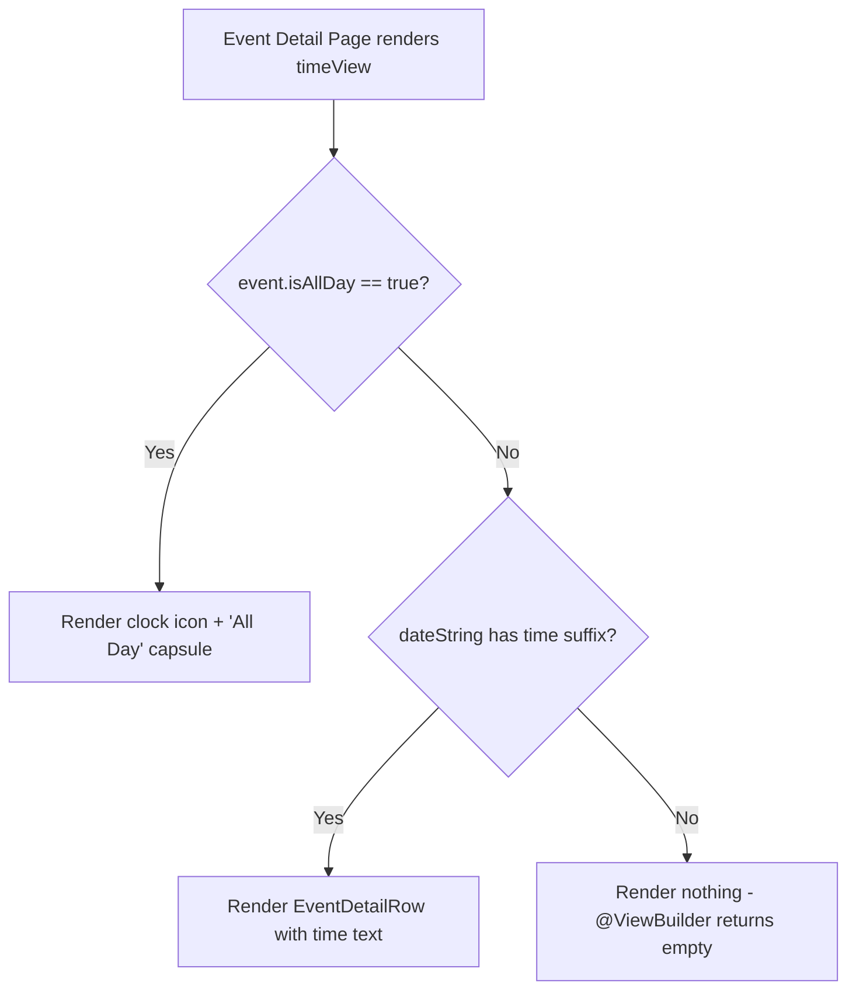

# Technical Specification: ASDLC-515 - Display "All Day" Indicator on Event Detail Page

**Status:** Draft
**Author:** Tech Lead Agent
**Created:** 2026-09-10

---

## 🎯 Problem

### Context

The Berkeley Mobile iOS app has an Events feature where users can browse campus events. Each event can be flagged as an "All Day" event — meaning no specific start/end time applies. The `BMEventCalendarEntry` model exposes this via the `isAllDay: Bool?` field, populated from the Firestore backend through `BerkeleyEvent.isAllDay`.

### Current State

Two separate mechanisms currently determine whether an event is "all day":

1. **`isAllDay: Bool?` field** on `BMEventCalendarEntry` — set directly from the API (`EventsViewModel.swift:67`).
2. **Time-component heuristic** in the `BMCalendarEvent.dateString` protocol extension (`BMCalendarEvent.swift:52-55`) — returns the suffix "All Day" only when `startDate` has components `(hour: 0, minute: 0, sec: 0)` AND `end` has components `(hour: 11, minute: 59, sec: 59)`.

**In `EventsView.swift`** (the event list), the view correctly uses `event.isAllDay == true` to render `AllDayEventBannerView` (a horizontal capsule row) in place of `EventRowView`.

**In `EventDetailView.swift`** (the event detail), the `timeView` computed property inside `BMDetailHeaderView` (line 154-158) does **not** consult `isAllDay`. It splits `dateString` by `" / "` and renders the trailing component as a plain text `EventDetailRow`:

```swift
@ViewBuilder
private var timeView: some View {
    if let timePart = event.dateString.components(separatedBy: " / ").last {
        EventDetailRow(systemImageName: "clock", text: timePart)
    }
}
```

When `isAllDay == true` but the start/end times do not match the exact heuristic (e.g., start is midnight but `end` is nil or uses a different convention), `dateString` returns `"Today / 12:00 AM"` rather than `"Today / All Day"`. The detail page then displays `12:00 AM` in the time row — misleading users into thinking the event has a specific time.

### Desired State

When `event.isAllDay == true`, the time row on the Event Detail Page should display an "All Day" capsule/pill label (instead of the time text). This is consistent with:
- How `AllDayEventBannerView.swift` uses `Capsule()` to communicate all-day status in the list view.
- The design request in the issue (capsule/pill-shaped indicator).

### Impact

- **UX**: Users navigating to an event detail for an all-day event (e.g., a university holiday or enrollment period) see incorrect time information ("12:00 AM"), which is misleading and erodes trust in the app.
- **Consistency**: The list view already correctly suppresses the time for all-day events; the detail view does not.
- **Scope**: Single-file fix in `berkeley-mobile/Events/EventDetailView.swift` with no backend or data-model changes required.

---

## 📋 Architectural Decisions

### Decision 1: Where to apply the `isAllDay` guard

#### Option A — Fix `timeView` in `EventDetailView.swift` only (targeted patch)

Check `event.isAllDay == true` at the start of the `timeView` computed property. If true, render an "All Day" capsule; otherwise fall through to the existing `dateString`-based logic.

- **Pros**: Minimal change (one file, ~10 lines), zero risk of regression in other views or data paths, directly mirrors how `EventsView.swift` handles `isAllDay`.
- **Cons**: The two all-day detection mechanisms (`isAllDay` flag vs. time-component heuristic in `dateString`) remain in coexistence; the heuristic is not fixed.
- **Effort**: Low (~30 min).
- **Alignment**: Follows the established pattern in `EventsView.swift` of using `isAllDay == true` as the gate.

#### Option B — Add `isAllDay` to the `BMCalendarEvent` protocol and update `dateString`

Extend the `BMCalendarEvent` protocol with `var isAllDay: Bool? { get }`, provide a default `nil` implementation, override it in `BMEventCalendarEntry`, and update the `dateString` extension to use `isAllDay == true` instead of (or in addition to) the time-component heuristic.

- **Pros**: Eliminates the dual-mechanism inconsistency; makes `dateString` authoritative for all conforming types.
- **Cons**: Protocol change touches more conforming types (requires auditing all implementors), risks introducing nil-handling bugs in existing callers of `dateString` (e.g., `EventRowView`, `CalendarView`). The time-component heuristic may be intentional for events that lack the `isAllDay` field.
- **Effort**: Medium (~2 hours, including audit of all `BMCalendarEvent` conformers).
- **Alignment**: Architecturally cleaner long-term, but over-engineered for this targeted bug fix.

#### Option C — Replace `EventDetailRow` with a new `EventTimeRow` component that encapsulates the all-day logic

Create a dedicated `EventTimeRow` view that internally decides whether to render the time or the capsule based on the event model.

- **Pros**: Encapsulates presentation logic, reusable if other views need the same behavior.
- **Cons**: Introduces a new abstraction for a single use-site; not warranted until there are multiple callers.
- **Effort**: Medium (~1 hour, new file + DI/registry updates if in separate module).
- **Alignment**: Premature abstraction per project conventions (three similar lines before abstraction).

#### Decision: **Option A**

Option A is the correct choice. The bug is isolated to `EventDetailView.swift`. The `isAllDay` flag is the authoritative API signal (from Firestore), and `EventsView.swift` already uses it as the gate. Option A makes the detail view consistent with the list view using the same condition (`event.isAllDay == true`), with minimal blast radius. Option B would be appropriate in a follow-up refactor if there is ever a need to unify all-day detection across the protocol.

---

### Decision 2: Visual design of the "All Day" indicator

#### Option A — Inline capsule text replacing the `EventDetailRow` text content

Keep the `HStack { Image(systemName: "clock") + ... }` structure from `EventDetailRow` but swap the `Text` for a capsule-styled `Text` view. The clock icon remains as the row's leading icon.

- **Pros**: Maintains visual alignment with the date row and location row; clock icon signals "time information" even when it reads "All Day"; minimal layout disruption.
- **Cons**: Slightly unusual to pair a clock icon with "All Day" (the concept is "no specific time"), but consistent with the existing row pattern.
- **Effort**: Low.

#### Option B — Remove the time row entirely when `isAllDay == true`

If `isAllDay`, simply do not render the time row (same as how `dateString` already suppresses the time for the time-component-matched case when shown in the `EventRowView`).

- **Pros**: No misleading clock icon.
- **Cons**: Removes contextual information; the user sees no indication of duration. The issue description explicitly requests an "All Day" indicator *in the time row*, not its removal.
- **Effort**: Low.

#### Option C — Full-width capsule banner (like `AllDayEventBannerView`)

Render a full-width `AllDayEventBannerView`-style capsule inside the header card.

- **Pros**: Visually prominent.
- **Cons**: `AllDayEventBannerView` is designed for the list row context and includes the event name; it would be redundant and oversized inside the detail card which already shows the event name prominently.
- **Effort**: Low but poor UX fit.

#### Decision: **Option A** — Inline capsule within the clock row

Render a compact `Capsule()`-shaped text label ("All Day") inline next to the clock icon, replacing the plain `Text` from `EventDetailRow`. This matches the issue's explicit request for a "capsule/pill-shaped label" and keeps visual consistency with the other info rows in the header card.

---

### 🔄 Decision Flow



---

## 🏗️ Architecture and Implementation

### Architectural Pattern

The Events feature follows SwiftUI's compositional view pattern with FactoryKit-based dependency injection for the `EventsViewModel`. `EventDetailView` is a pure view — it receives a `BMEventCalendarEntry` value and renders it; no ViewModel mutation is needed for this fix.

The header card structure in `EventDetailView.swift` is:

```
EventDetailView
└── BMDetailHeaderView (receives BMEventCalendarEntry)
    ├── eventNameView
    ├── dateView        (splits dateString at " / ", shows first component)
    ├── timeView        ← CHANGE HERE
    └── locationView
```

### Key Components

| File | Role | Change? |
|---|---|---|
| `berkeley-mobile/Events/EventDetailView.swift` | Renders the Event Detail page; contains `BMDetailHeaderView` with `timeView` | **Yes — modify `timeView`** |
| `berkeley-mobile/Events/EventDataSource/BMEventCalendarEntry.swift` | Data model with `isAllDay: Bool?` | No — field already exists |
| `berkeley-mobile/Events/EventDataSource/EventsViewModel.swift` | Maps Firestore `BerkeleyEvent.isAllDay` to `BMEventCalendarEntry.isAllDay` | No — mapping already correct |
| `berkeley-mobile/Data/ItemProtocols/BMCalendarEvent.swift` | Protocol extension computing `dateString` | No — not the fix target |
| `berkeley-mobile/Events/AllDayEventBannerView.swift` | Existing all-day capsule used in the list view | No — reference for style only |

### Data Flow

```
Firestore → BerkeleyEvent.isAllDay: Bool? 
          → BMEventCalendarEntry.isAllDay: Bool?  (EventsViewModel.swift:67)
          → EventDetailView(event:)
          → BMDetailHeaderView(event:)
          → timeView (reads event.isAllDay)
          → if isAllDay == true: AllDay capsule
          → else: clock + time text
```

### Implementation Plan

**Single file to modify**: `berkeley-mobile/Events/EventDetailView.swift`

**Step 1**: Replace the `timeView` computed property in `BMDetailHeaderView` (lines 153-158).

**Step 2**: Add a private `allDayIndicator` computed property (or inline the capsule directly in `timeView`). Inlining is preferred since it is a single use-site.

**Step 3**: Update the `#Preview` macro to include a second preview case using an all-day event entry to verify the capsule renders correctly.

---

## 💻 Implementation

### Code Template

```swift
// MARK: - BMDetailHeaderView (inside EventDetailView.swift)

// Replace existing timeView (lines 153–158) with:

@ViewBuilder
private var timeView: some View {
    if event.isAllDay == true {
        HStack(spacing: 6) {
            Image(systemName: "clock")
                .font(.system(size: 16))
            Text("All Day")
                .font(Font(BMFont.bold(11)))
                .padding(.horizontal, 8)
                .padding(.vertical, 3)
                .background(.gray.opacity(0.3))
                .clipShape(Capsule())
        }
    } else if let timePart = event.dateString.components(separatedBy: " / ").last {
        EventDetailRow(systemImageName: "clock", text: timePart)
    }
}
```

**Notes on the template**:
- `BMFont.bold(11)` matches the scale of `EventDetailRow`'s `BMFont.regular(12)` — slightly bolder to visually distinguish the capsule as a status label, not flowing text.
- `.gray.opacity(0.3)` matches the fill used in `AllDayEventBannerView` (`.gray.opacity(0.5)`) but is slightly more transparent to be appropriate for an inline compact pill vs. a full-row banner.
- `Capsule()` is the existing shape type used throughout the project (`AllDayEventBannerView`, `BMActionButton`, `BMSegmentedControlView`).
- The `else if` branch preserves the existing behavior exactly for non-all-day events.

### Preview Update Template

```swift
// Append to existing #Preview at bottom of EventDetailView.swift:

#Preview("All Day Event") {
    EventDetailView(event: BMEventCalendarEntry(
        name: "University Holiday",
        date: Calendar.current.startOfDay(for: Date()),
        isAllDay: true
    ))
}
```

This requires no new `sampleEntry` extension — the initializer already accepts all parameters.

### No DI / No New Files

This fix requires no new Swift files, no DI registration changes, and no changes to the Podfile or project configuration. The change is purely within the existing `BMDetailHeaderView` struct in `EventDetailView.swift`.

---

## ✅ Testing Strategy

### Observation on the test infrastructure

No dedicated unit or UI test targets were found in the repository beyond Pods-internal test utilities. There are no `XCTestCase` subclasses or `swift-testing` suites in the project tree. Testing is therefore primarily manual (simulator / device) with SwiftUI Previews as the first line of verification.

### Manual Testing Checklist

| Scenario | Steps | Expected Result |
|---|---|---|
| All-day event detail | Navigate to an event where `isAllDay == true` | Time row shows clock icon + "All Day" capsule |
| Non-all-day event detail (with end time) | Navigate to a regular event with start + end times | Time row shows "h:mm a - h:mm a" text as before |
| Non-all-day event (start time only) | Navigate to a regular event with start time and no end | Time row shows "h:mm a" text as before |
| Time-component-matched event (heuristic path) | Navigate to an event where start=00:00:00, end=23:59:59, `isAllDay == nil` | Time row shows `dateString`-derived "All Day" text (existing behavior preserved) |
| Preview — default | Open `#Preview` at bottom of `EventDetailView.swift` | Time row shows formatted time (sampleEntry has `isAllDay` defaulting to `false`) |
| Preview — all-day | Open `#Preview("All Day Event")` | Time row shows capsule with "All Day" label |

### SwiftUI Preview Verification

The `#Preview("All Day Event")` block (see Implementation section) provides instant visual feedback during development without requiring a simulator build. This is the recommended first-pass verification step.

### If Unit Tests Are Added in Future

Example structure using Swift Testing or XCTest:

```swift
// Tests for BMDetailHeaderView.timeView logic
func testTimeViewShowsAllDayCapsuleWhenIsAllDayTrue() {
    let event = BMEventCalendarEntry(name: "Holiday", date: Date(), isAllDay: true)
    // Render BMDetailHeaderView(event:) in a ViewInspector or snapshot test
    // Assert: contains a Capsule-shaped view with text "All Day"
    // Assert: does NOT contain a plain Text with "12:00 AM"
}

func testTimeViewShowsTimeTextWhenIsAllDayFalse() {
    let date = Calendar.current.date(bySettingHour: 14, minute: 30, second: 0, of: Date())!
    let event = BMEventCalendarEntry(name: "Meeting", date: date, isAllDay: false)
    // Assert: contains a Text with "2:30 PM"
    // Assert: does NOT contain a Capsule
}

func testTimeViewShowsTimeTextWhenIsAllDayNil() {
    let event = BMEventCalendarEntry(name: "Event", date: Date(), isAllDay: nil)
    // Assert: falls through to dateString path (same as false)
}
```

---

## 🔒 Security Considerations

- **Input validation**: `event.isAllDay` is a `Bool?` decoded from Firestore. It is read-only in this view — no user input, no mutation, no side effects. No injection surface exists.
- **No network calls**: This fix introduces no new network requests. The `isAllDay` value is already fetched as part of the existing `EventsDataService.fetchEventsGroupedByDate()` flow.
- **No new permissions**: No new entitlements, capabilities, or privacy-sensitive APIs are involved.
- **No secrets or hardcoded values**: The "All Day" string is a display literal; if internationalization is required in future, it would be addressed via `NSLocalizedString` — out of scope for this fix.

---

## ✅ Definition of Done

### Implementation
- [ ] `timeView` in `BMDetailHeaderView` (inside `EventDetailView.swift`) checks `event.isAllDay == true` first
- [ ] When `isAllDay == true`, renders a `HStack` with `Image(systemName: "clock")` and a capsule-shaped `Text("All Day")` label
- [ ] When `isAllDay != true`, existing `dateString`-based `EventDetailRow` rendering is preserved unchanged
- [ ] A `#Preview("All Day Event")` block is added showing the capsule state

### Testing
- [ ] Manual test: all-day event (from real Firestore data or a test account) shows "All Day" capsule in detail view
- [ ] Manual test: non-all-day event still shows correct time in detail view
- [ ] Both SwiftUI Preview states render without warnings or blank views

### Quality
- [ ] No new Swift compiler warnings introduced
- [ ] No force-unwraps added
- [ ] `event.isAllDay` is checked with `== true` (not `!= false`) to handle the `nil` case safely

### Documentation
- [ ] No additional documentation required — the change is self-explanatory from the view code

---

## 🚫 Out of Scope

- Fixing the time-component heuristic in `BMCalendarEvent.dateString` (the dual-mechanism inconsistency). This is a follow-up refactor concern.
- Adding `isAllDay` to the `BMCalendarEvent` protocol — not warranted by this bug fix.
- Internationalization of the "All Day" string — the project uses plain string literals throughout the Events feature.
- Handling the `EventRowView` (list row for non-all-day events) — `EventsView.swift` already correctly bypasses `EventRowView` for all-day events.
- Backend/Firestore data changes.
- Any UI changes to the `AllDayEventBannerView` shown in the events list.

---

## 📚 References

### Internal
- `berkeley-mobile/Events/EventDetailView.swift` — file being modified; `BMDetailHeaderView.timeView` is the specific target
- `berkeley-mobile/Events/EventDataSource/BMEventCalendarEntry.swift:61` — `isAllDay: Bool?` field definition
- `berkeley-mobile/Events/EventDataSource/EventsViewModel.swift:67` — Firestore → model mapping that sets `isAllDay`
- `berkeley-mobile/Data/ItemProtocols/BMCalendarEvent.swift:52-55` — existing time-component heuristic in `dateString`
- `berkeley-mobile/Events/EventsView.swift:25-26` — reference pattern for `event.isAllDay == true` gating
- `berkeley-mobile/Events/AllDayEventBannerView.swift` — reference for `Capsule()` fill and text styling

### Related Issues
- ASDLC-515 (this issue) — Event Detail Page shows 12:00 AM for all-day events
