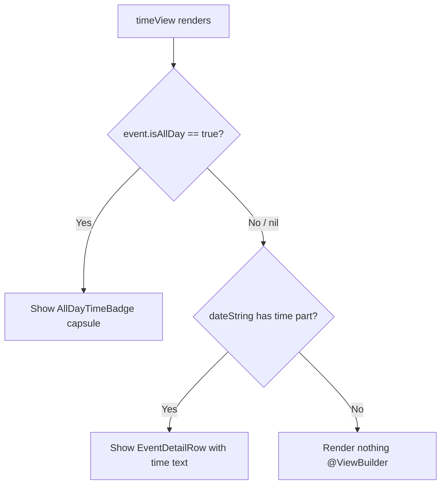

# Technical Specification: ASDLC-518 - Display "All Day" Indicator on Event Detail Page

**Status:** Draft
**Author:** Tech Lead Agent
**Created:** 2026-09-25

---

## 🎯 Problem

### Context

The Berkeley Mobile iOS app has an **Events** feature surfaced as a tab. Users can browse events grouped by date, tap an event to open the **Event Detail Page**, and optionally add it to their device calendar.

The Events feature already distinguishes "all-day" events (holidays, enrollment deadlines, multi-day exhibitions) from timed events. The list view (`EventsView.swift:25-26`) shows a full-width `AllDayEventBannerView` capsule for any event whose `isAllDay` flag equals `true`. The Event Detail Page (`EventDetailView.swift`) does not yet apply this distinction.

### Current State

`BMDetailHeaderView.timeView` (lines 153–158 of `berkeley-mobile/Events/EventDetailView.swift`) renders the time portion of every event unconditionally:

```swift
@ViewBuilder
private var timeView: some View {
    if let timePart = event.dateString.components(separatedBy: " / ").last {
        EventDetailRow(systemImageName: "clock", text: timePart)
    }
}
```

`event.dateString` is the computed property defined in the `BMCalendarEvent` protocol extension (`berkeley-mobile/Data/ItemProtocols/BMCalendarEvent.swift:38–65`). It returns `"All Day"` only when the time components exactly match midnight–11:59:59 PM. It ignores the explicit `isAllDay: Bool?` field on `BMEventCalendarEntry` (`berkeley-mobile/Events/EventDataSource/BMEventCalendarEntry.swift:61`).

**Result**: when an event has `isAllDay == true` but its stored times don't exactly match the midnight/11:59:59 heuristic, `timeView` shows the raw formatted time (e.g., `12:00 AM`) instead of an "All Day" indicator. Even when the heuristic does fire and `dateString` returns "All Day", it is displayed as plain text inside `EventDetailRow` — indistinguishable from a time string and inconsistent with the capsule badge shown in the list view.

### Desired State

When `event.isAllDay == true`, the `timeView` in `BMDetailHeaderView` must:
1. Skip the `EventDetailRow` / time string entirely.
2. Render a capsule/pill-shaped "All Day" badge, visually consistent with the `AllDayEventBannerView` already used in the list view.

For all other events (`isAllDay == false`, `isAllDay == nil`), behaviour must be unchanged.

### Impact

- **User trust**: users see "12:00 AM" on all-day events and incorrectly believe the event starts at midnight.
- **Feature consistency**: the list view already correctly shows the capsule badge; the Detail Page is the only remaining surface with the discrepancy.
- **Accessibility**: the current plain-text fallback provides no semantic differentiation between a time value and an all-day indicator.

### Relevant Files

| File | Role |
|---|---|
| `berkeley-mobile/Events/EventDetailView.swift` | Detail page and `BMDetailHeaderView` — **file to modify** |
| `berkeley-mobile/Events/AllDayEventBannerView.swift` | Existing all-day capsule component (list-view use) |
| `berkeley-mobile/Events/EventDataSource/BMEventCalendarEntry.swift` | Event model with `isAllDay: Bool?` field |
| `berkeley-mobile/Data/ItemProtocols/BMCalendarEvent.swift` | Protocol with `dateString` heuristic |
| `berkeley-mobile/Events/EventsView.swift` | List view — already guards on `event.isAllDay == true` |
| `berkeley-mobile/Assets/Colors/Colors+Event.swift` | Event colour tokens (`BMColor`) |

---

## 📋 Architectural Decisions

### Decision 1 — Where to place the all-day guard condition

The `timeView` computed property inside `BMDetailHeaderView` is the correct insertion point. The choice is how broadly to extract the logic.

| Option | Description | Pros | Cons | Effort |
|---|---|---|---|---|
| **A — Inline conditional in `timeView`** | Add `if event.isAllDay == true { ... } else { EventDetailRow(...) }` directly in `timeView`. Badge view defined as a small struct within the same file. | Minimal diff; change is co-located with the only consumer; consistent with the pattern already used in `EventsView.swift:25`. | Badge struct in `EventDetailView.swift` is not reusable by other detail views. | XS |
| **B — New standalone `AllDayBadgeView` file** | Extract the badge into its own `AllDayBadgeView.swift` in `berkeley-mobile/Events/`. | Reusable if future detail pages need it. | Over-engineering for a single consumer; conflicts with the project's own code-convention principle of co-locating view structs in the same file (e.g. `BMDetailHeaderView`, `EventDetailRow`, `BMDetailDescriptionView` all live in `EventDetailView.swift`). | S |
| **C — Modify `AllDayEventBannerView` to support a compact mode** | Add a `compact: Bool` parameter to `AllDayEventBannerView` that hides the event name when `true`. | Reuses existing component. | `AllDayEventBannerView` uses `@InjectedObservable(\.eventsViewModel)` which is unnecessary for a pure display badge; adding a parameter creates accidental complexity. | S |

**Decision**: **Option A** — inline conditional in `timeView` with a private `AllDayTimeBadge` struct defined within `EventDetailView.swift`.

**Rationale**: The project already uses this exact pattern (list of co-located view structs under `MARK` sections within a single file). The badge is display-only and has no dependency on `eventsViewModel`. Option B is premature abstraction; Option C introduces an unneeded `@InjectedObservable` dependency in a pure layout component.

---

### Decision 2 — Whether to reuse or mirror the `AllDayEventBannerView` style

The existing `AllDayEventBannerView` renders a full-width `Capsule().fill(.gray.opacity(0.5))` with the event name alongside "All Day". The business spec (BR-002, AC line 93) states the badge label text must read exactly "All Day" — the event name is already prominently displayed elsewhere in the header card and must not be duplicated inside the badge.

| Option | Description | Pros | Cons |
|---|---|---|---|
| **A — Badge shows only "All Day" label** | Compact `Capsule` with a single `Text("All Day")` — no event name. | Matches AC line 93 ("label text reads exactly 'All Day'"); avoids redundancy with `eventNameView`. | Slight visual divergence from `AllDayEventBannerView` which shows both texts. |
| **B — Reuse `AllDayEventBannerView` unchanged** | Embed `AllDayEventBannerView(event: event)` in `timeView`. | Zero new code. | Banner is full-width and includes the event name — redundant and too large for the compact row context of the header card. |

**Decision**: **Option A** — label-only compact badge. Fill and corner style (`Capsule`, `gray.opacity(0.5)`) are taken directly from `AllDayEventBannerView` for visual consistency per BR-002. The event name is omitted.

---

### Decision 3 — Guard logic: `isAllDay` flag vs. `dateString` heuristic

The `dateString` protocol extension already has a midnight/11:59:59 heuristic that returns "All Day" as a string. The question is whether the Detail Page badge should trigger on this heuristic, on `isAllDay == true`, or both.

| Option | Description | Pros | Cons |
|---|---|---|---|
| **A — Only `isAllDay == true`** | Badge shows if and only if `event.isAllDay == true`. | Explicit; directly maps to the data-source field; satisfies BR-003 and BR-006 exactly. | If `isAllDay` is absent (`nil`) but times match midnight/11:59:59, badge does not appear (OQ-001 in the business spec is answered conservatively). |
| **B — `isAllDay == true` OR midnight/11:59:59 heuristic** | Badge shows when either condition is met. | Covers edge case of OQ-001. | Business spec BR-006 says "if the all-day flag is absent, fall back to current behavior" — adding the heuristic conflicts with this rule. |

**Decision**: **Option A** — check `event.isAllDay == true` only. BR-006 explicitly forbids treating absent flags as all-day. The `dateString` heuristic remains as-is for the text fallback when `isAllDay` is nil.

---

### Decision Flow



---

## 🏗️ Architecture and Implementation

### Architectural Pattern

This change is a **pure view-layer modification**. No data model, view model, service, or DI registration changes are required. The `isAllDay: Bool?` field already exists on `BMEventCalendarEntry` and is already populated from Firestore in `EventsDataService` (`EventsViewModel.swift:67`). The only file touched is `berkeley-mobile/Events/EventDetailView.swift`.

### Key Components

| Component | File | Change |
|---|---|---|
| `BMDetailHeaderView.timeView` | `EventDetailView.swift:153–158` | Replace unconditional `EventDetailRow` with a conditional: branch on `event.isAllDay == true` |
| `AllDayTimeBadge` (new) | `EventDetailView.swift` (new MARK section) | New private SwiftUI struct; a compact capsule badge showing only the "All Day" label |
| `BMEventCalendarEntry.isAllDay` | `BMEventCalendarEntry.swift:61` | No change — field already exists as `Bool?` |
| `BMCalendarEvent.dateString` | `BMCalendarEvent.swift:38–65` | No change — heuristic is not altered |

### Data Flow

```
Firestore → EventsDataService.fetchEventsGroupedByDate()
         → BMEventCalendarEntry(isAllDay: Bool?)
         → EventsView (list) → taps event
         → EventDetailView(event:)
         → BMDetailHeaderView(event:)
              → timeView
                   ├── isAllDay == true → AllDayTimeBadge (new)
                   └── else             → EventDetailRow(text: timePart)
```

No additional data fetching, transformation, or DI wiring is needed.

---

## 💻 Implementation

### Step-by-step plan

1. **Modify `BMDetailHeaderView.timeView`** in `EventDetailView.swift` to branch on `event.isAllDay`.
2. **Add `AllDayTimeBadge` struct** in `EventDetailView.swift` below the existing `// MARK: - EventDetailRow` section.
3. **Manual smoke test** on an all-day event and a non-all-day event to verify the badge appears/disappears correctly and the `#Preview` still compiles.

---

### Code templates

#### `BMDetailHeaderView.timeView` — modified

```swift
@ViewBuilder
private var timeView: some View {
    if event.isAllDay == true {
        AllDayTimeBadge()
    } else if let timePart = event.dateString.components(separatedBy: " / ").last {
        EventDetailRow(systemImageName: "clock", text: timePart)
    }
}
```

**Notes**:
- `event.isAllDay == true` uses optional-equality (`Bool? == true`) which is `false` for both `false` and `nil` — satisfying BR-003 and BR-006.
- The `else if` preserves the existing `EventDetailRow` path untouched (BR-004).

---

#### `AllDayTimeBadge` — new struct (add under `// MARK: - EventDetailRow`)

```swift
// MARK: - AllDayTimeBadge

private struct AllDayTimeBadge: View {
    var body: some View {
        HStack {
            Capsule()
                .fill(.gray.opacity(0.5))
                .frame(height: 24)
                .overlay(
                    Text("All Day")
                        .font(Font(BMFont.bold(12)))
                        .padding(.horizontal, 10)
                )
                .fixedSize()
            Spacer()
        }
        .accessibilityElement(children: .ignore)
        .accessibilityLabel("All Day")
    }
}
```

**Notes**:
- `Capsule().fill(.gray.opacity(0.5))` mirrors the fill from `AllDayEventBannerView` for visual consistency (BR-002).
- `.fixedSize()` on the `Capsule` makes it shrink-wrap its overlay text rather than expand to full width — appropriate for a compact time-row badge.
- `HStack { ... Spacer() }` left-aligns the badge, matching `EventDetailRow`'s left-aligned layout.
- `.accessibilityElement(children: .ignore)` + `.accessibilityLabel("All Day")` satisfies the accessibility non-functional requirement.
- `BMFont.bold(12)` matches the font size used in `EventDetailRow`'s `BMFont.regular(12)`.
- No `@InjectedObservable` or external dependencies — pure display struct.

---

#### `#Preview` — update sample entry (optional but recommended)

The existing `sampleEntry` has `isAllDay: Bool? = false` (defaulted). To exercise the new badge during Xcode Canvas preview, add a second preview:

```swift
#Preview("All Day Event") {
    EventDetailView(event: BMEventCalendarEntry(
        name: "Campus Holiday",
        date: Date(),
        isAllDay: true
    ))
}
```

This does not change production behaviour; it simply gives developers a live preview of the badge path.

---

### Integration points

- No DI registration changes needed (`AllDayTimeBadge` has no injected dependencies).
- No changes to `AllDayEventBannerView`, `EventsView`, `BMCalendarEvent`, or `EventsViewModel`.
- No Firestore schema changes — `isAllDay` is already decoded in `BerkeleyEventsDaySnapshot` / `EventsDataService`.

---

## ✅ Testing Strategy

### Automated testing

Per `docs/testing-standards.md`, the repository has **no automated test infrastructure** — no `XCTest`, `Quick`/`Nimble`, or `Swift Testing` target exists. The standard "≥80% coverage" recommendation therefore cannot be applied via automated tests at this time.

**Recommendation for this change**: Validate through the existing manual QA approach and Xcode Canvas previews until a test target is established.

### Manual QA scenarios

| # | Scenario | Steps | Expected result |
|---|---|---|---|
| TC-01 | All-day event — badge shown | Navigate to Events → tap an event with `isAllDay == true` | Time row shows gray capsule with "All Day"; no time string |
| TC-02 | All-day event — date row unaffected | Same as TC-01 | Date row still shows the event's date |
| TC-03 | Non-all-day event — time shown | Tap an event with `isAllDay == false` | Time row shows start time (and end time if present); no badge |
| TC-04 | `isAllDay == nil` event — time shown | Tap an event where `isAllDay` was not set by backend | Falls back to current time display; no badge (BR-006) |
| TC-05 | All-day with location | Tap an all-day event that has a location | Both the "All Day" badge row and the location row appear |
| TC-06 | All-day without location | Tap an all-day event with no location | Only the "All Day" badge row appears; no empty location row |
| TC-07 | Dark mode | Switch device to dark appearance, open all-day event | Badge text and capsule background remain readable |
| TC-08 | Light mode | Switch device to light appearance, open all-day event | Badge text and capsule background remain readable |
| TC-09 | VoiceOver | Enable VoiceOver, navigate to time row | VoiceOver announces "All Day" (not individual text nodes) |
| TC-10 | Non-all-day regression | Open any previously working timed event | Time display is unchanged |

### Xcode Canvas preview

Add the `#Preview("All Day Event")` variant described in the Implementation section. This allows developers to immediately confirm the badge renders correctly in the Xcode canvas without a device/simulator run.

---

## 🔒 Security Considerations

| Check | Status | Notes |
|---|---|---|
| Input injection (XSS, SQL) | N/A | No user-supplied text rendered in this change; `isAllDay` is a `Bool?` from a typed Firestore decode |
| Data exposure | N/A | No new data fields introduced or exposed |
| Credential / secret handling | N/A | No credentials involved |
| Authentication / authorisation | N/A | Read-only UI change; no auth boundary crossed |
| Crash on nil | ✅ Handled | `event.isAllDay == true` safely evaluates `false` for both `false` and `nil`; no forced unwrap |
| Third-party dependency | N/A | No new dependencies added |

---

## ✅ Definition of Done

### Implementation
- [ ] `BMDetailHeaderView.timeView` in `EventDetailView.swift` checks `event.isAllDay == true` before rendering the time row
- [ ] `AllDayTimeBadge` struct added in `EventDetailView.swift` under a `// MARK: - AllDayTimeBadge` section
- [ ] Badge uses `Capsule().fill(.gray.opacity(0.5))` and `Text("All Day")` with `BMFont.bold(12)`
- [ ] Badge is left-aligned using `HStack { ... Spacer() }` to match `EventDetailRow` layout
- [ ] `.accessibilityElement(children: .ignore)` and `.accessibilityLabel("All Day")` applied to badge
- [ ] No changes outside `EventDetailView.swift` (except optional preview update)

### Testing / QA
- [ ] TC-01 through TC-10 manual scenarios pass on a physical device or simulator
- [ ] `#Preview("All Day Event")` compiles and renders the capsule badge in Xcode Canvas
- [ ] Existing `#Preview` (non-all-day `sampleEntry`) still renders correctly

### Quality
- [ ] No new compiler warnings introduced
- [ ] No forced unwraps added
- [ ] Code follows `// MARK: -` section conventions per `docs/code-conventions.md`
- [ ] No hardcoded colour values — badge fill replicates the pattern from `AllDayEventBannerView` (`.gray.opacity(0.5)`) which matches the project's pragmatic approach for event-specific visuals

### Documentation
- [ ] No new public API surface is added; no documentation update is required

---

## 🚫 Out of Scope

Per the business requirements (`specs/ASDLC-518/business-requirements.md` §8):

- Changes to the Events **list view** (`EventsView.swift`) — already handles all-day events correctly.
- Changes to how all-day events are **created, edited, or stored** — display-only change.
- Changes to the **date row** on the Event Detail Page.
- Changes to the **calendar add/remove action** behaviour for all-day events.
- Support for **multi-day events** spanning more than one calendar day.
- Changes to **notifications** or other surfaces outside the Event Detail Page.
- Changes to the **backend / Firestore schema** — `isAllDay` is already provided.
- Surfacing additional metadata (category, type) alongside the badge.
- Introducing automated test infrastructure (no test target exists; establishing one is a separate initiative).
- Modifying `BMCalendarEvent.dateString` or the midnight/11:59:59 heuristic.

---

## 📚 References

### Internal docs consulted

| Doc | Sections used |
|---|---|
| `docs/tech.md` | Mixed UIKit/SwiftUI approach; `FactoryKit` DI; `@Observable` / `ObservableObject` patterns |
| `docs/structure.md` | `Events/` feature folder layout; co-location of view structs in the same file |
| `docs/code-conventions.md` | `// MARK: -` section delimiters; `BMFont` usage; `BMColor` extension pattern |
| `docs/api-standards.md` | `isAllDay` sourced from Firestore via `EventsDataService`; no schema change needed |
| `docs/testing-standards.md` | No automated test target exists; manual QA is the current standard |

### Related codebase locations

| Symbol | File | Notes |
|---|---|---|
| `BMDetailHeaderView.timeView` | `EventDetailView.swift:153–158` | The line to modify |
| `AllDayEventBannerView` | `AllDayEventBannerView.swift` | Style reference (capsule fill, font) |
| `BMEventCalendarEntry.isAllDay` | `BMEventCalendarEntry.swift:61` | Source of truth for all-day flag |
| `BMCalendarEvent.dateString` | `BMCalendarEvent.swift:38–65` | Unchanged heuristic |
| `EventsView.swift:25–26` | `EventsView.swift` | Pattern for `isAllDay == true` guard already in use |
| `Colors+Event.swift` | `berkeley-mobile/Assets/Colors/` | Event colour tokens for potential future badge colour token |
