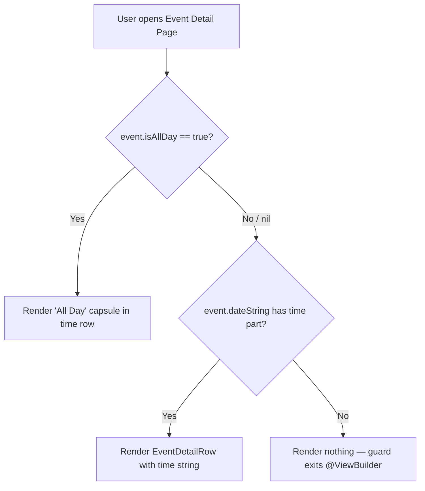

# Technical Specification: ASDLC-553 - Display "All Day" Indicator on Event Detail Page

**Status:** Draft
**Author:** Tech Lead Agent
**Created:** 2026-09-29

---

## 🎯 Problem

### Context

The Berkeley Mobile iOS app displays campus events on an Event Detail Page (`berkeley-mobile/Events/EventDetailView.swift`). Each event is modelled by `BMEventCalendarEntry` (`berkeley-mobile/Events/EventDataSource/BMEventCalendarEntry.swift`), which carries two independent mechanisms for indicating an all-day event:

1. **`isAllDay: Bool?`** — a first-class boolean flag sourced from Firestore via `BerkeleyEvent.isAllDay` and mapped through `EventsDataService.fetchEventsGroupedByDate()`.
2. **Time-based heuristic in `BMCalendarEvent.dateString`** — the protocol extension (`berkeley-mobile/Data/ItemProtocols/BMCalendarEvent.swift:52–54`) produces the string `"All Day"` for the time portion only when `startDate` is exactly midnight (00:00:00) AND `end` is exactly 23:59:59. If these precise time-component conditions are not met, even a genuinely all-day event falls through to format a time value such as `"12:00 AM"`.

### Current State

`BMDetailHeaderView.timeView` (line 153–158 of `EventDetailView.swift`) extracts the time portion of `event.dateString` by splitting on `" / "` and taking the last component:

```swift
@ViewBuilder
private var timeView: some View {
    if let timePart = event.dateString.components(separatedBy: " / ").last {
         EventDetailRow(systemImageName: "clock", text: timePart)
    }
}
```

Because `dateString` is computed by the heuristic, events where `isAllDay == true` but whose `startDate` is not exactly midnight (or whose `end` is absent/non-23:59:59) produce a time string like `"12:00 AM"` instead of `"All Day"`. The `isAllDay` flag on `BMEventCalendarEntry` is entirely ignored by `EventDetailView`. The result is that the time row misleads users by showing a fabricated time value.

The Events list view (`EventsView.swift:25`) correctly branches on `event.isAllDay == true` to display `AllDayEventBannerView` instead of `EventRowView`, confirming that the `isAllDay` flag is the established authoritative signal for all-day status elsewhere in the app.

### Desired State

When `event.isAllDay == true`, `BMDetailHeaderView.timeView` must render a capsule-shaped "All Day" label in place of any time string. When `event.isAllDay` is `false` or `nil`, the existing time-string display behaviour is preserved.

### Impact

- **User-facing**: Every all-day event viewed on the Event Detail Page currently shows incorrect time information. This actively misleads users about event scheduling.
- **Technical**: The fix is purely a view-layer change; no data model, networking, or view-model logic changes are needed.
- **Scope**: Affects only `EventDetailView.swift` / `BMDetailHeaderView`. The Events list, calendar view, and all other screens are unaffected.

### Open Question Resolution

The business spec (Section 7) asks which mechanism is authoritative. Given that `EventsView.swift` already uses `isAllDay == true` as the branch condition, and the heuristic was designed as a fallback for events that lack an explicit flag, **`isAllDay` is the authoritative source**. The heuristic must NOT be used to determine the time-row display on the Event Detail Page.

---

## 📋 Architectural Decisions

### AD-001: Where to place the "All Day" branch condition

#### Option A — Branch inside `BMDetailHeaderView.timeView` (inline, view-local)

Modify `timeView` in `BMDetailHeaderView` to check `event.isAllDay == true`. If true, render a capsule view. If false, render the existing `EventDetailRow`.

- **Pros**: Minimal blast radius; change is entirely self-contained in `EventDetailView.swift`. No new files. Consistent with how `EventsView.swift` does its branch inline.
- **Cons**: `BMDetailHeaderView` receives the full `BMEventCalendarEntry` object, so access to `isAllDay` is already available with zero refactoring.
- **Effort**: XS — 1 file, ~15 lines changed.
- **Alignment**: Matches existing inline-branch pattern in `EventsView.swift:25` (docs/structure.md — feature-folder view concern; docs/code-conventions.md — SwiftUI `@ViewBuilder` per-property pattern).

#### Option B — Add computed property `isAllDay: Bool` to `BMCalendarEvent` protocol extension

Expose `isAllDay` on the protocol so any `BMCalendarEvent` conformer can branch on it without casting. Override in `BMEventCalendarEntry`.

- **Pros**: Cleaner protocol surface; re-usable if `GymClass` ever needs all-day logic.
- **Cons**: `BMCalendarEvent` has no `isAllDay` concept today, and `GymClass` never has all-day events. This introduces protocol complexity for a single use-case. Also requires changing the protocol file in `Data/ItemProtocols/`, which is a broader change than the UI concern warrants.
- **Effort**: S — 2–3 files.
- **Alignment**: Moderate — protocol-oriented composition is encouraged (docs/code-conventions.md), but only for truly shared behaviours. `isAllDay` is specific to calendar-scraped events.

#### Option C — Extract a dedicated `AllDayCapsuleView` to `Common/` and reuse it

Create a new `Common/AllDayCapsuleView.swift` (capsule-only, no event name) and reference it from `BMDetailHeaderView.timeView`.

- **Pros**: Reusable component; avoids duplicating capsule styling if another screen needs "All Day".
- **Cons**: The existing `AllDayEventBannerView` already encapsulates a capsule but also displays the event name and is semantically an event-list banner, not a standalone capsule. A second file adds maintenance surface for a single-consumer widget.
- **Effort**: S — 2 files.
- **Alignment**: Acceptable; `Common/` is the right home for reusable view components (docs/structure.md). However the business requirement says to "reuse or reference" the existing component for consistency — a small inline `Capsule` is simpler.

#### Decision: Option A with inline capsule view

**Chosen**: Option A — branch inside `BMDetailHeaderView.timeView`, rendering an inline `Capsule`-based label that mirrors the styling of `AllDayEventBannerView` (`gray.opacity(0.5)` fill, `BMFont.bold(15)` text).

**Rationale**:
- Smallest change surface; exactly matches how `EventsView.swift` already handles the `isAllDay` branch.
- `BMDetailHeaderView` already receives the full `BMEventCalendarEntry`, so `isAllDay` is zero-cost to access.
- The capsule is a two-line SwiftUI expression; extracting it to a separate file would be premature abstraction (docs/code-conventions.md: "three similar lines is better than a premature abstraction").
- Consistent visual style with `AllDayEventBannerView` is achieved by matching its fill and font without a shared type.

**Alternative rejected**: Option B rejected — adding protocol complexity for a single concrete feature is not warranted. Option C rejected — the component already exists as `AllDayEventBannerView`; a stripped-down version inline is sufficient.

---

### AD-002: All-day determination signal

#### Option A — Use `event.isAllDay == true` (explicit flag)

Branch on the `BMEventCalendarEntry.isAllDay` boolean. This is the signal already used by `EventsView.swift`.

- **Pros**: Consistent with the rest of the app; authoritative; not sensitive to time-component precision of `startDate`/`end`.
- **Cons**: None; the flag is non-optional (`Bool?`, defaults to `false` in `init`).

#### Option B — Reuse the `dateString` heuristic (time-component check)

Continue to derive "all day" from `dateString.components(separatedBy: " / ").last == "All Day"`.

- **Pros**: No code change to the condition; purely additive to existing flow.
- **Cons**: The heuristic only fires when `startDate` is exactly midnight AND `end` is exactly 23:59:59. Events with `isAllDay == true` but non-standard times (e.g. absent `end`) will still display a wrong time. Violates BR-005 and the open-question resolution in the business spec.

#### Decision: Option A — `event.isAllDay == true`

**Rationale**: `EventsView.swift` already uses this flag as the authoritative branch condition. Using a different mechanism on the detail page would create inconsistency. The heuristic in `BMCalendarEvent.dateString` is a display-string convenience that must not drive UX branching on the detail page.

---

## 🔄 Decision Flow



---

## 🏗️ Architecture

### Architectural Pattern

Feature-folder SwiftUI view composition (docs/structure.md — `Events/` feature folder; docs/code-conventions.md — `@ViewBuilder` per-property pattern). This change adds a conditional branch inside an existing `@ViewBuilder` computed property of an existing `struct`. No new types, data sources, or DI wiring are required.

### Key Components

| Component | Path | Role |
|---|---|---|
| `BMDetailHeaderView` | `berkeley-mobile/Events/EventDetailView.swift:104` | Hosts the `timeView` `@ViewBuilder` property to be modified |
| `BMEventCalendarEntry` | `berkeley-mobile/Events/EventDataSource/BMEventCalendarEntry.swift` | Source of `isAllDay: Bool?` — no changes required |
| `AllDayEventBannerView` | `berkeley-mobile/Events/AllDayEventBannerView.swift` | Reference for capsule visual style (gray fill, BMFont.bold) — not reused directly |

### Data Flow

```
Firestore → BerkeleyEvent.isAllDay (Bool?)
          → EventsDataService.fetchEventsGroupedByDate()
          → BMEventCalendarEntry.isAllDay (mapped 1:1)
          → EventsView → EventDetailView(event:)
          → BMDetailHeaderView(event:)
          → timeView (@ViewBuilder) — branches on event.isAllDay
              ├─ true  → Capsule "All Day" label
              └─ false/nil → EventDetailRow(text: time string from dateString)
```

No new network calls, view-model state changes, or DI registrations are needed.

---

## 💻 Implementation

### Files to Modify

**`berkeley-mobile/Events/EventDetailView.swift`** — single file change, single property changed.

#### Before (lines 153–158)

```swift
@ViewBuilder
private var timeView: some View {
    if let timePart = event.dateString.components(separatedBy: " / ").last {
         EventDetailRow(systemImageName: "clock", text: timePart)
    }
}
```

#### After

```swift
@ViewBuilder
private var timeView: some View {
    if event.isAllDay == true {
        HStack {
            Image(systemName: "clock")
                .font(.system(size: 16))
            Text("All Day")
                .font(Font(BMFont.bold(15)))
                .padding(.horizontal, 8)
                .padding(.vertical, 3)
                .background(
                    Capsule()
                        .fill(.gray.opacity(0.5))
                )
                .accessibilityLabel("All Day")
        }
    } else if let timePart = event.dateString.components(separatedBy: " / ").last {
        EventDetailRow(systemImageName: "clock", text: timePart)
    }
}
```

#### Design notes

- **Capsule fill**: `.gray.opacity(0.5)` — mirrors `AllDayEventBannerView.swift:19` exactly for visual consistency (BR-002, NFR Visual Consistency).
- **Font**: `BMFont.bold(15)` — mirrors `AllDayEventBannerView.swift:23`.
- **Clock icon**: The `Image(systemName: "clock")` is retained at `.system(size: 16)` to match `EventDetailRow`'s icon size. This preserves visual alignment with `dateView` above it.
- **`accessibilityLabel`**: Explicit `.accessibilityLabel("All Day")` satisfies the accessibility NFR.
- **`isAllDay == true` guard**: Explicit equality to `true` handles the `Bool?` optionality. When `isAllDay` is `nil` (absent from Firestore for legacy events), the `else` branch falls through to the time-string path — existing timed-event behaviour is fully preserved (BR-004).
- **`else if` with `dateString` guard**: The existing `if let timePart` guard is retained inside the `else` branch to preserve the existing nil/empty-time-string suppression behaviour.

### `#Preview` update

The existing preview uses `BMEventCalendarEntry.sampleEntry`, which has `isAllDay` defaulting to `false`. To visually verify the new branch, add a second preview case:

```swift
#Preview("All Day Event") {
    EventDetailView(event: BMEventCalendarEntry(
        name: "Exhibit | A Storied Campus",
        date: Date(),
        end: nil,
        descriptionText: "An all-day exhibit.",
        location: "Doe Library",
        isAllDay: true
    ))
}
```

> Note: `sampleEntry` in `BMEventCalendarEntry.swift:136` does not pass `isAllDay`, so it defaults to `false`. No change to `sampleEntry` is needed.

### Integration Points

- **No DI changes**: `BMDetailHeaderView` receives `event: BMEventCalendarEntry` directly by value. No factory registration or `Container` extension changes are needed.
- **No model changes**: `BMEventCalendarEntry.isAllDay` already exists and is already populated from Firestore.
- **No `BMCalendarEvent` protocol changes**: The heuristic in `BMCalendarEvent.dateString` is untouched. It continues to serve `EventRowView` and any other consumer of `dateString`.
- **No regression surface**: Only `timeView` is modified. `dateView`, `locationView`, `eventNameView`, `descriptionSection`, `buttonsSection`, and the toolbar are entirely unchanged.

---

## ✅ Testing Strategy

### Testing Infrastructure Constraints

Per `docs/testing-standards.md`, the repository has **no XCTest target**. There are no unit tests, UI tests, or automated CI pipelines. Testing for this change is therefore limited to:

1. **SwiftUI `#Preview` canvas verification** — the established project pattern (35 preview blocks already exist; `docs/testing-standards.md`).
2. **Manual device/simulator testing** — run the app, navigate to the Events tab, open an all-day event detail page.

### Preview-Based Verification

Add a second `#Preview` block to `EventDetailView.swift` (see Implementation section) covering:

| Preview | `isAllDay` | Expected result |
|---|---|---|
| Default (`sampleEntry`) | `false` | Time row shows formatted time string |
| "All Day Event" | `true` | Time row shows capsule with "All Day" label |

### Manual Test Cases (mapping to Acceptance Criteria)

| Scenario | Steps | Expected |
|---|---|---|
| AC-1: All-day event shows capsule | Open detail for an event with `isAllDay == true` | Capsule "All Day" visible in time row; no time value |
| AC-2: Timed event unchanged | Open detail for an event with `isAllDay == false` | Time string (e.g. "10:00 AM – 11:30 AM") visible; no capsule |
| AC-3: Timed event, no end time | Event with `isAllDay == false` and no `end` date | Start time only visible |
| AC-4: All-day, no end date | Event with `isAllDay == true`, `end == nil` | Capsule shown; no time value |
| AC-5: Date row unaffected | Any event | Date row displays correctly regardless of all-day flag |
| AC-6: Visual distinction | All-day event detail | Capsule is visually distinct from plain text time display |

### Regression Check

- Open several non-all-day events and confirm time row is unchanged.
- Navigate from Events list → detail for the same event and confirm the `isAllDay` branch on the list (existing `AllDayEventBannerView`) and the detail page are consistent.

---

## 🔒 Security Considerations

- [x] **No new network calls** — change is purely view-layer; no new data is fetched or transmitted.
- [x] **No user input** — the "All Day" label is a static string; no injection surface is introduced.
- [x] **No sensitive data displayed** — `isAllDay` is a boolean flag; no PII or credentials are involved.
- [x] **No authentication changes** — this change does not interact with Firebase Auth or GoogleSignIn.
- [x] **No new dependencies** — no new CocoaPods or SPM packages are added.
- [x] **Accessibility** — `.accessibilityLabel("All Day")` ensures VoiceOver reads the capsule correctly (NFR from business spec Section 6).

---

## ✅ Definition of Done

### Implementation

- [ ] `BMDetailHeaderView.timeView` in `EventDetailView.swift` branches on `event.isAllDay == true`
- [ ] When `isAllDay == true`: renders `Image(systemName: "clock")` + capsule-background `Text("All Day")` with `.gray.opacity(0.5)` fill and `BMFont.bold(15)` font
- [ ] When `isAllDay != true`: existing `EventDetailRow` with `dateString` time part is rendered unchanged
- [ ] `.accessibilityLabel("All Day")` applied to the capsule text

### Visual Verification

- [ ] Second `#Preview("All Day Event")` block added and renders correctly in Xcode canvas
- [ ] Capsule styling matches `AllDayEventBannerView` (fill: `.gray.opacity(0.5)`, font: `BMFont.bold(15)`)
- [ ] Clock icon aligned with the date row icon above it
- [ ] Both preview cases verified in Xcode canvas (light and dark mode)

### Manual Testing

- [ ] All-day event (from live Firestore data): capsule visible, no time string
- [ ] Timed event: time string visible, no capsule
- [ ] Timed event with no end: start time only, no capsule
- [ ] Date row visually unaffected in all scenarios
- [ ] No visual regressions on Events list page (`EventsView`, `EventRowView`, `AllDayEventBannerView`)

### Code Quality

- [ ] No new files created (change is inline in `EventDetailView.swift`)
- [ ] No new imports required (`SwiftUI` already imported)
- [ ] File header comment unchanged
- [ ] No `// TODO`, `// FIXME`, or commented-out code left behind

---

## 🚫 Out of Scope

Per business spec Section 8:

- Changes to `EventsView`, `EventRowView`, `AllDayEventBannerView`, or `CalendarView` — this change is Event Detail Page only.
- Changes to how all-day events are created, fetched, or stored in Firestore.
- Changes to the date row in `BMDetailHeaderView.dateView`.
- Adding an "All Day" indicator to the event list or calendar view.
- Changing the color, font, or theme of `EventRowView` items.
- Modifying how events are added to the user's device calendar (`BMEventManager`).
- Changing the definition or heuristic of all-day detection in `BMCalendarEvent.dateString`.
- Refactoring `AllDayEventBannerView` or extracting a shared capsule component.

---

## 📚 References

### Internal Docs Consulted

- `docs/tech.md` — Swift/SwiftUI stack, FactoryKit DI, `os.Logger`, `@Observable`
- `docs/structure.md` — `Events/` feature-folder organization; `Common/` for shared components
- `docs/code-conventions.md` — `@ViewBuilder` per-property pattern; `BMFont`/`BMColor` usage; `BM` prefix convention; one primary type per file
- `docs/testing-standards.md` — no XCTest target; `#Preview` as the verification mechanism

### Key Source Files

- `berkeley-mobile/Events/EventDetailView.swift` — file to modify
- `berkeley-mobile/Events/AllDayEventBannerView.swift` — visual style reference
- `berkeley-mobile/Events/EventsView.swift:25` — existing `isAllDay == true` branch pattern
- `berkeley-mobile/Events/EventDataSource/BMEventCalendarEntry.swift:61` — `isAllDay: Bool?` field
- `berkeley-mobile/Data/ItemProtocols/BMCalendarEvent.swift:52–54` — time-based heuristic (unchanged)

### Related Issues

- ASDLC-553 — parent issue (this spec)
