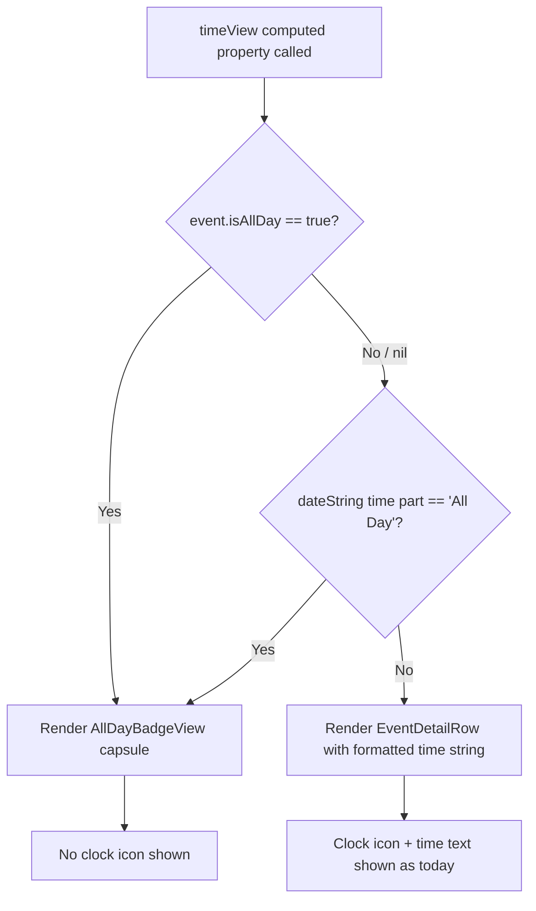

# Technical Specification: ASOS-6 - Display "All Day" Indicator on Event Detail Page

**Status:** Draft
**Author:** Tech Lead Agent
**Created:** 2026-06-30

---

## 🎯 Problem

### Context

Berkeley Mobile is a native iOS application (Swift/SwiftUI, MVVM, FactoryKit DI) serving UC Berkeley students and faculty. The Events feature pulls event data from Firestore (`"Events"` collection), deserializes it into `BerkeleyEvent` → `BMEventCalendarEntry`, and displays events in `EventsView` (list) and `EventDetailView` (detail).

### Current State

When a user opens `EventDetailView` for an event that has `isAllDay == true` in the backend payload, the time row inside `BMDetailHeaderView` displays a specific time value — most commonly "12:00 AM" — instead of indicating that the event has no specific start or end time.

**Root cause (confirmed via CodeGraph):**

`BMDetailHeaderView.timeView` (`EventDetailView.swift:154–158`) reads the time portion of `event.dateString` and always passes it to `EventDetailRow` as plain text:

```swift
@ViewBuilder
private var timeView: some View {
    if let timePart = event.dateString.components(separatedBy: " / ").last {
         EventDetailRow(systemImageName: "clock", text: timePart)
    }
}
```

`dateString` is defined in `BMCalendarEvent.swift:38–65` via a protocol default. It returns "All Day" as the time component **only when** `startDate` matches `hour:0, minute:0, sec:0` AND `end` matches `hour:11, minute:59, sec:59`. When `isAllDay == true` but the stored timestamps do not satisfy that exact heuristic (e.g., end is nil or is a different value), `dateString` falls through and formats `startDate` as "h:mm a" — yielding "12:00 AM" for a midnight timestamp. `timeView` then renders this value with no awareness of the `isAllDay` flag.

There is no existing guard in `timeView` that checks `event.isAllDay` before rendering.

### Desired State

When an event is classified as all-day — by either the explicit `isAllDay == true` flag or the existing time-heuristic in `dateString` — the time row on `EventDetailView` displays an "All Day" capsule/pill badge instead of any time string. The date row (calendar icon row) is unaffected. All timed event rendering is unchanged.

### Impact

Every all-day event visible in the app currently shows misleading time data on its detail page, which may cause users to arrive at incorrect times or dismiss events as incorrectly scheduled. This is an active data accuracy defect.

### Constraints

- **Display-only change**: No data model changes, no new network calls, no Firestore queries. All signals needed are available when the view renders.
- **Single authoritative signals**: `BMEventCalendarEntry.isAllDay: Bool?` (direct backend flag) and the time component of `BMCalendarEvent.dateString` (heuristic).
- **No regression**: Timed event display must remain byte-for-byte identical to the current implementation.
- **Consistency**: The "All Day" label text and capsule shape must match the existing `AllDayEventBannerView` component (`Events/AllDayEventBannerView.swift`) used in the list view.
- **Accessibility**: The badge must be announced as static "All Day" text by assistive technologies, not as an interactive element.

---

## 📋 Architectural Decisions

### Decision 1: All-Day Detection Signal

**Question**: Which signal should `BMDetailHeaderView.timeView` use to determine that an event is all-day?

#### Option A — `isAllDay` flag only
Read `event.isAllDay == true` in `timeView`. Ignore `dateString` time component for this decision.

- **Pros**: Direct, intent-driven signal from the backend; eliminates heuristic fragility.
- **Cons**: `isAllDay` is typed `Bool?` — it can be `nil` if the backend field is absent. Events uploaded before the `isAllDay` field was introduced would be missed. BC-001 in the business spec explicitly requires a fallback.
- **Effort**: Trivial (one `if` guard).

#### Option B — `dateString` time component equals "All Day" (existing heuristic)
Check `event.dateString.components(separatedBy: " / ").last == "All Day"`.

- **Pros**: Already the source of truth used by `EventRowView` via `Text(event.dateString)` in the list. Consistent with how `AllDayEventBannerView` triggers (via `EventsView` checking `event.isAllDay == true` for the banner, but the banner itself reads the full `dateString`).
- **Cons**: Only activates when start is midnight AND end is 11:59:59 PM — misses events where `isAllDay == true` but timestamps don't satisfy the heuristic. This is precisely the bug being fixed.
- **Effort**: Trivial, but does not fully fix the bug.

#### Option C — Combined: `isAllDay == true` OR `dateString` time part equals "All Day" ✅ SELECTED
Use `(event.isAllDay == true) || (event.dateString.components(separatedBy: " / ").last == "All Day")` as the predicate.

- **Pros**: Catches both signal paths. Satisfies EC-001 in the business spec ("if `isAllDay` is nil, fall back to the time-component heuristic"). No data model changes needed. Keeps the existing `BMCalendarEvent.dateString` as unchanged shared logic for all other consumers.
- **Cons**: Minor code verbosity; the two signals could theoretically disagree, but the OR union is the safe and correct business interpretation ("any event the system considers all-day must display All Day").
- **Effort**: Trivial (computed `isAllDayEvent` property or inline predicate in `@ViewBuilder`).
- **Alignment**: Directly satisfies BR-001, BR-004, EC-001 from the business requirements.

**Rationale**: Option C is the only option that handles the documented edge case where `isAllDay` may be nil. The heuristic in `BMCalendarEvent.dateString` is retained unchanged to avoid regression for any other consumer.

---

### Decision 2: Location of the "All Day" Badge Component

**Question**: Where should the "All Day" capsule badge view be defined?

#### Option A — Inline anonymous view inside `BMDetailHeaderView.timeView`
Embed the capsule/pill directly in the `timeView` computed property.

- **Pros**: Zero new files; change stays fully within `EventDetailView.swift`.
- **Cons**: Reuse impossible. Inconsistent with the project's pattern of extracting named sub-components (e.g., `EventDetailRow`, `BMDetailDescriptionView`).

#### Option B — New named `AllDayBadgeView` struct inside `EventDetailView.swift` ✅ SELECTED
Add a private `AllDayBadgeView` struct in the `// MARK: - EventDetailRow` section of `EventDetailView.swift`, mirroring the existing `EventDetailRow` naming pattern.

- **Pros**: Consistent with project conventions (`EventDetailRow` is already a named struct in the same file). Self-documenting. Easily previewable with `#Preview`. Does not add a new file for a tiny view.
- **Cons**: Not shareable across files without moving it, but there is currently no other call site for a detail-context all-day badge.
- **Effort**: Minimal.

#### Option C — New top-level `AllDayDetailBadgeView.swift` file in `Events/`
A standalone file alongside `AllDayEventBannerView.swift`.

- **Pros**: Fully reusable.
- **Cons**: Over-engineered for a badge consumed by one view. Adds a file for ~10 lines of code.

**Rationale**: Option B keeps the change surgical, mirrors the existing pattern (see `EventDetailRow` at `EventDetailView.swift:177`), and introduces no new files. The `AllDayEventBannerView` in the list is a wider, full-banner component with a different layout; it is not directly reusable in the detail header row context.

---

### Decision 3: Handling of `timeView` for All-Day Events

**Question**: Should `timeView` suppress the clock icon row entirely for all-day events, or show the icon alongside the badge?

#### Option A — Show clock icon + "All Day" text inside `EventDetailRow` (reuse existing row structure)
Pass `"All Day"` as the `text` parameter to the existing `EventDetailRow`.

- **Pros**: Zero layout change. Reuses existing component.
- **Cons**: The business spec (BR-002, NFR-001) explicitly requires a capsule/pill shape, not plain text. `EventDetailRow` renders plain `Text`, so this does not satisfy the requirement.

#### Option B — Replace the entire `timeView` content with the badge (no clock icon) ✅ SELECTED
When the event is all-day, emit only the "All Day" capsule badge in the time row — no clock icon, no `EventDetailRow` wrapper. When timed, emit the existing `EventDetailRow` unchanged.

- **Pros**: Visually distinct badge as required by BR-002. The prototype (`specs/ASOS-6/prototype/README.md`) shows the "All Day" pill replacing the time text — the icon is not shown in the prototype's all-day state. Clean separation.
- **Cons**: The clock icon is absent for all-day events, which is a minor cosmetic delta but is consistent with the prototype and the business spec intent ("a special category indicator, not a time string").
- **Effort**: Trivial.

#### Option C — Keep clock icon, replace text with capsule (icon + badge HStack)
Show the clock SF Symbol followed by a `Capsule` badge in an `HStack`.

- **Pros**: Visual continuity with timed events (icon always present).
- **Cons**: Slightly more complex layout; prototype does not show the icon in the all-day state.

**Rationale**: Option B matches the prototype exactly and satisfies BR-002 with the least complexity. The clock icon is a timing indicator and has no semantic meaning for all-day events.

---

## 🔄 Decision Flow



---

## 🏗️ Architecture and Implementation

### Architectural Pattern

MVVM. This change is **purely in the View layer** — no ViewModel, Model, DataSource, or service changes are required. All necessary data (`isAllDay: Bool?`, `dateString: String`) is already present on `BMEventCalendarEntry` when `EventDetailView` is rendered.

### Component Map

| Component | Path | Change |
|---|---|---|
| `BMDetailHeaderView` | `berkeley-mobile/Events/EventDetailView.swift:104` | Modify `timeView` computed property |
| `AllDayBadgeView` (new) | `berkeley-mobile/Events/EventDetailView.swift` (new struct, same file) | Add after `EventDetailRow` struct |
| `EventDetailRow` | `berkeley-mobile/Events/EventDetailView.swift:177` | No change |
| `BMEventCalendarEntry` | `berkeley-mobile/Events/EventDataSource/BMEventCalendarEntry.swift` | No change |
| `BMCalendarEvent.dateString` | `berkeley-mobile/Data/ItemProtocols/BMCalendarEvent.swift:38` | No change |
| `AllDayEventBannerView` | `berkeley-mobile/Events/AllDayEventBannerView.swift` | No change |

### Data Flow

```
Firestore "Events" collection
    → EventsDataService.fetchEventsGroupedByDate()          (EventsViewModel.swift:40)
        → BerkeleyEvent.isAllDay: Bool?                     (EventsViewModel.swift:31)
        → BMEventCalendarEntry.init(... isAllDay: $0.isAllDay)  (EventsViewModel.swift:59–67)
            → BMEventCalendarEntry.isAllDay: Bool?          (BMEventCalendarEntry.swift:61)
            → BMCalendarEvent.dateString (protocol default) (BMCalendarEvent.swift:38)
→ EventDetailView(event: BMEventCalendarEntry)
    → BMDetailHeaderView(event: event)
        → timeView                                          ← CHANGE HERE
            → event.isAllDay: Bool?
            → event.dateString time component: String
            → if all-day → AllDayBadgeView()               ← NEW
            → else       → EventDetailRow(systemImageName: "clock", text: timePart)
```

### Files to Modify

#### `berkeley-mobile/Events/EventDetailView.swift`

**Change 1 — Modify `BMDetailHeaderView.timeView`** (`EventDetailView.swift:153–158`)

Replace the current `timeView` computed property:

```swift
// BEFORE (EventDetailView.swift:153–158)
@ViewBuilder
private var timeView: some View {
    if let timePart = event.dateString.components(separatedBy: " / ").last {
         EventDetailRow(systemImageName: "clock", text: timePart)
    }
}
```

With the updated implementation that guards on the all-day signal before rendering:

```swift
// AFTER
@ViewBuilder
private var timeView: some View {
    let timePart = event.dateString.components(separatedBy: " / ").last
    if event.isAllDay == true || timePart == "All Day" {
        AllDayBadgeView()
    } else if let timePart {
        EventDetailRow(systemImageName: "clock", text: timePart)
    }
}
```

**Change 2 — Add `AllDayBadgeView` struct** (insert after `EventDetailRow` struct, `EventDetailView.swift:189`)

```swift
// MARK: - AllDayBadgeView

struct AllDayBadgeView: View {
    var body: some View {
        Text("All Day")
            .font(Font(BMFont.bold(12)))
            .foregroundStyle(Color(BMColor.Calendar.dayOfWeekHeader))
            .padding(.horizontal, 10)
            .padding(.vertical, 4)
            .background(
                Capsule()
                    .fill(Color(BMColor.Calendar.dayOfWeekHeader).opacity(0.15))
            )
            .accessibilityLabel("All Day")
            .accessibilityAddTraits(.isStaticText)
    }
}
```

**Change 3 — Update `#Preview`** to add an all-day preview variant alongside the existing one:

```swift
// AFTER (replaces single #Preview at EventDetailView.swift:212–214)
#Preview("Timed Event") {
    EventDetailView(event: BMEventCalendarEntry.sampleEntry)
}

#Preview("All Day Event") {
    EventDetailView(event: {
        let e = BMEventCalendarEntry.sampleEntry
        e.isAllDay = true
        return e
    }())
}
```

### Integration Points

- **`BMColor.Calendar.dayOfWeekHeader`** (`Colors+Calendar.swift:17`) — the `#5670B9` blue used as the badge foreground; already imported and available in `EventDetailView.swift` via `import SwiftUI` (all `BMColor` values are accessible as `UIColor` via `Color(BMColor.*)`).
- **`BMFont.bold(12)`** — matches the `AllDayEventBannerView` label font size; scaled down from the banner's `bold(15)` to fit within the detail header row.
- **No imports required** — `EventDetailView.swift` already imports `SwiftUI` and `FactoryKit`; `BMColor` and `BMFont` are project-global, requiring no additional imports.

### All-Day Detection Predicate — Explanation

```swift
event.isAllDay == true || timePart == "All Day"
```

- `event.isAllDay == true`: catches events where the backend explicitly sets `isAllDay: true`, regardless of the stored timestamp values. Uses `== true` (not `== .some(true)`) — idiomatic Swift for optional Bool where `nil` is treated as `false`.
- `timePart == "All Day"`: catches events where `isAllDay` is nil/absent but the existing midnight-heuristic in `BMCalendarEvent.dateString` (lines 52–55 of `BMCalendarEvent.swift`) returns "All Day" as the time component. This is the existing fallback already used by `EventRowView` when displaying `event.dateString` in the list.
- The OR union ensures any event the system considers all-day by either signal is treated consistently on the detail page.

---

## ✅ Testing Strategy

### Testing Baseline

The project has **no automated test suite** (no XCTest target, no XCTestCase subclasses — confirmed in `docs/testing-standards.md`). All verification is therefore done via SwiftUI `#Preview` blocks and manual QA.

### SwiftUI Preview Coverage

The following `#Preview` blocks must exist in `EventDetailView.swift` after the change:

| Preview Name | Event Configuration | Verifies |
|---|---|---|
| `"Timed Event"` | `BMEventCalendarEntry.sampleEntry` (existing, `isAllDay` is nil, has start+end times) | Timed event still shows clock icon + formatted time; no regression |
| `"All Day Event (isAllDay flag)"` | `sampleEntry` with `isAllDay = true` | `AllDayBadgeView` renders; no time string shown |
| `"All Day Event (heuristic)"` | `sampleEntry` with `startDate` at midnight, `end` at 23:59:59, `isAllDay = nil` | Heuristic path also renders `AllDayBadgeView` |
| `"No End Time"` | `sampleEntry` with `end = nil`, `isAllDay = false` | Only start time shown; no regression |

### Manual QA Checklist

```gherkin
Given the app is running with real Firestore event data:

Scenario 1 — All-day event (isAllDay flag)
  When opening EventDetailView for an event where isAllDay == true
  Then the time row shows an "All Day" capsule badge in blue
  And no clock icon or time string is displayed in the time row
  And the date row (calendar icon) shows the event date / "Today" / "Tomorrow"

Scenario 2 — All-day event (midnight heuristic, no isAllDay flag)
  When opening EventDetailView for an event with start=00:00:00, end=23:59:59, isAllDay=nil
  Then the time row shows an "All Day" capsule badge
  And no time value is shown

Scenario 3 — Timed event, no regression
  When opening EventDetailView for an event with isAllDay == false (or nil) and a non-midnight start time
  Then the time row shows the clock icon and formatted time string
  And the layout is identical to the pre-fix behavior

Scenario 4 — Timed event with no end time
  When opening EventDetailView for an event with a start time but no end time and isAllDay = nil
  Then only the start time is shown; no dash or end time

Scenario 5 — All-day event with no location
  When opening EventDetailView for an all-day event with no location
  Then the "All Day" badge appears and no location row is shown

Scenario 6 — Accessibility
  When VoiceOver is active and the user navigates to an all-day event's time row
  Then VoiceOver announces "All Day" as static text
  And does not announce it as a button or interactive element
```

### Regression Risk: Minimal

The change is isolated to `BMDetailHeaderView.timeView` — a private computed property in `EventDetailView.swift`. It does not touch:
- `BMCalendarEvent.dateString` (protocol default, shared across all calendar event types)
- `AllDayEventBannerView` (list-view banner, not referenced in detail view)
- `EventsViewModel`, `EventsDataService`, `BMEventCalendarEntry`, or any data layer component

---

## 🔒 Security Considerations

| Concern | Assessment |
|---|---|
| Input injection | Not applicable. `event.isAllDay` is a `Bool?` — it cannot carry malicious content. `dateString` is a computed property on a typed model, not user-supplied raw string input rendered into a WebView or evaluated dynamically. |
| Data exposure | Not applicable. This is a display-only change within the app's own event detail screen. No new data is surfaced that was not already visible. |
| Network calls | None introduced. The fix uses only data already loaded when the view renders. |
| Accessibility (security-adjacent) | `accessibilityAddTraits(.isStaticText)` ensures VoiceOver does not misrepresent the badge as an interactive control, preventing a UI misrepresentation risk. |
| No new permissions required | Calendar, location, notification permissions are unaffected. |

---

## ✅ Definition of Done

### Implementation
- [ ] `BMDetailHeaderView.timeView` updated to check `event.isAllDay == true || timePart == "All Day"` before rendering
- [ ] `AllDayBadgeView` struct added to `berkeley-mobile/Events/EventDetailView.swift` in the `// MARK: - EventDetailRow` section
- [ ] Existing `EventDetailRow` struct is unchanged
- [ ] The `#Preview` block updated to include both timed and all-day preview variants
- [ ] No changes to `BMCalendarEvent.swift`, `BMEventCalendarEntry.swift`, `EventsViewModel.swift`, `AllDayEventBannerView.swift`, or any data layer file

### Testing / QA
- [ ] SwiftUI Preview for "All Day Event (isAllDay flag)" renders `AllDayBadgeView` with no time string
- [ ] SwiftUI Preview for "All Day Event (heuristic)" renders `AllDayBadgeView` via the fallback path
- [ ] SwiftUI Preview for "Timed Event" is visually unchanged from pre-fix behavior
- [ ] Manual QA passes all 6 scenarios in the manual checklist above
- [ ] VoiceOver announces the badge as "All Day" static text (Scenario 6)

### Code Quality
- [ ] No compiler warnings introduced
- [ ] No `@unchecked Sendable`, force-casts, or `!` optionals introduced in new code
- [ ] `BMColor.Calendar.dayOfWeekHeader` used for badge color (no raw hex values)
- [ ] `BMFont.bold(12)` used for badge label (no system font substitution)
- [ ] Consistent `// MARK: -` section annotation applied to `AllDayBadgeView`

### Non-Regression
- [ ] `EventRowView` display for timed events is visually unchanged
- [ ] `AllDayEventBannerView` display in `EventsView` is visually unchanged
- [ ] No change to calendar add/delete behavior via the toolbar `ToolbarItem`

---

## 🚫 Out of Scope

- Changes to how all-day events are displayed in `EventsView` list or `AllDayEventBannerView` — these are working correctly and are not affected.
- Changes to how all-day events are displayed in `EventRowView` for timed events shown in the list.
- Modifications to `BMCalendarEvent.dateString` protocol default — the heuristic logic is retained as-is.
- Changes to EventKit calendar add/delete logic in `BMEventManager`.
- Localization or translation of the "All Day" label text.
- Multi-day all-day event date range display on the detail page (no evidence this pattern exists in current data; out of scope per the business spec).
- Any changes to how the backend identifies or flags all-day events.
- Introduction of a dedicated test target or XCTest infrastructure (the project has no test infrastructure; this would be a separate initiative).
- Changes to `EventDetailView` scroll behavior, card layout, or image presentation.

---

## 📚 References

### Steering Files Consulted
- `docs/tech.md` — architecture overview, technology stack (Swift/SwiftUI, MVVM, FactoryKit DI, Firebase)
- `docs/structure.md` — feature module layout, Events/ directory, `EventDetailView.swift` location confirmed
- `docs/code-conventions.md` — `BM` prefix conventions, `BMColor`/`BMFont` usage, `@Observable` vs `ObservableObject`, `#Preview` macro pattern
- `docs/testing-standards.md` — confirmed: no automated test suite; preview-based verification is the project standard
- `docs/api-standards.md` — confirmed: all data fetching is Firestore via `EventsDataService`; no new API calls needed

### CodeGraph Queries Performed
1. `EventDetailView BMDetailHeaderView EventsView` — retrieved full source of `EventDetailView.swift` and confirmed `timeView` as the bug site
2. `BMEventCalendarEntry BMCalendarEvent isAllDay dateString` — retrieved `BMCalendarEvent.swift` (protocol default, heuristic logic) and `BMEventCalendarEntry.swift` (model, `isAllDay: Bool?` field at line 61)
3. `AllDayEventBannerView EventRowView` — retrieved `AllDayEventBannerView.swift` (existing capsule reference) and `View+Extension.swift` (shared modifiers including `Shadowfy`, `EventsContextMenuModifier`)

### Related Specs
- `specs/ASOS-6/business-requirements.md` — business rules BR-001 through BR-006, acceptance criteria, edge cases EC-001 through EC-004
- `specs/ASOS-6/prototype/README.md` — design tokens, screen states, component decisions

### Key Source Locations (line numbers confirmed by CodeGraph)
| Symbol | File | Line |
|---|---|---|
| `BMDetailHeaderView.timeView` | `berkeley-mobile/Events/EventDetailView.swift` | 153–158 |
| `EventDetailRow` struct | `berkeley-mobile/Events/EventDetailView.swift` | 177–189 |
| `BMEventCalendarEntry.isAllDay` | `berkeley-mobile/Events/EventDataSource/BMEventCalendarEntry.swift` | 61 |
| `BMCalendarEvent.dateString` (heuristic) | `berkeley-mobile/Data/ItemProtocols/BMCalendarEvent.swift` | 38–65 |
| `AllDayEventBannerView` | `berkeley-mobile/Events/AllDayEventBannerView.swift` | 12 |
| `BMColor.Calendar.dayOfWeekHeader` | `berkeley-mobile/Assets/Colors/Colors+Calendar.swift` | 17 |
| `EventsView` all-day check | `berkeley-mobile/Events/EventsView.swift` | 25 |
