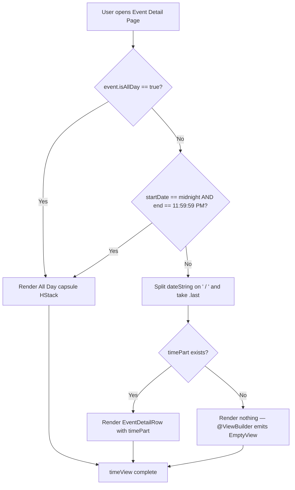

# Technical Specification: ASOS-7 - Display "All Day" Indicator on Event Detail Page

**Status:** Draft
**Author:** Tech Lead Agent
**Created:** 2026-07-01

---

## 🎯 Problem

### Context

The Events feature (`berkeley-mobile/Events/`) surfaces campus events to UC Berkeley students and staff. When a user taps an event row in the events list, the app navigates to `EventDetailView`, which renders a header card via `BMDetailHeaderView` (`berkeley-mobile/Events/EventDetailView.swift:104`). That card lays out four rows in order: event name → date → time → location.

### Current State (Bug)

`BMDetailHeaderView.timeView` (line 153–158) always derives the time string by splitting `event.dateString` on `" / "` and taking the `.last` component:

```swift
// EventDetailView.swift:153-158 — current broken implementation
@ViewBuilder
private var timeView: some View {
    if let timePart = event.dateString.components(separatedBy: " / ").last {
         EventDetailRow(systemImageName: "clock", text: timePart)
    }
}
```

The `dateString` computed property on `BMCalendarEvent` (`berkeley-mobile/Data/ItemProtocols/BMCalendarEvent.swift:38`) contains an all-day detection branch that returns `"All Day"` as the time portion — but only when both `startDate` is exactly midnight and `end` is exactly 11:59:59 PM. For events sourced from Firestore via `EventsDataService`, the `isAllDay: Bool?` flag is already deserialized from `BerkeleyEvent` and stored on `BMEventCalendarEntry` (`berkeley-mobile/Events/EventDataSource/BMEventCalendarEntry.swift:61`). However, the current `timeView` ignores `isAllDay` entirely. If the upstream source sets `isAllDay = true` without also setting the times to midnight/11:59 PM, `dateString` will return a misleading time (e.g. "12:00 AM") rather than "All Day", and that raw time string is displayed to the user.

### Desired State

When `event.isAllDay == true` (or when the legacy midnight-to-23:59:59 time pattern is detected), `timeView` MUST render a capsule/pill-shaped "All Day" badge instead of a time string. The visual treatment must match the existing `AllDayEventBannerView` component (`berkeley-mobile/Events/AllDayEventBannerView.swift`) — a `Capsule().fill(.gray.opacity(0.5))` with a `"All Day"` `Text` label in `BMFont.bold(15)`. The time row must always be present for every event; only its content changes.

### Business Impact

- Users viewing all-day events (academic calendar holidays, enrollment deadlines, campus-wide events) see "12:00 AM" where no time is meaningful, eroding trust in the app's data accuracy.
- The `AllDayEventBannerView` already establishes "All Day" as the visual language for this concept in the list view; the detail page is inconsistent.

### Constraints

- **No model changes**: `BMEventCalendarEntry.isAllDay` already exists (line 61). `BerkeleyEvent.isAllDay` already flows through `EventsDataService.fetchEventsGroupedByDate` (line 67). No Firestore schema or data model changes required.
- **No new files**: The fix is a surgical edit to `timeView` inside `BMDetailHeaderView` in `EventDetailView.swift`. No new source files are needed.
- **No DI changes**: `EventsViewModel` is already registered in `BerkeleyMobile+Injection.swift`; `BMDetailHeaderView` receives `event: BMEventCalendarEntry` directly.
- **Fallback**: When `isAllDay` is `nil` or `false`, the legacy `dateString`-based time display must continue unchanged (BR-002, BR-004).
- **Accessibility**: The "All Day" capsule text must be VoiceOver-readable (BR per NFR).
- **Scope**: Only `BMDetailHeaderView.timeView` changes. `EventDetailRow` is a pure display component — it may need a content-based init variant added (see Architecture section), or the capsule is inlined directly in `timeView`. No changes to `EventRowView`, `AllDayEventBannerView`, or any data layer.

---

## 📋 Architectural Decisions

### Decision 1 — How to render the "All Day" capsule inside `timeView`

The existing `EventDetailRow` struct (`EventDetailView.swift:177`) accepts `systemImageName: String` and `text: String`. There are three approaches to introducing the capsule content.

| | Option A: Inline capsule in `timeView` | Option B: Generic content `EventDetailRow` init | Option C: New `AllDayTimeRowView` component |
|---|---|---|---|
| **Description** | Conditionally emit `HStack { Image(...) + Capsule overlay }` directly inside `@ViewBuilder private var timeView` | Add a second `EventDetailRow` initializer that accepts `@ViewBuilder content` instead of `text`, used only for the all-day branch | Extract a new standalone SwiftUI struct for the all-day time row |
| **Pros** | Zero structural changes; entirely self-contained; easiest to review | Keeps `EventDetailRow` the canonical row abstraction; composable | Clear named component |
| **Cons** | Slightly more code in `timeView`; capsule styling is duplicated from `AllDayEventBannerView` (accepted) | Adds complexity to `EventDetailRow` for a single caller | New file for a ~10-line view; over-engineered for scope |
| **Effort** | XS | S | S |
| **Alignment** | Matches the codebase pattern for `dateView` and `locationView` which also inline their full `HStack` | Moderate — adds an overload for one call site | Low — docs/code-conventions.md says one type per file; this would be a trivially small file |

**Decision: Option A — inline capsule in `timeView`.**

The existing `dateView` and `locationView` computed properties already inline their own `HStack { Image + Text }` directly rather than using `EventDetailRow`. Adding the capsule inline in `timeView` follows this exact same pattern: the `@ViewBuilder` property renders the appropriate view given the event state. This minimizes blast radius, requires no changes to `EventDetailRow`, and keeps the entire logic change in one property.

The capsule styling (`.gray.opacity(0.5)` fill, `BMFont.bold(15)` text, `height: 30`) is sourced directly from `AllDayEventBannerView` to ensure visual consistency, per BR-003.

---

### Decision 2 — All-day detection logic: `isAllDay` only vs. `isAllDay` + legacy fallback

| | Option A: `isAllDay == true` only | Option B: `isAllDay == true` OR legacy midnight detection |
|---|---|---|
| **Description** | Show "All Day" badge only when `event.isAllDay == true` | Show "All Day" badge when `isAllDay == true` OR when `startDate` is midnight and `end` is 11:59:59 PM (the same condition already in `BMCalendarEvent.dateString`) |
| **Pros** | Simple; single source of truth from the upstream data flag | Handles legacy event records where the flag may be absent but the time pattern implies all-day (Scenario OQ-001) |
| **Cons** | Would regress for older records that already display "All Day" via `dateString` (because those pass `timePart == "All Day"` through today) | Slightly more code; duplicates a check already in `dateString` |
| **Effort** | XS | XS |

**Decision: Option B — `isAllDay == true` OR legacy midnight detection.**

The existing `BMCalendarEvent.dateString` already returns `"All Day"` as the time token for the midnight pattern. The current code passes that `"All Day"` string to `EventDetailRow` as plain text — which renders correctly today but only because `dateString` happens to return the right string. The fix should be explicit: check `isAllDay` first, then fall back to the legacy condition. This satisfies acceptance criterion Scenario 5 ("Legacy all-day detection") from the business spec and open question OQ-001. The logic mirrors what `dateString` already does, so no new Date utility methods are needed.

```
isAllDay → show capsule
else if legacy midnight+23:59:59 → show capsule
else → show timePart from dateString
```

---

### Decision 3 — Whether `EventDetailRow` needs modification

**Decision: No changes to `EventDetailRow`.**

`EventDetailRow` (line 177) accepts `text: String` and renders `Image + Text`. The current two callers (`dateView`, `timeView`) both pass plain text. For the all-day case, the `timeView` will not call `EventDetailRow` at all — it will render an `HStack { Image + Capsule }` directly (Option A above). This keeps `EventDetailRow` unchanged and avoids introducing an overloaded initializer for one internal call site.

---

### Decision Flow



---

## 🏗️ Architecture and Implementation

### Architectural Pattern

The Events feature uses **SwiftUI with `@Observable` ViewModel** injected via FactoryKit. `EventDetailView` is a pure SwiftUI view receiving a `BMEventCalendarEntry` value directly. `BMDetailHeaderView` is a private sub-view composing four `@ViewBuilder` computed properties (`eventNameView`, `dateView`, `timeView`, `locationView`). No coordinator, router, or separate repository is involved in this display-only change.

### Component Map

| Component | Path | Role in this change |
|---|---|---|
| `BMDetailHeaderView` | `berkeley-mobile/Events/EventDetailView.swift:104` | Contains `timeView` — **only file modified** |
| `BMEventCalendarEntry` | `berkeley-mobile/Events/EventDataSource/BMEventCalendarEntry.swift:11` | Provides `isAllDay: Bool?` (line 61) and `startDate`, `end` — **read-only, no change** |
| `BMCalendarEvent.dateString` | `berkeley-mobile/Data/ItemProtocols/BMCalendarEvent.swift:38` | Legacy all-day detection reference — **no change** |
| `AllDayEventBannerView` | `berkeley-mobile/Events/AllDayEventBannerView.swift:12` | Source of capsule styling tokens — **no change** |
| `EventDetailRow` | `berkeley-mobile/Events/EventDetailView.swift:177` | Used for timed events in the else-branch — **no change** |
| `BMFont` | `berkeley-mobile/Assets/Fonts.swift` | `BMFont.bold(15)` for capsule label — **no change** |

### Data Flow

```
Firestore "Events" collection
  └─ BerkeleyEvent.isAllDay: Bool?          ← upstream flag
       └─ EventsDataService.fetchEventsGroupedByDate()
            └─ BMEventCalendarEntry.isAllDay: Bool?  (line 61)
                 └─ EventDetailView(event:)
                      └─ BMDetailHeaderView(event:)
                           └─ timeView (MODIFIED)
                                ├─ isAllDay == true  → All Day capsule HStack
                                ├─ legacy midnight check → All Day capsule HStack
                                └─ else → EventDetailRow(text: timePart)
```

### Files to Modify

**Exactly one file changes:**

`berkeley-mobile/Events/EventDetailView.swift` — replace `timeView` (lines 153–158) inside `BMDetailHeaderView`.

No other files are touched.

---

### Implementation Plan

#### Step 1 — Add `isAllDay` computed helper on `BMDetailHeaderView`

Inside `BMDetailHeaderView`, derive a private `Bool` that encapsulates the two-condition all-day check. This keeps `timeView` readable.

```swift
// Add below `private var locationView` in BMDetailHeaderView

private var isAllDayEvent: Bool {
    if event.isAllDay == true { return true }
    // Legacy: midnight start, 23:59:59 end
    return event.startDate.doesDateComponentsAreEqualTo(hour: 0, minute: 0, sec: 0)
        && (event.end?.doesDateComponentsAreEqualTo(hour: 11, minute: 59, sec: 59) ?? false)
}
```

`Date.doesDateComponentsAreEqualTo(hour:minute:sec:)` is defined in `berkeley-mobile/Utils/Date+Extension.swift:141` — already available, no import needed.

#### Step 2 — Replace `timeView` in `BMDetailHeaderView`

Replace the current implementation (lines 153–158) with the conditional:

```swift
// BEFORE (lines 153-158):
@ViewBuilder
private var timeView: some View {
    if let timePart = event.dateString.components(separatedBy: " / ").last {
         EventDetailRow(systemImageName: "clock", text: timePart)
    }
}

// AFTER:
@ViewBuilder
private var timeView: some View {
    if isAllDayEvent {
        HStack(spacing: 6) {
            Image(systemName: "clock")
                .font(.system(size: 16))
            Capsule()
                .fill(.gray.opacity(0.5))
                .frame(height: 24)
                .overlay(
                    Text("All Day")
                        .font(Font(BMFont.bold(15)))
                        .padding(.horizontal, 8)
                )
                .fixedSize(horizontal: true, vertical: false)
        }
        .accessibilityElement(children: .ignore)
        .accessibilityLabel("All Day event")
    } else if let timePart = event.dateString.components(separatedBy: " / ").last {
        EventDetailRow(systemImageName: "clock", text: timePart)
    }
}
```

**Notes on the template:**
- `Capsule().fill(.gray.opacity(0.5))` mirrors `AllDayEventBannerView.swift:18-19` exactly.
- `BMFont.bold(15)` matches `AllDayEventBannerView.swift:24`.
- `height: 24` (vs. 30 in the banner) is appropriate for the smaller row context; this is a judgment call consistent with the "same visual style" requirement without copying the full-width banner geometry.
- `.fixedSize(horizontal: true, vertical: false)` prevents the capsule from expanding to fill the `HStack`.
- `.accessibilityElement(children: .ignore)` + `.accessibilityLabel("All Day event")` collapses the icon + capsule into a single VoiceOver element with a meaningful label (NFR — Accessibility).
- The `else if let timePart` branch preserves existing behavior byte-for-byte (BR-002).

#### Step 3 — Update `sampleEntry` in `#Preview` (optional but recommended)

The `#Preview` block at line 212 uses `BMEventCalendarEntry.sampleEntry` which has no `isAllDay` set (defaults to `false`). To make the Xcode preview immediately show the all-day branch for development verification, a second preview entry can be added inline:

```swift
// In EventDetailView.swift at the bottom — add alongside existing preview
#Preview("All Day Event") {
    let allDayEvent = BMEventCalendarEntry(
        name: "Golden Bear Orientation",
        date: Calendar.current.startOfDay(for: Date()),
        end: nil,
        location: "Memorial Stadium",
        isAllDay: true
    )
    EventDetailView(event: allDayEvent)
}
```

This preview is development-only and has zero runtime impact.

---

### Integration Points

- **No DI wiring changes**: `BMDetailHeaderView` receives `event: BMEventCalendarEntry` via its own initializer, injected by `EventDetailView`. No new FactoryKit registrations needed.
- **No `BMCalendarEvent` protocol changes**: `dateString` is used unchanged in the `else` branch.
- **No `EventDetailRow` changes**: the struct is used as-is in the timed branch.
- **No `AllDayEventBannerView` changes**: styling is copied by value, not composed.
- **No new files**: the entire change is contained in `EventDetailView.swift`.

---

## ✅ Testing, Security, and Definition of Done

### Testing Strategy

#### Current Test Infrastructure

Per `docs/testing-standards.md`: the repository has **no application-level XCTest target**. No unit tests, UI tests, or snapshot tests exist for any of the in-scope symbols (`BMDetailHeaderView`, `EventDetailView`, `BMEventCalendarEntry`). The only testing artefacts are vendor Pod utilities.

#### Recommended Tests to Add

Given the absence of a test target, the minimum viable verification path is **Xcode Previews** (already supported in the codebase) and **manual QA** against the acceptance criteria. If a test target is introduced in the future, the following tests should be written:

##### Unit Tests (XCTest — `EventsTests` target, to be created)

| Test case | Assertion |
|---|---|
| `testIsAllDayEvent_whenFlagTrue_returnsCapsule` | Create `BMEventCalendarEntry(isAllDay: true)`, present `BMDetailHeaderView`, assert `timeView` does **not** contain a `Text` with a time string; assert it contains `Text("All Day")` |
| `testIsAllDayEvent_whenFlagFalse_returnsTimeString` | Create `BMEventCalendarEntry(isAllDay: false)` with a noon start, assert `timeView` contains `Text("Noon")` |
| `testIsAllDayEvent_whenFlagNil_returnsTimeString` | Create entry with `isAllDay: nil`, assert time string is shown (fallback to timed display) |
| `testIsAllDayEvent_legacyMidnightPattern_returnsCapsule` | Create entry with midnight start, 23:59:59 end, `isAllDay: nil`, assert capsule shown |
| `testIsAllDayEvent_legacyMidnightPattern_withExplicitFalse` | Create entry with midnight start but `isAllDay: false`, assert time string shown (explicit flag overrides legacy detection — BR-004) |
| `testIsAllDayEvent_noEndDate_stillShowsCapsule` | `isAllDay: true`, `end: nil`, assert capsule rendered |

> **Note on the last test**: BR-004 states the app MUST use the provided flag. When `isAllDay == false` explicitly, even if times look like midnight/23:59, the flag wins. This is consistent with the decision that `isAllDay == true` is the primary branch, and legacy detection only fires when `isAllDay` is `nil` or absent.

##### UI / Snapshot Tests

| Test | Coverage |
|---|---|
| Snapshot: `BMDetailHeaderView` with `isAllDay: true` | Regression guard for capsule styling |
| Snapshot: `BMDetailHeaderView` with `isAllDay: false` | Regression guard — timed display unchanged |
| Accessibility audit: all-day capsule `accessibilityLabel` | Verify `"All Day event"` label is present via `XCUIAccessibility` |

##### Manual QA Checklist (required before merge, since no test target exists)

- [ ] Open an all-day event in the Events tab → time row shows the "All Day" capsule
- [ ] Open a timed event → time row shows the time string exactly as before
- [ ] Open an all-day event with no location → "All Day" capsule shows; no location row; no blank space
- [ ] Dark Mode: capsule is visible against both light and dark `.regularMaterial` backgrounds
- [ ] VoiceOver: focus on the time row → reads "All Day event" (not icon + text separately)
- [ ] Contrast: capsule text meets WCAG AA 4.5:1 against `.gray.opacity(0.5)` fill

---

## 🔒 Security Considerations

| Area | Assessment |
|---|---|
| Input validation | `event.isAllDay` is a `Bool?` decoded from Firestore. The fix reads it defensively (`== true` pattern, not force-unwrap). No injection vector. |
| Data exposure | `isAllDay` is a display-only flag with no PII. No new data is read from user input or external APIs. |
| UI injection | The "All Day" text is a string literal — not derived from user input or network data. No XSS-equivalent vector. |
| Authentication | No auth-gated data is touched. The fix is in a pure display layer. |
| Dependency changes | No new dependencies, frameworks, or Pods are introduced. |
| `NSCoding` | `BMEventCalendarEntry.encode(with:)` does not encode `isAllDay`. Decoded entries (from device calendar cache) will have `isAllDay = nil`, which falls back to the legacy detection path per our decision. This is safe and consistent. |

---

## ✅ Definition of Done

### Implementation

- [ ] `BMDetailHeaderView.isAllDayEvent` computed property added in `EventDetailView.swift`
- [ ] `BMDetailHeaderView.timeView` replaced with the conditional capsule/time-string implementation
- [ ] Capsule styling matches `AllDayEventBannerView` (`.gray.opacity(0.5)`, `BMFont.bold(15)`)
- [ ] Clock icon is retained in the all-day branch (BR-005, OQ-002)
- [ ] `accessibilityLabel("All Day event")` is set on the all-day `HStack`
- [ ] The `else` branch is byte-for-byte equivalent to the original `timeView` logic (no regression for timed events)
- [ ] `#Preview("All Day Event")` block added for development verification

### Testing

- [ ] Manual QA checklist above fully passed in the Simulator (iPhone 15 Pro, iOS 18)
- [ ] Manual QA checklist above fully passed on a physical device (if available)
- [ ] Dark Mode verified (time row legible)
- [ ] VoiceOver verified (reads "All Day event" for all-day, reads time string for timed)

### Quality

- [ ] Build passes with zero warnings for the modified file (`swift build` or Xcode)
- [ ] No `FIXME`/`TODO` comments left in the modified section
- [ ] Xcode Preview renders correctly for both all-day and timed states
- [ ] Code review sign-off from at least one reviewer

### Documentation

- [ ] PR description references this spec and the issue key ASOS-7
- [ ] Inline comments not needed — logic is self-explanatory via `isAllDayEvent` naming

---

## 🚫 Out of Scope

Per business spec section 8, the following are explicitly excluded:

- **Event list/row view** (`EventRowView`, `EventsDateSectionView`): The time display on event list rows is not changed.
- **`AllDayEventBannerView`**: The existing list-view banner component is not modified; its styling is copied by value.
- **`BMCalendarEvent.dateString`**: The protocol's computed property is not changed; it remains the source for the timed `timePart` string.
- **`BMEventCalendarEntry.encode(with:)` / `NSCoding`**: `isAllDay` is not added to the encoded fields. Calendar-cached events will fall back gracefully.
- **`EventDetailRow`**: No new initializer or overload is added.
- **Adding to device calendar behavior**: `BMEventManager` and EventKit integration are untouched.
- **Back-end / Firestore schema**: No new fields or collection changes.
- **Push notifications, reminders**: Out of scope.
- **Event editing or creation**: The app is read-only for events.
- **Academic calendar vs. campus-wide event tabs**: The fix applies uniformly to any `BMEventCalendarEntry` with `isAllDay == true`.

---

## 📚 References

### `docs/*.md` Consulted

- `docs/tech.md` — UIKit + SwiftUI mixed architecture, Swift Observation `@Observable`, FactoryKit DI, Firebase Firestore patterns
- `docs/structure.md` — Events feature module layout (`Events/`, `EventDataSource/`), `Common/`, `Assets/` paths
- `docs/code-conventions.md` — `@ViewBuilder` patterns, `MARK:` section delimiters, `UpperCamelCase` types, no inline comments convention
- `docs/testing-standards.md` — Confirmed absence of any application test target
- `docs/api-standards.md` — Confirmed `isAllDay` flows through `async/await` Firestore path via `BerkeleyEvent.isAllDay → BMEventCalendarEntry.isAllDay`

### CodeGraph Queries Performed

| Query | Purpose |
|---|---|
| `BMDetailHeaderView EventDetailView timeView event detail` | Located the exact `timeView` implementation and its surrounding context |
| `AllDayEventBannerView BMCalendarEvent dateString isAllDay` | Found existing all-day visual component and legacy detection logic in `BMCalendarEvent.dateString` |
| `BMEventCalendarEntry isAllDay sampleEntry` | Confirmed `isAllDay: Bool?` field (line 61), init signature, and `sampleEntry` for preview |
| `EventDetailRow init systemImageName content label accessibilityLabel` | Confirmed `EventDetailRow` signature; found `withoutAnimation`, `Shadowfy`, `BMFont`, color tokens in `View+Extension.swift` |
| `BerkeleyMobile+Injection eventsViewModel Container FactoryKit` | Confirmed no DI wiring changes needed |

### Related Specs and Components

- `specs/ASOS-7/business-requirements.md` — Business requirements, acceptance criteria, edge cases
- `specs/ASOS-7/prototype/README.md` — UI prototype with exact line references and design tokens
- `berkeley-mobile/Events/AllDayEventBannerView.swift` — Source-of-truth for capsule visual style
- `berkeley-mobile/Data/ItemProtocols/BMCalendarEvent.swift` — Legacy all-day detection in `dateString`
- `berkeley-mobile/Events/EventDataSource/BMEventCalendarEntry.swift` — `isAllDay` field
