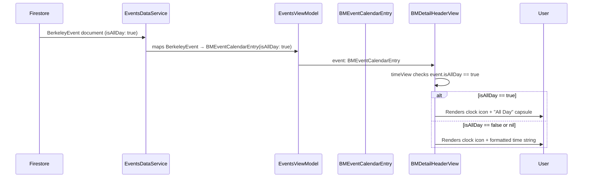
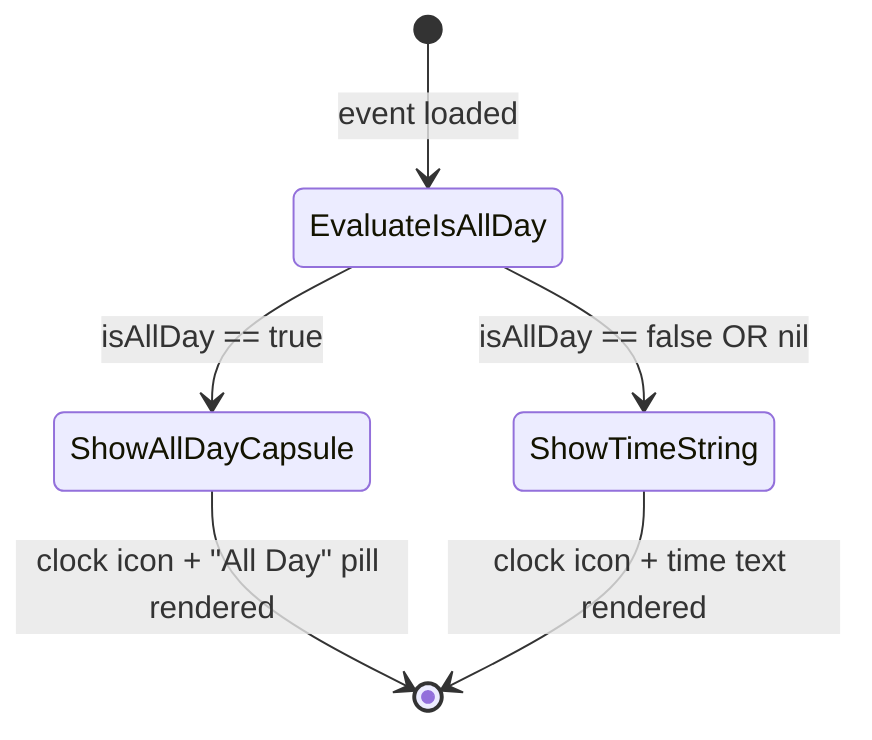

# Technical Specification: ASOS-8 - Display "All Day" Indicator on Event Detail Page

**Status:** Draft
**Author:** B3 Tech Lead Agent
**Created:** 2026-07-14
**Stack:** Swift / SwiftUI (iOS)
**Platform:** [MOBILE] — iOS only

---

## 🎯 Problem

### Context

Berkeley Mobile is a Swift/SwiftUI iOS application serving UC Berkeley campus community members. The Events feature displays campus events sourced from the Firestore `"Events"` collection via `EventsDataService`. Each event is represented by a `BMEventCalendarEntry` model object, which carries an optional `isAllDay: Bool?` field.

### Root Cause

`BMDetailHeaderView.timeView` (inside `EventDetailView.swift`, lines 154–158) derives the time string to display by splitting the output of `event.dateString` on `" / "` and taking the last component. The `dateString` computed property (defined in `BMCalendarEvent.swift`, the protocol extension) uses a **time-component heuristic** to detect all-day events: it checks whether `startDate` equals 00:00:00 and `end` equals 23:59:59. However, backend all-day events store midnight (00:00:00) as the start time, but the end time may not be precisely 23:59:59. This causes `dateString` to fall through the heuristic and return the formatted start time (`"12:00 AM"`) instead of `"All Day"`.

The `isAllDay: Bool?` field on `BMEventCalendarEntry` (line 61 of `BMEventCalendarEntry.swift`) is the authoritative, explicit flag for all-day status, but the `timeView` never consults it.

### Affected Component Inventory

| Component | File | Role |
|---|---|---|
| `BMDetailHeaderView.timeView` | `berkeley-mobile/Events/EventDetailView.swift:154` | **Bug site** — renders time row from `dateString` without checking `isAllDay` |
| `BMEventCalendarEntry.isAllDay` | `berkeley-mobile/Events/EventDataSource/BMEventCalendarEntry.swift:61` | Source of truth for all-day status (`Bool?`) |
| `BMCalendarEvent.dateString` | `berkeley-mobile/Data/ItemProtocols/BMCalendarEvent.swift:38` | Protocol extension; heuristic-based — **not modified** |
| `AllDayEventBannerView` | `berkeley-mobile/Events/AllDayEventBannerView.swift:12` | Existing capsule component used in list view — reference for design pattern |
| `EventDetailRow` | `berkeley-mobile/Events/EventDetailView.swift:177` | Shared row view (icon + text) used by `dateView`, `timeView`, `locationView` |
| `BMEventCalendarEntry.sampleEntry` | `berkeley-mobile/Events/EventDataSource/BMEventCalendarEntry.swift:136` | Preview fixture — no `isAllDay` set, so `isAllDay == nil` |

### User Impact

When any all-day campus event (holiday, enrollment period, full-day exhibit, etc.) is opened on the Event Detail Page, users see `"12:00 AM"` in the time row — an incorrect and misleading time value. This is live in production for all users.

### Out-of-Scope Components (Not Modified)

- `BMCalendarEvent.dateString` protocol extension and its heuristic
- `AllDayEventBannerView` (list-level capsule banner)
- `EventRowView` (list row display)
- Firestore data pipeline and `EventsDataService`
- Android platform (iOS-only repository)

---

## 📋 Architectural Decisions

### Decision 1 — Where to Implement the All-Day Guard

**Options considered:**

| Option | Description | Trade-offs |
|---|---|---|
| A — Patch `BMCalendarEvent.dateString` | Update the protocol extension to also check `isAllDay` | Would require adding `isAllDay` to the protocol; ripples to all conformers; changes a shared contract for a single view's bug |
| B — Rewrite `timeView` in `BMDetailHeaderView` to check `isAllDay` directly | `timeView` inspects `event.isAllDay` before parsing `dateString` | Minimal blast radius; single-purpose fix; keeps the protocol unchanged; aligns with BR-005 and BR-008 |
| C — Add a new computed property on `BMEventCalendarEntry` | e.g., `var timeDisplayString: String` that encapsulates the logic | Extra indirection for a one-line conditional; premature abstraction given no other callers need it |

**Decision: Option B**

`BMDetailHeaderView.timeView` is the only call site exhibiting the bug. Patching it directly is the smallest, safest change. The `isAllDay` field already exists on `BMEventCalendarEntry` and is already populated by `EventsViewModel`. No protocol changes are needed.

---

### Decision 2 — Visual Representation of the "All Day" Indicator

**Options considered:**

| Option | Description | Trade-offs |
|---|---|---|
| A — Plain `Text("All Day")` inside `EventDetailRow` | Reuse existing row component with a string | Does not meet BR-004 / AC-004 requiring a capsule/pill shape |
| B — Custom inline `Capsule` shape in `timeView` | Inline SwiftUI `Capsule().overlay(Text(...))` beside the clock icon | Consistent with `AllDayEventBannerView`'s existing `Capsule().fill(.gray.opacity(0.5))` pattern (BR-004); no new file needed; clock icon remains visible (BR-007) |
| C — New reusable `AllDayCapsuleView` component in `Common/` | Extracted standalone component | Justified only if used in >1 place; currently one use site; out of scope to refactor `AllDayEventBannerView` to use it |

**Decision: Option B**

Inline `Capsule` within `timeView` mirrors the styling already established in `AllDayEventBannerView` (gray, 0.5 opacity, `BMFont.bold` label), maintaining visual consistency without introducing unnecessary abstraction. The clock icon is preserved in an `HStack` before the capsule.

---

### Decision 3 — Nil-Safety Handling for `isAllDay`

**Business rule BR-006** specifies: when `isAllDay` is `nil`, treat the event as NOT all-day.

Swift optional unwrapping via `event.isAllDay == true` (or equivalently `event.isAllDay ?? false`) correctly maps:
- `nil` → `false` → show time (correct per BR-006)
- `false` → show time
- `true` → show capsule

This requires no additional model changes.

---

### Decision 4 — String Literal vs. Localization

**NFR-004** notes that `"All Day"` must be defined in a localizable way. The project currently uses no formal localization mechanism (no `Localizable.strings`, no `String(localized:)` catalog pattern). The existing codebase uses raw string literals throughout (including `AllDayEventBannerView`'s `Text("All Day")`).

**Decision:** Use `Text("All Day")` consistent with the codebase convention. Document as a known limitation in this spec. If localization is introduced project-wide in the future, this string is a candidate for extraction.

---

### Data Flow Diagram



---

### State Machine for `timeView`



---

## 🏗️ Architecture and Implementation

### Overview

This is a [MOBILE]-only, single-file change. No backend, data pipeline, model schema, or protocol changes are required. The only modified file is:

```
berkeley-mobile/Events/EventDetailView.swift
```

---

### 1. Modified Component: `BMDetailHeaderView.timeView`

**File:** `berkeley-mobile/Events/EventDetailView.swift`  
**Current implementation (lines 153–158):**

```swift
@ViewBuilder
private var timeView: some View {
    if let timePart = event.dateString.components(separatedBy: " / ").last {
         EventDetailRow(systemImageName: "clock", text: timePart)
    }
}
```

**Problem:** This code calls `event.dateString`, which uses a time-component heuristic (start == 00:00:00 AND end == 23:59:59). If the backend stores midnight as the all-day placeholder without setting `end` to exactly 23:59:59, the heuristic fails and `timePart` becomes `"12:00 AM"`, displayed unconditionally.

---

**New implementation:**

```swift
@ViewBuilder
private var timeView: some View {
    HStack(spacing: 8) {
        Image(systemName: "clock")
            .font(.system(size: 16))

        if event.isAllDay == true {
            Text("All Day")
                .font(Font(BMFont.bold(12)))
                .padding(.horizontal, 8)
                .padding(.vertical, 3)
                .background(
                    Capsule()
                        .fill(.gray.opacity(0.5))
                )
        } else if let timePart = event.dateString.components(separatedBy: " / ").last {
            Text(timePart)
                .font(Font(BMFont.regular(12)))
        }
    }
}
```

**Design rationale:**

- The `HStack` with the `Image(systemName: "clock")` replaces the `EventDetailRow` wrapper so the clock icon and the conditional content can coexist at the same level. `EventDetailRow` accepts only a `text: String` parameter and cannot render a non-text child — thus a direct `HStack` is used here, consistent with `locationView` which also uses a manual `HStack`.
- `event.isAllDay == true` is the guard (nil-safe, per BR-005 and BR-006).
- The `Capsule` styling mirrors `AllDayEventBannerView`: `fill(.gray.opacity(0.5))` with bold text — ensuring visual consistency (BR-004, AC-004).
- Font sizes (`BMFont.bold(12)` for the label, consistent with the 12pt scale used in the info rows) follow the existing font scale in `BMDetailHeaderView`.
- The `else if` branch retains the original `dateString`-based time display for timed events (BR-003, AC-002, AC-003).
- When `isAllDay == true` and `dateString` would also happen to include `"All Day"` (EC-004), the explicit flag branch fires first — no double "All Day" can appear.

---

### 2. No Changes Required

| Component | Reason |
|---|---|
| `BMEventCalendarEntry` | `isAllDay: Bool?` field already present (line 61) and already populated by `EventsViewModel` |
| `EventsViewModel` | Already maps `BerkeleyEvent.isAllDay` → `BMEventCalendarEntry.isAllDay` (line 67 per business spec) |
| `BMCalendarEvent.dateString` | Protocol extension kept intact per BR-008 |
| `AllDayEventBannerView` | Unmodified per BR-008 |
| `EventDetailRow` | Not used for `timeView` in the new implementation (replaced by direct `HStack`) |
| `EventDetailView` | Outer view struct, toolbar, description and button sections unchanged |
| Firestore / data pipeline | No change |

---

### 3. Preview Update

The `#Preview` macro at the bottom of `EventDetailView.swift` uses `BMEventCalendarEntry.sampleEntry`, which has `isAllDay == nil`. To verify the capsule in Xcode canvas, add a second preview with `isAllDay = true`. No code-path change in production is needed.

**Addendum to `#Preview` block (template only — not the production fix):**

```swift
#Preview("All Day Event") {
    let allDayEvent = BMEventCalendarEntry(
        name: "Campus Holiday",
        date: Calendar.current.startOfDay(for: Date()),
        end: nil,
        descriptionText: "No classes today.",
        location: "UC Berkeley Campus",
        imageURL: "",
        sourceLink: nil,
        isAllDay: true
    )
    NavigationStack {
        EventDetailView(event: allDayEvent)
    }
}
```

> Note: The `BMEventCalendarEntry` initializer must accept `isAllDay:` for this to compile. Verify the designated initializer signature in `BMEventCalendarEntry.swift` to confirm the parameter is already present (the model already stores the field at line 61 and the sample entry constructor uses no `isAllDay:` argument, implying it defaults to `nil` in a convenience init or is set post-init). Adjust preview accordingly.

---

### 4. Accessibility

Per **NFR-003**, the "All Day" capsule must be readable by VoiceOver. SwiftUI's `Text("All Day")` inside a `Capsule` overlay is automatically accessible — VoiceOver will read the text content. No additional `.accessibilityLabel` modifier is required unless QA testing reveals VoiceOver reads the `Capsule` shape rather than the text child.

If VoiceOver issues are found during testing, add `.accessibilityElement(children: .combine)` to the capsule container.

---

### 5. Edge-Case Handling Summary

| Edge Case | Spec Reference | Handling |
|---|---|---|
| `isAllDay = true`, non-midnight start time | EC-001 | Shows capsule — `isAllDay` flag takes precedence |
| `isAllDay = false`, times are midnight/23:59 | EC-002 | Shows time from `dateString` — heuristic irrelevant; flag is authoritative |
| `isAllDay = true`, no `end` date | EC-003 | Shows capsule — `end` is not consulted |
| `isAllDay = true`, start and end both midnight | EC-004 | Shows capsule — `isAllDay == true` branch fires before `dateString` is parsed |
| `isAllDay = nil` | BR-006, AC-003 | `event.isAllDay == true` evaluates `false`; falls through to time string |
| Multiple all-day events navigated in sequence | EC-005 | SwiftUI re-evaluates `timeView` body per event binding — no state bleed |

---

## ✅ Testing, Security, and Definition of Done

### Testing Strategy

> **Note:** As documented in `docs/testing-standards.md`, the repository currently has no automated test suite (no XCTest target, no Quick/Nimble, no test files). All testing is therefore manual or via Xcode canvas previews until a test target is established.

#### Manual Test Cases

The following test cases map directly to the business acceptance criteria and edge cases.

| TC-ID | Scenario | AC/BR ref | Steps | Expected Result |
|---|---|---|---|---|
| TC-001 | All-day event: time row shows capsule | AC-001 | Open Event Detail Page for an event with `isAllDay = true` | Clock icon visible; "All Day" capsule/pill rendered; no time value visible |
| TC-002 | Timed event: time row shows time | AC-002 | Open Event Detail Page for an event with `isAllDay = false` or `nil` | Clock icon visible; formatted start time shown (and end time if present); no "All Day" capsule |
| TC-003 | nil `isAllDay`: treated as timed | AC-003 | Open Event Detail Page for an event where `isAllDay` is absent from Firestore | Time value shown; no capsule |
| TC-004 | Capsule visual style | AC-004 | Inspect time row on all-day event | Text "All Day" enclosed in a gray, pill-shaped background consistent with `AllDayEventBannerView` |
| TC-005 | Event list row unaffected | AC-005 | View an all-day event in the Events list | List row continues to display `dateString` as before; no visual change |
| TC-006 | Date row unaffected | AC-006 | Open Event Detail Page for any event | Date row (calendar icon) unchanged |
| TC-007 | `isAllDay = true`, non-midnight time | EC-001 | Construct an event with `isAllDay = true` and `startDate` at 09:00 | Capsule shown; no time value |
| TC-008 | `isAllDay = false`, midnight start | EC-002 | Construct an event with `isAllDay = false` and `startDate` at 00:00 | "12:00 AM" or `dateString` heuristic result shown; no capsule |
| TC-009 | `isAllDay = true`, no end date | EC-003 | Construct event with `isAllDay = true` and `end = nil` | Capsule shown |
| TC-010 | Multiple events navigated in sequence | EC-005 | Navigate between an all-day event and a timed event | Capsule shown only on all-day; time shown on timed; no state bleed |

#### Xcode Canvas Preview

Add the `"All Day Event"` preview variant (shown in Implementation section §3) to `EventDetailView.swift`. This provides immediate visual regression feedback for the capsule during development.

#### Recommended Future Test Infrastructure

When an XCTest target is added to the project:

**Unit tests** — `BMDetailHeaderViewTests` (or as a `ViewInspector`-based test):
- Assert that `timeView` renders a `Capsule` + `Text("All Day")` when `isAllDay == true`
- Assert that `timeView` renders a `Text` with the time string when `isAllDay == false`
- Assert that `timeView` renders a `Text` with the time string when `isAllDay == nil`

**Snapshot tests** — If `swift-snapshot-testing` or similar is introduced:
- Snapshot `BMDetailHeaderView` for `isAllDay = true` and `isAllDay = false` states
- Reference snapshots checked into version control to catch regressions

---

### Security Checklist

This change is a pure UI display fix with no network, storage, or authentication implications. The checklist below is included for completeness per B3/Berkeley Mobile security baseline:

- [x] **No new network calls** — change reads from `event.isAllDay`, a field already loaded from Firestore as part of the existing event model. NFR-001 confirmed.
- [x] **No PII in view or logs** — `isAllDay` is a non-personal boolean flag. No CPF, account number, email, or token is introduced or logged.
- [x] **No new UserDefaults keys** — no persisted state introduced.
- [x] **No new FactoryKit registrations** — no new view models or services.
- [x] **No authentication changes** — existing event access control is unchanged.
- [x] **Offline-safe** — `isAllDay` is part of the `BMEventCalendarEntry` model decoded at fetch time and cached by `EventsDataService`; behavior is identical online and offline (NFR-002).
- [x] **Accessibility** — `Text("All Day")` is VoiceOver-readable without additional annotations (NFR-003).
- [x] **Backward compatibility** — `isAllDay == nil` is handled gracefully; pre-existing Firestore documents without the field are treated as timed events (BR-006, NFR-006).

---

### Definition of Done

| Gate | Criterion |
|---|---|
| Build | `xcodebuild -workspace berkeley-mobile.xcworkspace -scheme berkeley-mobile build` exits with code 0, no errors or warnings introduced by the change |
| Manual QA — TC-001 | All-day event shows "All Day" capsule in time row |
| Manual QA — TC-002 | Timed event shows correct time (zero regression) |
| Manual QA — TC-005 | Event list rows unchanged |
| Canvas preview | All Day Event preview renders capsule; default preview (sampleEntry, `isAllDay == nil`) renders time |
| Code review | Single-file diff reviewed; no extraneous changes; decision rationale understood |

---

### Out of Scope

- Changes to `BMCalendarEvent.dateString` protocol extension (BR-008)
- Changes to `AllDayEventBannerView` or `EventRowView` (BR-008)
- Firestore data pipeline changes
- Localization of "All Day" string into other languages (NFR-004 — documented as known limitation)
- Android platform (iOS-only repository per business spec §8)

---

### References

| Resource | Path / Link |
|---|---|
| Bug site | `berkeley-mobile/Events/EventDetailView.swift:154` — `BMDetailHeaderView.timeView` |
| Event model | `berkeley-mobile/Events/EventDataSource/BMEventCalendarEntry.swift:61` — `isAllDay: Bool?` |
| Existing capsule pattern | `berkeley-mobile/Events/AllDayEventBannerView.swift:12` |
| Protocol date string | `berkeley-mobile/Data/ItemProtocols/BMCalendarEvent.swift:38` — `dateString` (not modified) |
| Business requirements | `specs/ASOS-8/business-requirements.md` |
| Code conventions | `docs/code-conventions.md` |
| Tech overview | `docs/tech.md` |
| Testing standards | `docs/testing-standards.md` |
