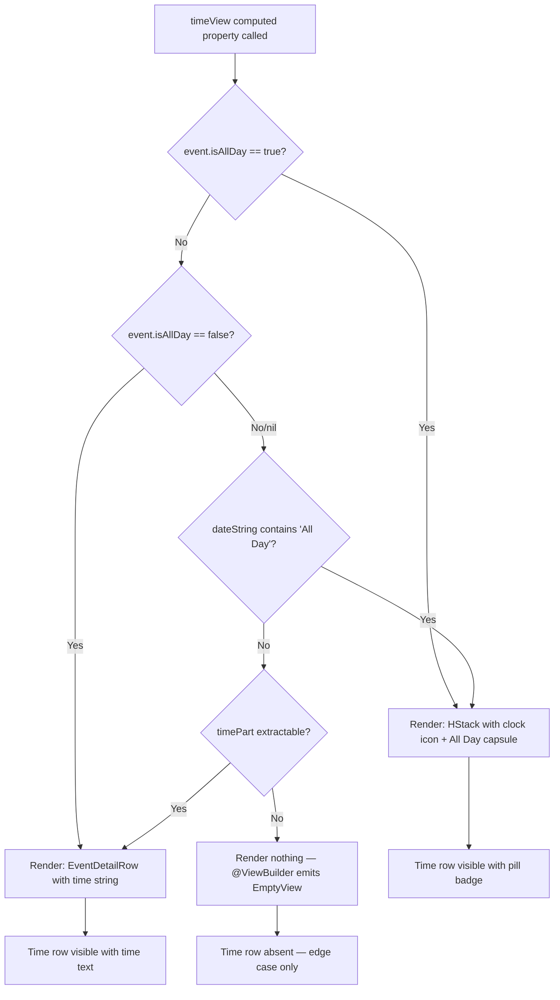

# Technical Specification: ASOS-9 - Display "All Day" Indicator Instead of Time on Event Detail Page

**Status:** Draft
**Author:** Tech Lead Agent
**Created:** 2026-07-15

---

## 🎯 Problem

### Context

The Berkeley Mobile iOS app (v11.14.1) is a native Swift/SwiftUI application for UC Berkeley students that surfaces campus events via a Firestore-backed `Events` collection. The Events feature is composed of:

- `EventsDataService` — fetches and decodes `BerkeleyEventsDaySnapshot` / `BerkeleyEvent` documents from Firestore
- `BMEventCalendarEntry` — the model class conforming to `BMCalendarEvent`, which holds per-event data including `isAllDay: Bool?` (line 61 of `berkeley-mobile/Events/EventDataSource/BMEventCalendarEntry.swift`)
- `BMDetailHeaderView` (inside `EventDetailView.swift`) — the SwiftUI view that renders the Event Detail Page header with date, time, and location rows

### Current State (The Bug)

The `timeView` computed property in `BMDetailHeaderView` (lines 153–158 of `berkeley-mobile/Events/EventDetailView.swift`) always derives the time string from `event.dateString` using a string split:

```swift
@ViewBuilder
private var timeView: some View {
    if let timePart = event.dateString.components(separatedBy: " / ").last {
         EventDetailRow(systemImageName: "clock", text: timePart)
    }
}
```

The `dateString` property (defined in the `BMCalendarEvent` extension in `BMCalendarEvent.swift`) only returns `"All Day"` as the time component when `startDate` has components `(hour: 0, minute: 0, sec: 0)` AND `end` has components `(hour: 11, minute: 59, sec: 59)` — a purely time-based heuristic. It does **not** consult `isAllDay`.

**Two failure paths exist:**
1. **API flag path (primary bug)**: An event arrives from Firestore with `isAllDay: true` but with a non-midnight `startDate` (e.g., the backend stored `12:00 AM` as UTC or the scraper set a default date). In this case `dateString` computes a real time string (e.g., `"12:00 AM"`), and `timeView` displays `"12:00 AM"` to the user — misleading and incorrect.
2. **Heuristic-only path (secondary gap)**: If an event has midnight start / 11:59 PM end but `isAllDay` is `nil`, `dateString` returns `"All Day"` as plain text. `timeView` then renders it via `EventDetailRow` as plain text without the required capsule/pill visual treatment — failing the business requirement for visual distinctiveness (BR-004).

The `EventsView.swift` list view already correctly uses `event.isAllDay == true` to branch into `AllDayEventBannerView` vs `EventRowView` (lines 25–30 of `EventsView.swift`), but `EventDetailView`'s `timeView` has no such branching.

### Desired State

When an event is all-day (determined by `isAllDay == true` OR by the time-based heuristic), the time row on the Event Detail Page must display an `"All Day"` label styled as a capsule/pill badge — consistent with the visual language of the existing `AllDayEventBannerView` (which uses `Capsule().fill(.gray.opacity(0.5))` and `BMFont.bold`). For all other events, the existing time display must remain unchanged.

### Impact

- **User confusion**: Students see `"12:00 AM"` on all-day events (holidays, enrollment windows, exhibits) and may misread their schedules or think an event starts at midnight.
- **Data accuracy defect**: Every all-day event with a non-midnight server timestamp actively presents false information. This affects a well-defined, non-trivial subset of events in the Firestore `"Events"` collection.
- **Design inconsistency**: The list view already handles all-day events correctly; the detail page does not, creating an inconsistent in-app experience.

### Constraints

- Only `berkeley-mobile/Events/EventDetailView.swift` needs to change. No backend, data model, or other view file requires modification.
- The visual style of the capsule must match the existing `AllDayEventBannerView` design language (`.gray.opacity(0.5)` or `.gray.opacity(0.2)` fill, `BMFont.bold`, `Capsule()` clip shape).
- `EventDetailRow` currently only accepts a `text: String` parameter. Any approach must either extend `EventDetailRow` or render the capsule inline — without breaking the two existing `EventDetailRow` callers (`dateView` and `timeView` in `BMDetailHeaderView`).
- The time row must never be blank (BR-006) and must never crash on nil/missing data (EC-001).

---

## 📋 Architectural Decisions

### Decision 1: Which all-day signal is authoritative? (Resolves OQ-001)

**Background**: Two signals exist — the explicit `isAllDay: Bool?` flag on `BMEventCalendarEntry` and the time-based heuristic in `BMCalendarEvent.dateString` (midnight start + 11:59 PM end).

| Option | Description | Pros | Cons |
|--------|-------------|------|------|
| **A — Explicit flag only** | Show capsule only when `event.isAllDay == true` | Simple; respects EC-003 (midnight vigil shown as timed) | Misses events with `isAllDay: nil` but midnight/11:59 timestamps |
| **B — Heuristic only** | Show capsule only when `dateString` time component equals `"All Day"` | No new property read | Breaks EC-003; midnight events w/ `isAllDay: false` get capsule |
| **C — Flag first, heuristic fallback** (recommended) | `isAllDay == true` → capsule; `isAllDay == nil/false` → check heuristic; explicit `false` → never capsule | Handles both API sources; respects EC-003 (explicit `false` overrides); handles legacy nil data | Slightly more conditional logic |

**Decision: Option C — explicit flag takes precedence; heuristic is the fallback for nil.**

**Rationale**: `EventsView.swift` already uses `event.isAllDay == true` as the sole gate for `AllDayEventBannerView`. Adopting the same pattern in the detail view ensures consistency. The heuristic fallback is a safety net for events where the backend does not set `isAllDay`. Explicit `false` correctly overrides the heuristic (EC-003).

**All-day determination logic:**
```
isAllDay == true            → show capsule
isAllDay == false           → show time (explicit negative wins)
isAllDay == nil             → check dateString for "All Day" suffix → if yes, show capsule; else show time
```

---

### Decision 2: How to render the capsule within the time row?

The time row must keep its clock icon (`"clock"` SF Symbol) and always be present. The existing `EventDetailRow` struct (`EventDetailView.swift:177`) takes only `systemImageName: String` and `text: String` — it cannot render a SwiftUI sub-view as the label content.

| Option | Description | Pros | Cons |
|--------|-------------|------|------|
| **A — Add a generic content initializer to `EventDetailRow`** | Add `init(systemImageName:, content:) where Content: View` as a second initializer | Reusable; mirrors the pattern used by `AllDayEventBannerView` overlay pattern | Changes a shared struct; requires `@ViewBuilder` overload |
| **B — Inline capsule in `timeView` without using `EventDetailRow`** | Duplicate the HStack with `Image(systemName: "clock")` + capsule directly in `timeView` | Zero shared-struct changes; minimally invasive | Minor code duplication of the icon+content HStack pattern |
| **C — Replace `timeView` content with EventDetailRow for text and add capsule branch** (recommended) | When all-day: render `HStack { Image("clock") + capsuleLabel }` inline. When timed: use existing `EventDetailRow(text:)` | No change to `EventDetailRow` — zero blast radius on callers; exact same visual result | Slightly more lines in `timeView` |

**Decision: Option C — inline capsule rendering inside `timeView`; `EventDetailRow` untouched.**

**Rationale**: `EventDetailRow` is used in two places and the callers rely on its current interface. Extending it would be the correct abstraction for a richer feature but exceeds the minimal scope of this bug fix. The `locationView` computed property in the same struct already uses a raw `HStack` with an SF Symbol without `EventDetailRow`, establishing precedent for inline icon+content rendering.

**CodeGraph evidence**: `EventDetailRow` blast-radius analysis shows exactly 2 callers — both in `BMDetailHeaderView` (`dateView` and `timeView`). Changing `EventDetailRow`'s interface risks the `dateView` caller. Inline rendering in `timeView` is zero-risk.

---

### Decision 3: Capsule visual style — exact tokens

The `AllDayEventBannerView` (the existing component this must match per the business requirements) uses:
- Background fill: `Capsule().fill(.gray.opacity(0.5))`
- Text font: `Font(BMFont.bold(15))`
- Padding: `.horizontal, 10` / `.vertical, 4`

For the **inline capsule in the time row**, the capsule must fit within the compact row layout alongside the clock icon. The prototype README specifies a slightly smaller variant:
- Background: `Color.gray.opacity(0.2)` (lighter, appropriate for inside a `.regularMaterial` card)
- Font: `Font(BMFont.bold(12))` — matching the row's overall `BMFont.light(12)` scale
- Padding: `.horizontal, 8` / `.vertical, 3`

This matches the prototype's suggested implementation and is consistent with the `.regularMaterial` background of `BMDetailHeaderView` — the lighter `.gray.opacity(0.2)` ensures legibility without over-darkening the material background.

---

## 🔄 Decision Flow



---

## 🏗️ Architecture

### Architectural Pattern

This change touches a single view layer in a feature module. The app uses a **UIKit + SwiftUI hybrid** architecture with **FactoryKit** dependency injection. The Events feature follows MVVM:

- **Model**: `BMEventCalendarEntry` (class, `NSObject`, `BMCalendarEvent`) + `BerkeleyEvent` (struct, `Codable`)
- **ViewModel**: `EventsViewModel` (`@Observable`, `@MainActor`) + `EventsDataService` (service, not a view model proper)
- **View**: `EventDetailView` → `BMDetailHeaderView` → `timeView` (the single affected computed property)

No new layer, type, or service is required. This fix is entirely within the View layer.

### Affected Components

| File | Change Type | Description |
|------|-------------|-------------|
| `berkeley-mobile/Events/EventDetailView.swift` | **Modify** | Replace `timeView` body in `BMDetailHeaderView` |

No other file requires modification.

### Data Flow (Unchanged)

```
Firestore "Events" collection
    └─► EventsDataService.fetchEventsGroupedByDate()
            └─► BerkeleyEvent { isAllDay: Bool? }
                    └─► BMEventCalendarEntry(isAllDay: $0.isAllDay)
                            └─► EventsViewModel.eventsGroupedByDate
                                    └─► EventDetailView(event:)
                                            └─► BMDetailHeaderView(event:)
                                                    └─► timeView  ← fix applied here
```

The `isAllDay` field travels from Firestore (`BerkeleyEvent.isAllDay`) through `EventsDataService` (line 67 of `EventsViewModel.swift`: `isAllDay: $0.isAllDay`) into `BMEventCalendarEntry.isAllDay` (line 61 of `BMEventCalendarEntry.swift`). No changes to this path are required — the field is already available at the view layer.

---

## 💻 Implementation

### Step 1 — Modify `timeView` in `BMDetailHeaderView`

**File**: `berkeley-mobile/Events/EventDetailView.swift`  
**Location**: `BMDetailHeaderView`, lines 153–158

#### Current code (lines 153–158):

```swift
@ViewBuilder
private var timeView: some View {
    if let timePart = event.dateString.components(separatedBy: " / ").last {
         EventDetailRow(systemImageName: "clock", text: timePart)
    }
}
```

#### Replacement code:

```swift
@ViewBuilder
private var timeView: some View {
    let isAllDay = event.isAllDay == true
        || (event.isAllDay == nil
            && event.dateString.components(separatedBy: " / ").last == "All Day")

    if isAllDay {
        HStack {
            Image(systemName: "clock")
                .font(.system(size: 16))
            Text("All Day")
                .font(Font(BMFont.bold(12)))
                .padding(.horizontal, 8)
                .padding(.vertical, 3)
                .background(Color.gray.opacity(0.2))
                .clipShape(Capsule())
                .accessibilityLabel("All Day")
        }
    } else if let timePart = event.dateString.components(separatedBy: " / ").last {
        EventDetailRow(systemImageName: "clock", text: timePart)
    }
}
```

**Key implementation decisions reflected in the template:**

1. **`isAllDay` local constant**: Consolidates the two-signal logic into one readable Boolean. `event.isAllDay == true` is the primary gate (mirrors `EventsView.swift` line 25). The `== nil` fallback reads the existing `dateString` heuristic without re-implementing it.

2. **`event.isAllDay == false` implicit handling**: If `isAllDay` is `false`, neither branch of the outer condition is true. The `else if` falls through to the existing `EventDetailRow` path — correctly displaying a timed event's time string. Explicit `false` defeats the heuristic (EC-003).

3. **`HStack` with `Image(systemName: "clock")`**: Mirrors the `locationView` pattern in the same struct (lines 160–171), which uses a raw `HStack { Image(...) Text(...) }` rather than `EventDetailRow`. This is an established local pattern.

4. **`.font(.system(size: 16))`**: Matches the existing `EventDetailRow` icon size (line 183 of `EventDetailRow.body`).

5. **`Font(BMFont.bold(12))`**: Uses the project's `BMFont` type factory (Apercu-Bold, 12pt) — smaller than `AllDayEventBannerView`'s `BMFont.bold(15)` to fit within the compact row context.

6. **`Color.gray.opacity(0.2)`**: Lighter than `AllDayEventBannerView`'s `.gray.opacity(0.5)` — appropriate for the `.regularMaterial` card background of `BMDetailHeaderView`.

7. **`.accessibilityLabel("All Day")`**: Ensures screen readers announce "All Day" — the capsule shape does not interfere with VoiceOver (BR-004, NFR accessibility).

8. **`@ViewBuilder`**: Retained — consistent with the existing annotation and required for multi-branch conditional view synthesis.

### Step 2 — Update the `#Preview` to cover the all-day case

**File**: `berkeley-mobile/Events/EventDetailView.swift`  
**Location**: bottom of file, line 212

#### Current preview (line 212–214):

```swift
#Preview {
    EventDetailView(event: BMEventCalendarEntry.sampleEntry)
}
```

#### Add a second preview block below:

```swift
#Preview("All Day Event") {
    let allDayEntry = BMEventCalendarEntry(
        name: "University Holiday",
        date: Date().getStartOfDay(),
        end: nil,
        descriptionText: "Campus closed.",
        location: "UC Berkeley",
        registerLink: nil,
        imageURL: nil,
        sourceLink: nil,
        isAllDay: true
    )
    EventDetailView(event: allDayEntry)
}
```

This provides an in-editor visual check of the all-day capsule without requiring a test target. It follows the `#Preview` convention already used across the codebase (e.g., `BMActionButton.swift`, `SafetyView.swift`, `CalendarSectionView.swift`).

### Integration Points

| Integration point | Notes |
|---|---|
| `EventDetailRow` (line 177) | **Unchanged** — both existing callers (`dateView`, `timeView`'s timed branch) continue using the same struct with the same interface |
| `BMDetailHeaderView.dateView` (line 146) | **Unchanged** — date row is not in scope |
| `BMDetailHeaderView.locationView` (line 160) | **Unchanged** — location row is not in scope |
| `BMEventCalendarEntry.isAllDay` (line 61) | Read-only property access — no change required |
| `BMCalendarEvent.dateString` (protocol extension) | Read-only — no change required |
| `AllDayEventBannerView` | **Not reused** — it includes `event.name` in the banner (designed for list rows); the detail page time row is narrower in scope |

### No DI or Registration Changes

`BMDetailHeaderView` is a private struct within `EventDetailView.swift` and uses no injected dependencies of its own — it receives `event: BMEventCalendarEntry` as a `let` property. No FactoryKit registration changes are needed.

---

## ✅ Testing Strategy

### Existing Test Infrastructure

CodeGraph blast-radius analysis confirms: **no formal automated test suite (XCTest, XCUITest) exists** in this repository. `docs/testing-standards.md` explicitly documents this finding — no `*Tests` directories or `XCTestCase` subclasses are present. All formal tests for this change must therefore be manual or via SwiftUI `#Preview`.

### SwiftUI Previews (Primary Verification Mechanism)

Per project convention (`CalendarSectionView.swift`, `SafetyView.swift`, `BMActionButton.swift`), SwiftUI `#Preview` blocks are the in-editor visual check layer.

**Required previews in `EventDetailView.swift`**:

| Preview Name | `isAllDay` | `startDate` | Expected time row |
|---|---|---|---|
| (existing) default | `nil` | timed event | Time string (e.g., `"2:00 PM – 4:00 PM"`) |
| `"All Day Event"` (new) | `true` | `Date().getStartOfDay()` | `"All Day"` capsule |

The second preview block (Step 2 of the implementation) directly exercises the primary fix path (`isAllDay == true`).

### Manual Test Matrix

Execute on a device or simulator before marking the issue done:

| Test case | Setup | Expected result |
|---|---|---|
| **TC-01** All-day event (flag) | Event with `isAllDay: true`, `startDate` = any time | Time row shows `"All Day"` capsule; no time value |
| **TC-02** All-day event (heuristic) | Event with `isAllDay: nil`, `startDate` = midnight, `end` = 23:59:59 | Time row shows `"All Day"` capsule |
| **TC-03** Timed event (flag false) | Event with `isAllDay: false`, midnight start | Time row shows `"12:00 AM"` — NOT capsule |
| **TC-04** Timed event (regular) | Event with start/end times, `isAllDay: nil` | Time row shows time range |
| **TC-05** Timed event (start only) | Event with start, no `end`, `isAllDay: nil` | Time row shows start time only |
| **TC-06** All-day event, no end | `isAllDay: true`, `end` = nil | Time row shows `"All Day"` capsule |
| **TC-07** Date row unaffected | All-day event | Date row shows Today/Tomorrow/date — unchanged |
| **TC-08** Time row always visible | All-day event | Time row is present (BR-006) |
| **TC-09** Long event name | All-day event with 60+ char name | Capsule visible, not clipped |
| **TC-10** VoiceOver | All-day event | Accessibility label reads "All Day" |
| **TC-11** List → Detail navigation | Tap all-day event from list | List shows `AllDayEventBannerView`; detail shows capsule in time row |

### If a Test Target Is Added in Future

Should the project adopt XCTest, the following unit test structure is recommended for this logic. File path (if created): `berkeley-mobiletests/Events/EventDetailViewTests.swift`.

```swift
final class BMDetailHeaderViewTimeLabelTests: XCTestCase {

    private func makeEntry(isAllDay: Bool?, startHour: Int, endHour: Int?, endMinute: Int? = 0, endSecond: Int? = 0) -> BMEventCalendarEntry {
        let calendar = Calendar.current
        let start = calendar.date(bySettingHour: startHour, minute: 0, second: 0, of: Date())!
        let end: Date? = endHour.map { calendar.date(bySettingHour: $0, minute: endMinute!, second: endSecond!, of: Date())! }
        return BMEventCalendarEntry(name: "Test", date: start, end: end,
                                    descriptionText: nil, location: nil,
                                    registerLink: nil, imageURL: nil,
                                    sourceLink: nil, isAllDay: isAllDay)
    }

    func testIsAllDayTrue_alwaysShowsCapsule() {
        // isAllDay flag wins regardless of startDate time
        let entry = makeEntry(isAllDay: true, startHour: 9, endHour: 17)
        XCTAssertTrue(entry.isAllDay == true)
        // View verification: BMDetailHeaderView(event: entry).timeView renders capsule (manual/preview)
    }

    func testIsAllDayFalse_midnightStart_showsTime() {
        // Explicit false: never show capsule even if midnight (EC-003)
        let entry = makeEntry(isAllDay: false, startHour: 0, endHour: 23, endMinute: 59, endSecond: 59)
        XCTAssertEqual(entry.isAllDay, false)
    }

    func testIsAllDayNil_heuristicMatch_showsCapsule() {
        // nil + midnight/23:59:59 → dateString contains "All Day"
        let entry = makeEntry(isAllDay: nil, startHour: 0, endHour: 23, endMinute: 59, endSecond: 59)
        XCTAssertNil(entry.isAllDay)
        XCTAssertEqual(entry.dateString.components(separatedBy: " / ").last, "All Day")
    }

    func testIsAllDayNil_noHeuristicMatch_showsTime() {
        let entry = makeEntry(isAllDay: nil, startHour: 9, endHour: 17)
        XCTAssertNil(entry.isAllDay)
        XCTAssertNotEqual(entry.dateString.components(separatedBy: " / ").last, "All Day")
    }

    func testIsAllDayTrue_noEndDate_showsCapsule() {
        let entry = makeEntry(isAllDay: true, startHour: 0, endHour: nil)
        XCTAssertTrue(entry.isAllDay == true)
    }
}
```

---

## 🔒 Security Considerations

| Concern | Assessment |
|---|---|
| **Data trust** | `isAllDay` is a `Bool?` decoded from Firestore via `Codable` on `BerkeleyEvent`. No user-controlled input. No injection risk. |
| **Input validation** | The `isAllDay == true` check is a boolean comparison — no string parsing, no format assumptions. |
| **UI injection** | The capsule renders the hardcoded string literal `"All Day"` — not any user-supplied or server-supplied string. No XSS-equivalent risk. |
| **Crash safety** | The `@ViewBuilder` with `if`/`else if` ensures `EmptyView` is emitted when all conditions fail. No force-unwraps introduced. |
| **Accessibility** | `.accessibilityLabel("All Day")` explicitly sets the accessibility text — the capsule shape does not replace the semantic label. |
| **Dark mode** | `Color.gray.opacity(0.2)` adapts natively via SwiftUI's adaptive color system. `BMFont` provides system-font fallback when Apercu is unavailable. |

No security review is required for this change — it is a purely presentational bug fix within a single computed property.

---

## ✅ Definition of Done

### Implementation

- [ ] `timeView` in `BMDetailHeaderView` (`EventDetailView.swift`) updated per the template in Step 1
- [ ] All-day capsule uses `Font(BMFont.bold(12))`, `Color.gray.opacity(0.2)`, `Capsule()`, `.padding(.horizontal, 8)`, `.padding(.vertical, 3)`
- [ ] Clock SF Symbol (`.font(.system(size: 16))`) retained alongside capsule
- [ ] `.accessibilityLabel("All Day")` applied to the `Text("All Day")`
- [ ] `EventDetailRow` struct is unchanged (no interface modifications)
- [ ] `#Preview("All Day Event")` block added for in-editor verification

### Logic Correctness

- [ ] `isAllDay == true` → capsule shown (TC-01)
- [ ] `isAllDay == nil` + heuristic match → capsule shown (TC-02)
- [ ] `isAllDay == false` + midnight start → time shown, not capsule (TC-03)
- [ ] Timed events continue to show time string (TC-04, TC-05)
- [ ] All-day event with no `end` → capsule shown (TC-06)
- [ ] Date row and location row are unaffected
- [ ] Time row is always present for any event with data (BR-006)

### Quality

- [ ] No force-unwraps introduced
- [ ] No new compilation warnings
- [ ] SwiftUI Preview for all-day case renders correctly in Xcode canvas
- [ ] Manual test matrix TC-01 through TC-11 all pass on simulator or device
- [ ] VoiceOver reads "All Day" for the capsule (TC-10)
- [ ] Capsule does not clip or overflow with long event names (TC-09)
- [ ] Dark mode renders legibly (gray opacity on `.regularMaterial` background)

### Code Review

- [ ] PR description references ASOS-9 and explains the two-signal logic
- [ ] No commented-out code or debug artifacts left in the file
- [ ] Implementation matches this spec's template exactly or with approved deviations documented in the PR

---

## 🚫 Out of Scope

Per business-requirements section 8, the following are explicitly excluded from this ticket:

- Changes to the Events list view (`EventsView.swift`) or calendar grid — the `AllDayEventBannerView` in the list is already correct
- Changes to `BMCalendarEvent.dateString` or the time-based heuristic itself
- Changes to `AllDayEventBannerView`
- Changes to `BMEventCalendarEntry`, `BerkeleyEvent`, or `EventsDataService`
- Backend / Firestore schema changes
- Adding the "All Day" indicator to event row cards in the list view
- Changes to the date row, location row, description, buttons, or toolbar in `EventDetailView`
- `BMEventManager` / calendar export behavior for all-day events
- Push notification or calendar integration for all-day events
- Filtering or sorting by all-day status

---

## 📚 References

### Docs Consulted
- `docs/tech.md` — architecture, SwiftUI/UIKit hybrid, FactoryKit DI, concurrency patterns
- `docs/structure.md` — feature module layout, `Events/` directory, `Common/` directory
- `docs/code-conventions.md` — `BMFont`, `BMColor`, `#Preview`, `@ViewBuilder`, `@InjectedObservable` patterns
- `docs/testing-standards.md` — no formal test target; `#Preview` is the verification mechanism
- `docs/api-standards.md` — Firestore Pattern 3 (direct Firestore access in `EventsDataService`)
- `specs/ASOS-9/business-requirements.md` — BR-001 through BR-006, EC-001 through EC-005, AC scenarios
- `specs/ASOS-9/prototype/README.md` — design token values, exact code location, suggested implementation

### CodeGraph Queries Performed
1. `EventDetailView timeView EventDetailRow BMCalendarEvent dateString isAllDay` — retrieved all source for `EventDetailView.swift` and `BMCalendarEvent.swift`
2. `BMEventCalendarEntry isAllDay AllDayEventBannerView` — retrieved `BMEventCalendarEntry.swift`, `AllDayEventBannerView.swift`, `EventsView.swift`, `CalendarView.swift`
3. `EventsDataService BerkeleyEvent isAllDay Firestore Events collection` — retrieved `EventsViewModel.swift`, confirmed `isAllDay` propagation path
4. `BMColor BMFont EventDetailRow @ViewBuilder content label` — retrieved `EventDetailView.swift` (full), `View+Extension.swift`, `Fonts.swift`, confirmed design token usage

### Related Specs / Issues
- ASOS-9 issue: [Events Page] Display (All Day) Indicator Instead of Time on Event Detail Page
- Related symbol: `AllDayEventBannerView` (`berkeley-mobile/Events/AllDayEventBannerView.swift`) — all-day design language reference
- Related symbol: `BMCalendarEvent.dateString` (`berkeley-mobile/Data/ItemProtocols/BMCalendarEvent.swift`) — existing heuristic
- Related symbol: `EventsView.swift` line 25 — existing `isAllDay == true` pattern used in list view
