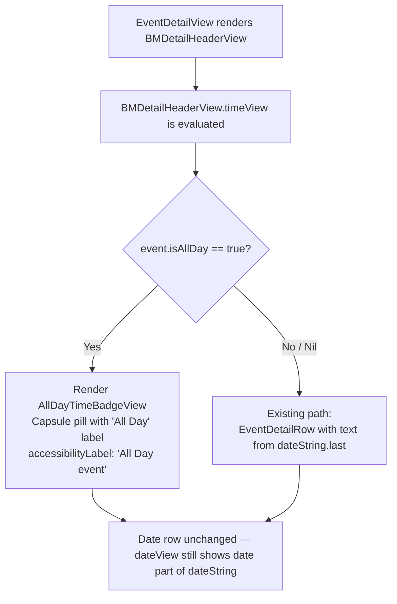
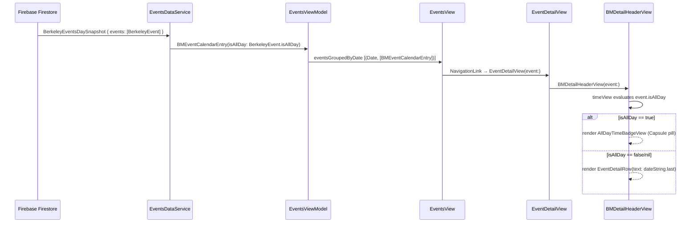

# Technical Specification: ASOS-9 — Display "All Day" Indicator on Event Detail Page

**Status:** Draft
**Author:** B3 Tech Lead Agent
**Created:** 2026-07-14
**Stack:** Swift / SwiftUI (iOS — berkeley-mobile)
**Platform tag:** [MOBILE]

---

## 🎯 Problem

### Context

Berkeley Mobile is an iOS application (Swift / SwiftUI) that surfaces campus events sourced from Firebase Firestore. Events are modelled by two types:

- **`BerkeleyEvent`** (`EventsViewModel.swift:23`) — the raw Firebase Codable struct; carries `isAllDay: Bool?` directly from the backend.
- **`BMEventCalendarEntry`** (`BMEventCalendarEntry.swift:11`) — the UI model used throughout the Events feature; stores `isAllDay: Bool?` and is passed to all views.

### Root Cause

`BMDetailHeaderView.timeView` (inside `EventDetailView.swift:154–158`) blindly splits `event.dateString` on `" / "` and renders the last component as plain text inside a generic `EventDetailRow`:

```swift
@ViewBuilder
private var timeView: some View {
    if let timePart = event.dateString.components(separatedBy: " / ").last {
        EventDetailRow(systemImageName: "clock", text: timePart)
    }
}
```

`dateString` is computed by the `BMCalendarEvent` protocol extension (`BMCalendarEvent.swift:38–65`). For events where `startDate` is midnight and `end` is 23:59:59, it appends `"All Day"` — but this heuristic is **not** tied to the authoritative `isAllDay` flag. The result:

| Event type | `dateString` output | `timeView` renders |
|---|---|---|
| All-day (isAllDay = true) | `"Today / All Day"` | Plain text `"All Day"` in `EventDetailRow` — no visual distinction |
| All-day with inconsistent time | `"Today / 12:00 AM"` | `"12:00 AM"` — inaccurate and misleading |
| Timed event | `"Today / 10:00 AM - 11:30 AM"` | Correct |

### What Is Not Broken

- **`EventsView.swift:25`** — the list correctly branches on `event.isAllDay == true` to render `AllDayEventBannerView` vs `EventRowView`.
- **`AllDayEventBannerView.swift`** — the existing pill/capsule design element already uses `Capsule()` with a gray fill and "All Day" label.
- **`BMEventCalendarEntry`** — `isAllDay` is correctly populated from `BerkeleyEvent.isAllDay` during the Firebase-to-model mapping in `EventsDataService.fetchEventsGroupedByDate()` (`EventsViewModel.swift:58–68`).
- The calendar add/remove toolbar flow is unaffected.

### Required Fix (Scoped)

Inside `BMDetailHeaderView.timeView`, consult `event.isAllDay` **first**. When `true`, render a pill-shaped "All Day" badge (a new `AllDayTimeBadgeView` or an inline `Capsule`). When `false` or `nil`, preserve the existing `EventDetailRow` behavior. No change to `dateString`, `BMCalendarEvent`, `EventsView`, or `AllDayEventBannerView` is required.

---

## 📋 Architectural Decisions

### Decision 1 — Signal source for all-day status

**Options considered:**

| Option | Approach | Trade-off |
|---|---|---|
| A | Parse `dateString` for the substring `"All Day"` | Fragile: couples UI behaviour to a string-formatting heuristic; violates BR-007 |
| B | Check `isAllDay == true` on `BMEventCalendarEntry` | Authoritative; directly sourced from Firebase; satisfies BR-001 and BR-007 |
| C | Reintroduce time-component heuristic (00:00:00 / 23:59:59) | Violates BR-001 and EC-002 |

**Decision: Option B.** `event.isAllDay == true` is the sole gate. The flag travels from `BerkeleyEvent.isAllDay` (Firebase) through `EventsDataService` into `BMEventCalendarEntry.isAllDay` without client-side mutation, satisfying BR-001 and NFR-005.

---

### Decision 2 — Where to place the conditional branch

**Options considered:**

| Option | Approach | Trade-off |
|---|---|---|
| A | Modify `dateString` to return a sentinel (e.g. empty string) for all-day events | Causes side-effects in all callers of `dateString` (CalendarView, etc.) — out of scope per business spec §8 |
| B | Branch inside `BMDetailHeaderView.timeView` on `event.isAllDay` | Surgical; touches only `EventDetailView.swift`; zero impact on other consumers |
| C | Add a computed property on `BMEventCalendarEntry` (e.g. `timeDisplayMode`) | An abstraction layer with no present consumer beyond this one view — over-engineering for a one-view change |

**Decision: Option B.** The branch lives entirely inside `BMDetailHeaderView.timeView`. This is consistent with the pattern already used in `EventsView` (line 25), where the list view makes the same `event.isAllDay == true` check locally, and keeps the fix scoped to a single `@ViewBuilder` function.

---

### Decision 3 — Visual representation of the "All Day" indicator

**Options considered:**

| Option | Approach | Trade-off |
|---|---|---|
| A | Reuse `AllDayEventBannerView` directly | That view also renders `event.name`; it's a full-width list-row component, inappropriate for the inline detail context |
| B | Introduce a new `AllDayTimeBadgeView` struct in `EventDetailView.swift` | Self-contained; mirrors `AllDayEventBannerView`'s `Capsule()` idiom at smaller inline scale; follows the file-per-primary-type convention by co-locating with other detail components |
| C | Inline a `Capsule()` directly inside `timeView` | Works, but a named struct is more legible and previews cleanly |

**Decision: Option B.** Define `AllDayTimeBadgeView` as a private struct inside `EventDetailView.swift` (below the existing `MARK: - EventDetailRow` section). It uses `Capsule()` with a muted fill and `BMFont.bold(12)` label, keeping visual language consistent with `AllDayEventBannerView` at an appropriately smaller scale. No new file needed — the struct belongs to the detail view family.

---

### Decision 4 — Accessibility label

Per NFR-002, VoiceOver must receive a meaningful description. `AllDayTimeBadgeView` will carry `.accessibilityLabel("All Day event")` on its root view. This is more informative than the visible label text "All Day" alone, since it adds the noun "event" for screen reader context.

---

### Decision flow diagram



---

## 🏗️ Architecture and Implementation

### Scope of change

**Three files modified** (see §4.5 for full table):

1. `berkeley-mobile/Events/EventDetailView.swift` — primary view change
2. `berkeley-mobile/Assets/Colors/Colors+Event.swift` — new `BMColor` token
3. `berkeley-mobile/en.lproj/Localizable.strings` — localization key

The data model (`BMEventCalendarEntry`), the protocol (`BMCalendarEvent`), the data service (`EventsViewModel`), and all list views are untouched.

---

### 4.1 Modified: `BMDetailHeaderView.timeView`

**Current implementation** (`EventDetailView.swift:153–158`):

```swift
@ViewBuilder
private var timeView: some View {
    if let timePart = event.dateString.components(separatedBy: " / ").last {
         EventDetailRow(systemImageName: "clock", text: timePart)
    }
}
```

**Replacement implementation:**

```swift
@ViewBuilder
private var timeView: some View {
    if event.isAllDay == true {
        HStack(spacing: 8) {
            Image(systemName: "clock")
                .font(.system(size: 16))
            AllDayTimeBadgeView()
        }
    } else if let timePart = event.dateString.components(separatedBy: " / ").last {
        EventDetailRow(systemImageName: "clock", text: timePart)
    }
}
```

**Key design points:**

- The branch `event.isAllDay == true` (not `!= false`) respects the optional: `nil` falls through to the `else if` branch, preserving existing behaviour (BR-004, EC-002).
- `HStack(spacing: 8)` explicitly matches the implicit default `HStack` spacing used inside `EventDetailRow` (line 182: `HStack { Image … Text … }` — no explicit spacing, which renders at SwiftUI's default of 8 pt). Declaring it explicitly prevents unintended visual misalignment between the all-day branch and the date/location rows if SwiftUI's default ever changes.
- The `Image(systemName: "clock")` is retained in the `isAllDay` branch so the time row maintains its icon alignment with the date and location rows — visual consistency with the surrounding `VStack(alignment: .leading, spacing: 4)`.
- The `dateView` computed property is not changed. It still extracts the first component of `dateString`, which for all-day events correctly returns `"Today"` or `"MM/DD/YYYY"` (BR-006).

---

### 4.2 New: `AllDayTimeBadgeView`

Added as a private struct in `EventDetailView.swift`, after the existing `// MARK: - EventDetailRow` section.

**Prerequisite: add `BMColor.allDayBadgeBackground` to `Colors+Event.swift`**

Following the adaptive `UIColor` closure pattern used throughout `BMColor`, add one new token to `berkeley-mobile/Assets/Colors/Colors+Event.swift`:

```swift
// berkeley-mobile/Assets/Colors/Colors+Event.swift

extension BMColor {
    // ... existing event color entries ...

    /// Background fill for the "All Day" time-row badge on the Event Detail Page.
    /// Uses adaptive gray so the badge remains visually coherent in both light and dark mode.
    static var allDayBadgeBackground: UIColor {
        return UIColor { trait in
            trait.userInterfaceStyle == .dark
                ? UIColor(white: 1.0, alpha: 0.18)
                : UIColor(white: 0.0, alpha: 0.12)
        }
    }
}
```

Light value (`UIColor(white: 0.0, alpha: 0.12)`) produces a near-opaque light gray over the `.regularMaterial` card background — slightly more subtle than `AllDayEventBannerView`'s `0.5` opacity because the detail card surface is already elevated. Dark value (`UIColor(white: 1.0, alpha: 0.18)`) is a muted white-tint that reads clearly against the dark material.

**`AllDayTimeBadgeView` struct** (in `EventDetailView.swift`):

```swift
// MARK: - AllDayTimeBadgeView

private struct AllDayTimeBadgeView: View {
    var body: some View {
        Text("all_day_badge_label", bundle: .main)
            .font(Font(BMFont.bold(12)))
            .padding(.horizontal, 10)
            .padding(.vertical, 4)
            .background(Capsule().fill(Color(BMColor.allDayBadgeBackground)))
            .accessibilityLabel("All Day event")
    }
}
```

**Localization key** — add to `Localizable.strings` (English):

```
/* Time-row badge label shown on the Event Detail Page for all-day events */
"all_day_badge_label" = "All Day";
```

Using `Text("all_day_badge_label", bundle: .main)` makes the string visible to `xcodebuild`'s localization export pipeline and to the Xcode String Catalog importer, satisfying NFR-004 without a structural change when future locales are added.

**Design rationale:**

| Property | Value | Justification |
|---|---|---|
| Font | `BMFont.bold(12)` | Matches label weight used in `AllDayEventBannerView` (`BMFont.bold(15)`) at a size appropriate for the inline detail context (`BMFont.light(12)` is the surrounding font size) |
| Shape | `Capsule()` | Matches `AllDayEventBannerView.swift:18` — BR-005 pill shape requirement |
| Fill | `Color(BMColor.allDayBadgeBackground)` | Adaptive `UIColor` closure in `BMColor` (not a raw `.gray` literal) ensures correct rendering in both light and dark mode per the project's color-system contract |
| Padding | H: 10, V: 4 | Proportional to `AllDayEventBannerView`'s H: 10, V: 4 padding at reduced overall height |
| Accessibility | `"All Day event"` | NFR-002: screen reader reads the noun phrase, not just the adjective |
| Localization | `Text("all_day_badge_label", bundle: .main)` | NFR-004: key in `Localizable.strings` is visible to Xcode localization export and String Catalog import; future locale additions require no structural change |

**Placement and future reuse**: `AllDayTimeBadgeView` is declared `private` inside `EventDetailView.swift` because it has exactly one consumer today, consistent with `docs/structure.md`'s single-consumer co-location rule. If a future view (e.g. a new `EventSummaryView` or widget extension) needs the same badge, the upgrade path is: move the struct to `berkeley-mobile/Common/AllDayTimeBadgeView.swift`, change the access level to `internal`, and update the import. No rename is required at that time.

---

### 4.3 Updated `#Preview` block

The existing preview uses `BMEventCalendarEntry.sampleEntry` (a timed event). Add two additional preview variants.

> **Parameter labels verified**: The `BMEventCalendarEntry` initializer signature (confirmed in `BMEventCalendarEntry.swift:80`) uses `name:`, `date:`, `end:`, `descriptionText:`, `location:`, `registerLink:`, `imageURL:`, `sourceLink:`, `type:`, `isAllDay:`. All preview constructor calls below use these exact labels. The `descriptionText:` label is confirmed by both the struct definition and the existing `CalendarView.swift:#Preview` usage.

```swift
#Preview("All Day Event") {
    // Covers AC-001, AC-005, EC-004 (end: nil + isAllDay: true)
    EventDetailView(
        event: BMEventCalendarEntry(
            name: "UC Berkeley Enrollment Opens",
            date: Calendar.current.startOfDay(for: Date()),
            end: nil,
            descriptionText: "All undergraduate enrollment windows open today.",
            isAllDay: true
        )
    )
}

#Preview("Timed Event — isAllDay nil") {
    // Covers AC-002, AC-004, EC-003 regression guard
    // isAllDay is nil (default); dateString may return "All Day" if time components match,
    // but the capsule must NOT appear since isAllDay != true.
    EventDetailView(event: BMEventCalendarEntry.sampleEntry)
}

#Preview("Timed Event — Midnight Start") {
    // Covers EC-002: isAllDay=false, midnight startDate — shows "12:00 AM", no capsule
    EventDetailView(
        event: BMEventCalendarEntry(
            name: "Late-night Seminar",
            date: Calendar.current.startOfDay(for: Date()),
            end: Calendar.current.date(byAdding: .hour, value: 2, to: Calendar.current.startOfDay(for: Date())),
            isAllDay: false
        )
    )
}
```

| Preview name | `isAllDay` | Expected render | Edge cases covered |
|---|---|---|---|
| `"All Day Event"` | `true`, `end: nil` | Clock icon + `AllDayTimeBadgeView` capsule containing "All Day" | AC-001, AC-005, EC-004 |
| `"Timed Event — isAllDay nil"` | `nil` | Clock icon + `EventDetailRow` with time string; no capsule | AC-004, EC-003 regression guard |
| `"Timed Event — Midnight Start"` | `false` | "12:00 AM" in `EventDetailRow`; no capsule | EC-002 |

---

### 4.4 Data flow overview



---

### 4.5 Files changed summary

| File | Change type | Description |
|---|---|---|
| `berkeley-mobile/Events/EventDetailView.swift` | Modify | Replace `timeView` body; add `AllDayTimeBadgeView` struct; update `#Preview` blocks |
| `berkeley-mobile/Assets/Colors/Colors+Event.swift` | Modify | Add `BMColor.allDayBadgeBackground` adaptive `UIColor` token |
| `berkeley-mobile/en.lproj/Localizable.strings` | Modify | Add `"all_day_badge_label" = "All Day"` key for localization export visibility |

No model, protocol, data service, or list-view files are modified.

---

## ✅ Testing, Security, and Definition of Done

### 5.1 Testing Strategy

The repository currently has **no XCTest target** (see `docs/testing-standards.md`). All test coverage for this issue therefore takes the form of:

1. **SwiftUI `#Preview` validation** — the primary verification mechanism used project-wide.
2. **Manual device/simulator testing** against the acceptance criteria below.
3. **A future XCTest unit test** is specified here as the recommended first test to add when a test target is introduced.

#### 5.1.1 SwiftUI Previews (immediate)

Three `#Preview` macros are specified in §4.3:

| Preview name | `isAllDay` | Expected render | Edge cases covered |
|---|---|---|---|
| `"All Day Event"` | `true`, `end: nil` | Clock icon + `AllDayTimeBadgeView` capsule containing "All Day" | AC-001, AC-005, EC-004 |
| `"Timed Event — isAllDay nil"` | `nil` (default) | Clock icon + `EventDetailRow` with time string; no capsule | AC-004, EC-003 regression guard |
| `"Timed Event — Midnight Start"` | `false` | "12:00 AM" in `EventDetailRow`; no capsule | EC-002 |

#### 5.1.2 Manual Test Cases (acceptance criteria mapping)

| AC | Scenario | Steps | Expected |
|---|---|---|---|
| AC-001 | All-day event (isAllDay = true) | Launch app → Events tab → tap an all-day event | Time row shows "All Day" capsule; no numeric time |
| AC-002 | Timed event with end time | Tap a timed event with start + end | Time row shows e.g. "10:00 AM - 11:30 AM" |
| AC-003 | Timed event, no end time | Tap an event with start only | Time row shows start time only |
| AC-004 | isAllDay nil | Tap a timed event (isAllDay not set) | Time row shows time string; no capsule |
| AC-005 | Capsule visual check | View time row of all-day event | Badge is pill-shaped, visually distinct from plain text |
| AC-006 | List page unchanged | Scroll events list | AllDayEventBannerView and EventRowView render as before |
| AC-007 | Calendar add flow | Tap calendar toolbar on all-day event | Add/delete alert appears; calendar saves correctly |
| EC-001 | All-day with non-midnight startDate | Backend sends isAllDay=true with 9:00 AM startDate | Capsule shown (isAllDay wins, not time components) |
| EC-002 (BR-007) | Timed event with midnight start | isAllDay=false, startDate 00:00:00 | "12:00 AM" shown; no capsule |
| EC-003 (BR-007) | dateString returns "All Day" but isAllDay is false/nil | isAllDay=nil, startDate=00:00:00, end=23:59:59 — dateString heuristic would produce "All Day" | Time row shows the `dateString`-derived time string (e.g. "All Day" text in `EventDetailRow`) and **no capsule appears**; validates that capsule gate is `isAllDay`, not string content |
| EC-004 | isAllDay=true with end=nil | isAllDay=true, end=nil (no end date set in Firestore) | Capsule appears; no end time is shown; date row shows event date correctly |
| EC-005 | Rapid navigation | Quickly navigate between all-day and timed events | Each detail page renders the correct indicator without bleed |

#### 5.1.3 Recommended Tests (when test target is added)

The project currently has no XCTest target. The tests below are the **minimum seed** to add when one is introduced. They are ordered by priority: the rendering test (a) is more valuable than the model-level guards (b) because it directly exercises the `@ViewBuilder` conditional that is the primary code change.

##### (a) Rendering test — ViewInspector (highest priority)

Use [ViewInspector](https://github.com/nalexn/ViewInspector) (`swift-package-manager` dependency) to assert the rendered view tree, not just model properties. This directly tests the `@ViewBuilder` conditional branch in `timeView` that is the core change of this issue.

```swift
// Target: EventDetailViewTests.swift (XCTest + ViewInspector)
import XCTest
import ViewInspector
@testable import BerkeleyMobile

final class BMDetailHeaderViewRenderingTests: XCTestCase {

    // AC-001, AC-005: isAllDay=true → AllDayTimeBadgeView must be present
    func test_timeView_showsBadge_whenIsAllDayTrue() throws {
        let event = BMEventCalendarEntry(
            name: "Holiday",
            date: Calendar.current.startOfDay(for: Date()),
            end: nil,
            isAllDay: true
        )
        let view = EventDetailView(event: event)
        // ViewInspector traversal — AllDayTimeBadgeView must appear in the tree
        XCTAssertNoThrow(
            try view.inspect().find(AllDayTimeBadgeView.self),
            "AllDayTimeBadgeView must be present in timeView when isAllDay == true"
        )
    }

    // EC-003, AC-004: isAllDay=nil → AllDayTimeBadgeView must be absent
    func test_timeView_hidesBadge_whenIsAllDayNil() throws {
        let event = BMEventCalendarEntry.sampleEntry  // isAllDay not set → nil
        let view = EventDetailView(event: event)
        XCTAssertThrowsError(
            try view.inspect().find(AllDayTimeBadgeView.self),
            "AllDayTimeBadgeView must NOT appear when isAllDay is nil"
        )
    }

    // EC-002: isAllDay=false, midnight start → AllDayTimeBadgeView must be absent
    func test_timeView_hidesBadge_whenIsAllDayFalseWithMidnightStart() throws {
        let midnight = Calendar.current.startOfDay(for: Date())
        let event = BMEventCalendarEntry(
            name: "Late seminar",
            date: midnight,
            isAllDay: false
        )
        let view = EventDetailView(event: event)
        XCTAssertThrowsError(
            try view.inspect().find(AllDayTimeBadgeView.self),
            "AllDayTimeBadgeView must NOT appear when isAllDay is false, even at midnight (EC-002)"
        )
    }
}
```

> **Note on `AllDayTimeBadgeView` visibility**: Because `AllDayTimeBadgeView` is declared `private` inside `EventDetailView.swift`, the ViewInspector tests above require the struct to be marked `internal` (or the file to use `@testable import`) when the test target is set up. Add `internal` visibility or lift the `private` modifier to `fileprivate` in `EventDetailView.swift` specifically to enable testability — no other consumer is affected.

> **If ViewInspector is not immediately available**: At minimum, add the test stubs above with `XCTFail("ViewInspector not yet integrated — rendering of AllDayTimeBadgeView is untested")` so CI fails explicitly rather than silently skipping the coverage. Link the test file to the follow-up ticket referenced in §5.3.

##### (b) Model-level guard tests (secondary — pure XCTest, no ViewInspector)

These assert that the flag values used as the rendering gate are correctly propagated from the model. They pass even if the conditional branch is absent, so they supplement (a) rather than replace it.

```swift
final class BMEventCalendarEntryAllDayTests: XCTestCase {

    func test_isAllDay_true_isAuthoritative() {
        let event = BMEventCalendarEntry(
            name: "Holiday",
            date: Calendar.current.startOfDay(for: Date()),
            end: nil,
            isAllDay: true
        )
        XCTAssertEqual(event.isAllDay, true)
    }

    func test_isAllDay_nil_treated_as_timed() {
        let event = BMEventCalendarEntry(
            name: "Seminar",
            date: Calendar.current.startOfDay(for: Date()),
            end: nil,
            isAllDay: nil
        )
        XCTAssertNil(event.isAllDay)
    }

    func test_isAllDay_false_with_midnight_start_is_timed() {
        let midnight = Calendar.current.startOfDay(for: Date())
        let event = BMEventCalendarEntry(
            name: "Late seminar",
            date: midnight,
            isAllDay: false
        )
        XCTAssertEqual(event.isAllDay, false)
    }
}
```

---

### 5.2 Security Checklist

This feature is a **pure UI display change** on a consumer student application. The security surface is minimal, but the standard B3/ASUC OCTO checklist is applied:

| Check | Status | Notes | Reference |
|---|---|---|---|
| No PII in logs | ✅ Pass | The change adds no logging. `event.isAllDay` is a boolean; no personal data is touched. | — |
| No sensitive data rendered in capsule | ✅ Pass | `AllDayTimeBadgeView` renders only the static string `"All Day"` — no user data, no account numbers, no tokens. | — |
| No new network call | ✅ Pass | `isAllDay` is evaluated from the already-fetched `BMEventCalendarEntry`; no HTTP request is made. The app is client-only with no outbound HTTP API — all data comes from Firebase SDK. | `docs/api-standards.md` (client-only, no HTTP API) |
| No new Firestore read/write | ✅ Pass | Data layer is untouched. The Firestore read of `BerkeleyEvent.isAllDay` already occurs in `EventsDataService`; this change adds no new read/write operations. | `docs/api-standards.md` (client-only, no HTTP API) |
| No new FactoryKit registration | ✅ Pass | No ViewModel or service is added. | — |
| Accessibility label contains no sensitive data | ✅ Pass | `"All Day event"` is a static, non-personal string. | — |
| `isAllDay` flag not mutated client-side | ✅ Pass | The flag is read-only in this change; its value from Firebase is preserved (NFR-005). | `specs/ASOS-9/business-requirements.md` §NFR-005 |

---

### 5.3 Definition of Done

- [ ] `BMDetailHeaderView.timeView` branches on `event.isAllDay == true` before falling back to `dateString` parsing.
- [ ] `AllDayTimeBadgeView` renders a `Capsule()` filled with `Color(BMColor.allDayBadgeBackground)` and uses `Text("all_day_badge_label", bundle: .main)` with `.accessibilityLabel("All Day event")`.
- [ ] `BMColor.allDayBadgeBackground` is defined in `Colors+Event.swift` using an adaptive `UIColor` closure (light and dark variants).
- [ ] `"all_day_badge_label" = "All Day"` key exists in `Localizable.strings`.
- [ ] All three SwiftUI previews (`"All Day Event"`, `"Timed Event — isAllDay nil"`, `"Timed Event — Midnight Start"`) render correctly in Xcode canvas.
- [ ] All manual test cases in §5.1.2 (including EC-003 and EC-004) pass on simulator (iOS 17+) and a physical device.
- [ ] No regression on the Events list page (`EventsView`, `AllDayEventBannerView`, `EventRowView`).
- [ ] VoiceOver reads "All Day event" when focus lands on the capsule in the time row.
- [ ] Xcode build passes with zero warnings added: `xcodebuild -workspace berkeley-mobile.xcworkspace -scheme berkeley-mobile -configuration Debug build`.
- [ ] `SwiftLint` (if configured) reports no new violations.

**Coverage target (follow-up)**: When an XCTest target is introduced for the project, the `EventDetailView` rendering logic (the `timeView` `@ViewBuilder` conditional) must achieve **≥80% branch coverage**. The minimum seed tests are specified in §5.1.3. Create a follow-up ticket to track test-target setup and wire up the ViewInspector-based rendering tests from §5.1.3(a); until that ticket is resolved, the SwiftUI preview validation in §5.1.1 and the manual test cases in §5.1.2 are the primary verification mechanism.

---

### 5.4 Out of Scope

Per `specs/ASOS-9/business-requirements.md` §8:

- Changes to `EventsView`, `AllDayEventBannerView`, `EventRowView`.
- Changes to `BMCalendarEvent.dateString` computed property.
- Changes to the calendar add/delete flow or `BMEventManager`.
- Changes to `BerkeleyEvent` Codable struct or Firebase schema.
- Localization into Portuguese/Brazilian-Portuguese.
- Push notification behaviour.
- How all-day events appear in the iOS system Calendar after the user adds them.
- The Today feed or any view outside `EventDetailView` / `BMDetailHeaderView`.

---

### 5.5 References

| Resource | Path / Link |
|---|---|
| Detail view (modified) | `berkeley-mobile/Events/EventDetailView.swift` |
| Event model | `berkeley-mobile/Events/EventDataSource/BMEventCalendarEntry.swift` |
| Calendar event protocol | `berkeley-mobile/Data/ItemProtocols/BMCalendarEvent.swift` |
| All-day list banner (reference design) | `berkeley-mobile/Events/AllDayEventBannerView.swift` |
| Data service / isAllDay source | `berkeley-mobile/Events/EventDataSource/EventsViewModel.swift` |
| Events list (isAllDay pattern reference) | `berkeley-mobile/Events/EventsView.swift:25` |
| Business requirements | `specs/ASOS-9/business-requirements.md` |
| Repository | https://github.com/gouveiahenrique/berkeley-mobile-ios |
