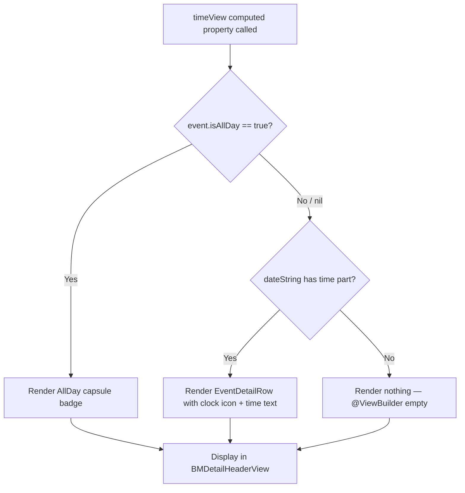

# Technical Specification: GOP-63 - Display "All Day" Indicator on Event Detail Page

**Status:** Draft
**Author:** Tech Lead Agent
**Created:** 2026-07-31

---

## 🎯 Problem

### Context

The Events feature (`berkeley-mobile/Events/`) displays campus events sourced from Firestore. Each event is modelled by `BMEventCalendarEntry`, which carries an `isAllDay: Bool?` flag populated from Firestore via `BerkeleyEvent.isAllDay`. Events are shown in two views: a list row (`EventRowView` / `AllDayEventBannerView`) and a detail page (`EventDetailView` → `BMDetailHeaderView`).

### Current State

`BMDetailHeaderView` (in `EventDetailView.swift:154–158`) renders the time row by splitting the computed `dateString` property (defined in the `BMCalendarEvent` protocol extension in `BMCalendarEvent.swift:38–65`) on the delimiter `" / "` and displaying the second component:

```swift
// EventDetailView.swift:154
@ViewBuilder
private var timeView: some View {
    if let timePart = event.dateString.components(separatedBy: " / ").last {
         EventDetailRow(systemImageName: "clock", text: timePart)
    }
}
```

`BMCalendarEvent.dateString` contains "All Day" detection logic (line 52–55) that returns early with `"<date> / All Day"` **only** when `startDate` has components `00:00:00` **and** `end` has components `11:59:59`. However, events fetched from Firestore populate `startDate` from `$0.startTime ?? Date().getStartOfDay()` — when `startTime` is `nil` (which is the case for all-day events from the Berkeley Events scraper), the date defaults to `Date().getStartOfDay()` (midnight, 00:00:00), but `end` (from `$0.endTime`) is also `nil`. Because `end` is `nil`, the early-return guard `if startDate.doesDateComponentsAreEqualTo(hour: 0, minute: 0, sec: 0), let end, end.doesDateComponentsAreEqualTo(hour: 11, minute: 59, sec: 59)` **fails** (the `let end` binding is nil), so the `dateString` falls through to `startDate.getDateString(withFormat: "h:mm a")`, which formats `00:00:00` as `"12:00 AM"`.

Meanwhile, `EventsView.swift:25` already uses `event.isAllDay == true` to branch into `AllDayEventBannerView` on the list, demonstrating that the `isAllDay` flag is both present and reliable for this distinction.

The result is that the time row on the Event Detail Page always shows `"12:00 AM"` for all-day events instead of a meaningful indicator.

### Desired State

When `event.isAllDay == true`, the time row in `BMDetailHeaderView` must:
1. **Not** display the `"12:00 AM"` time value.
2. **Display** a capsule-shaped "All Day" badge in place of the time text, consistent with the pill styling already used in `AllDayEventBannerView` and elsewhere in the app (`BMActionButton`, `SafetyViewFilterScrollView`).

### Impact

- **User-facing:** Misleading time label on every all-day event's detail page is replaced with a clear, accurate indicator.
- **Code surface:** Change is confined to `BMDetailHeaderView` inside `EventDetailView.swift`. No model changes, no new files, no ViewModel changes are needed — `isAllDay` is already propagated end-to-end.
- **Scope:** Read-only UI change. No Firestore reads or writes affected.

---

## 📋 Architectural Decisions

### Decision 1 — Where to place the all-day detection branch

Three options were considered for where to make `BMDetailHeaderView` aware that the event is all-day.

---

#### Option A — Branch on `event.isAllDay` directly in `timeView` (Recommended)

Replace `timeView` in `BMDetailHeaderView` to check `event.isAllDay` first. If true, render a SwiftUI capsule badge. If false (or nil), fall through to the existing `dateString`-based rendering.

- **Pros:** Single, explicit branch at the display layer. Uses the authoritative flag (`isAllDay`) already stored on the model and already used in `EventsView`. No changes to shared protocol logic. Zero risk of regressions in other event consumers.
- **Cons:** The time-component heuristic in `BMCalendarEvent.dateString` is left slightly inconsistent (it still has a dead "All Day" code path for the case where `end` has 11:59:59 components), but this is pre-existing and irrelevant to the fix.
- **Effort:** XS — edit one computed property in `EventDetailView.swift`.
- **Alignment:** Follows `docs/code-conventions.md` § View Decomposition (`private var` computed property), uses `BMFont`/`BMColor` design tokens, and mirrors the existing pattern in `EventsView.swift:25`.

---

#### Option B — Fix `BMCalendarEvent.dateString` to use `isAllDay` flag

Add an `isAllDay` requirement to the `BMCalendarEvent` protocol and update the `dateString` default implementation to check it first, replacing the time-component heuristic.

- **Pros:** Centralises all-day detection in one place; fixes `EventRowView`'s plain-text rendering of "12:00 AM" as a side effect.
- **Cons:** Requires a protocol change that touches every conforming type (`BMEventCalendarEntry` and any academic calendar event type). `dateString` returning "All Day" as a plain string does not allow the detail page to render a styled badge (it would still just be `Text("All Day")`). Risk of unintended display regressions in `EventRowView` where `dateString` is also used.
- **Effort:** S — protocol + model change + all consumers must be audited.
- **Alignment:** Higher risk change; violates the principle of keeping changes minimal (docs/structure.md § Feature Modules pattern).

---

#### Option C — Create a dedicated `AllDayTimeView` subcomponent in a new file

Extract the all-day badge into `AllDayTimeBadgeView.swift` under `Events/`.

- **Pros:** Most reusable if other screens need the same badge later.
- **Cons:** Over-engineering for a one-call-site change. `docs/code-conventions.md` § View Decomposition explicitly favours `private var` computed properties over separate files for small sub-components.
- **Effort:** S — new file, DI not required, but creates unnecessary fragmentation.
- **Alignment:** Misaligned with `docs/code-conventions.md` § View Decomposition.

---

### Decision: Option A

**Rationale:** The `isAllDay` flag is the authoritative source — it is populated directly from Firestore and already drives the `AllDayEventBannerView` branch in `EventsView`. Branching on it in `timeView` is the narrowest, least-risk change. A `private var` capsule view inline in `BMDetailHeaderView` is the idiomatic SwiftUI pattern per `docs/code-conventions.md`. No model or protocol changes are needed.

**Trade-offs acknowledged:** The time-component "All Day" detection in `BMCalendarEvent.dateString` remains as dead code for the detail-page path; it is not removed here to keep this change minimal and avoid scope creep.

---

### Decision 2 — Capsule badge styling

Two sub-options for the badge appearance:

#### Option A — Use `Capsule()` with `.fill(.gray.opacity(0.5))` matching `AllDayEventBannerView` (Recommended)

```swift
Capsule()
    .fill(.gray.opacity(0.5))
    .frame(height: 24)
    .overlay(Text("All Day").font(Font(BMFont.bold(12))).foregroundStyle(.primary))
```

- **Pros:** Visually consistent with the existing `AllDayEventBannerView`; reuses the same fill and capsule pattern; compact size appropriate for the header's info row.
- **Alignment:** Mirrors `AllDayEventBannerView.swift:18–20`.

#### Option B — Use `BMColor.openTag` blue fill (matches `TagView.open`)

- **Pros:** Semantically tag-like.
- **Cons:** `openTag` is blue, associated with open/closed status — semantically inappropriate for an all-day time indicator. `BMColor.openTag` is a `UIColor`; wrapping in `Color(BMColor.openTag)` works but adds noise.
- **Alignment:** `Colors+TagView.swift` defines tag colors for open/closed status, not for time metadata.

**Decision: Option A** — gray capsule matching `AllDayEventBannerView` for visual cohesion.

---

## 🔄 Decision Flow



---

## 🏗️ Architecture and Implementation

## 🏗️ Architecture

### Pattern

**MVVM / SwiftUI View Decomposition** — per `docs/structure.md` § Feature Modules and `docs/code-conventions.md` § View Decomposition. The change lives entirely in the View layer. No ViewModel, no DataSource, no model change is required.

### Key Components

| Component | File | Role |
|---|---|---|
| `BMDetailHeaderView` | `berkeley-mobile/Events/EventDetailView.swift:104` | Outer header card; owns `timeView` |
| `timeView` (computed property) | `EventDetailView.swift:154` | **Modified** — adds all-day branch |
| `allDayBadgeView` (new computed property) | `EventDetailView.swift` (inside `BMDetailHeaderView`) | **New** — renders the capsule |
| `BMEventCalendarEntry.isAllDay` | `berkeley-mobile/Events/EventDataSource/BMEventCalendarEntry.swift:61` | Source of truth — read-only |
| `AllDayEventBannerView` | `berkeley-mobile/Events/AllDayEventBannerView.swift` | Reference for capsule styling — not reused directly |

### Data Flow

```
Firestore
  └─> BerkeleyEvent.isAllDay: Bool?
        └─> EventsDataService.fetchEventsGroupedByDate()  [EventsViewModel.swift:40]
              └─> BMEventCalendarEntry(isAllDay: $0.isAllDay)  [EventsViewModel.swift:67]
                    └─> EventDetailView(event:)
                          └─> BMDetailHeaderView(event:)
                                └─> timeView  ← CHANGE POINT
                                      ├─ event.isAllDay == true  →  allDayBadgeView (capsule)
                                      └─ else                    →  EventDetailRow (clock + text)
```

No new DI wiring is needed — `BMDetailHeaderView` already receives `event: BMEventCalendarEntry` as a value parameter.

---

## 💻 Implementation

### Step 1 — Modify `timeView` and add `allDayBadgeView` in `BMDetailHeaderView`

**File:** `berkeley-mobile/Events/EventDetailView.swift`

**Current code (lines 153–158):**

```swift
@ViewBuilder
private var timeView: some View {
    if let timePart = event.dateString.components(separatedBy: " / ").last {
         EventDetailRow(systemImageName: "clock", text: timePart)
    }
}
```

**Replacement:**

```swift
@ViewBuilder
private var timeView: some View {
    if event.isAllDay == true {
        allDayBadgeView
    } else if let timePart = event.dateString.components(separatedBy: " / ").last {
        EventDetailRow(systemImageName: "clock", text: timePart)
    }
}

private var allDayBadgeView: some View {
    Capsule()
        .fill(.gray.opacity(0.5))
        .frame(height: 24)
        .overlay(
            Text("All Day")
                .font(Font(BMFont.bold(12)))
                .foregroundStyle(.primary)
        )
        .frame(maxWidth: 80, alignment: .leading)
}
```

**Notes on the template:**
- `event.isAllDay == true` (not `event.isAllDay ?? false`) preserves the existing optional semantics: `nil` falls through to the time-string path, avoiding any change in behaviour for legacy events that predate the `isAllDay` field.
- `frame(maxWidth: 80, alignment: .leading)` constrains the badge so it aligns left with the date and location rows above/below it. Adjust if design review specifies a different width.
- `foregroundStyle(.primary)` respects dark/light mode automatically without requiring a `BMColor` lookup.
- `BMFont.bold(12)` matches the font scale used in the surrounding `locationView`.
- The `allDayBadgeView` is a `private var` — per `docs/code-conventions.md` § View Decomposition, small sub-components stay inline rather than in separate files.

### Step 2 — Update `sampleEntry` to cover the all-day case (preview support)

**File:** `berkeley-mobile/Events/EventDataSource/BMEventCalendarEntry.swift`

Add a second static preview entry so `#Preview` in `EventDetailView.swift` can display both the regular and all-day states:

```swift
static let sampleAllDayEntry = BMEventCalendarEntry(
    name: "Cal Day Open House",
    date: Date().getStartOfDay(),
    end: nil,
    descriptionText: "Annual open house spanning the full day.",
    location: "Sproul Plaza",
    isAllDay: true
)
```

This supports the `#Preview` macro and is not shipping code. No change to `init` signature is needed.

### Step 3 — Add an all-day preview in `EventDetailView.swift`

**File:** `berkeley-mobile/Events/EventDetailView.swift`

Replace (or extend) the existing `#Preview` at the bottom of the file:

```swift
#Preview("Regular Event") {
    EventDetailView(event: BMEventCalendarEntry.sampleEntry)
}

#Preview("All Day Event") {
    EventDetailView(event: BMEventCalendarEntry.sampleAllDayEntry)
}
```

### Files Modified

| File | Change |
|---|---|
| `berkeley-mobile/Events/EventDetailView.swift` | Modify `timeView`; add `allDayBadgeView`; add second `#Preview` |
| `berkeley-mobile/Events/EventDataSource/BMEventCalendarEntry.swift` | Add `sampleAllDayEntry` static property |

### Files NOT Modified

| File | Reason |
|---|---|
| `berkeley-mobile/Data/ItemProtocols/BMCalendarEvent.swift` | `dateString` heuristic left intact; not the source of truth for detail page |
| `berkeley-mobile/Events/EventsViewModel.swift` | No logic change |
| `berkeley-mobile/Events/AllDayEventBannerView.swift` | Not reused; used as style reference only |
| `BerkeleyMobile+Injection.swift` | No new DI registration needed |

---

## ✅ Testing, Security, and Definition of Done

## ✅ Testing Strategy

Per `docs/testing-standards.md` § Current State, the project has no existing automated test target. The testing approach below defines what should be added when a test target is established, and specifies the manual/preview verification steps required before merging.

### Unit Tests (when test target exists)

**Target file:** `berkeley-mobileTests/ViewModelTests/EventDetailViewTests.swift` (to be created)

Pattern: `test<MethodUnderTest><Scenario>` per `docs/testing-standards.md` § Test Naming Conventions.

```swift
// berkeley-mobileTests/ViewModelTests/EventDetailViewTests.swift

import XCTest
@testable import berkeley_mobile

final class BMDetailHeaderViewTests: XCTestCase {

    // MARK: - isAllDay flag tests

    func testTimeViewRendersAllDayBadgeWhenIsAllDayTrue() {
        // Arrange
        let event = BMEventCalendarEntry(
            name: "Test",
            date: Date().getStartOfDay(),
            end: nil,
            isAllDay: true
        )
        // Act — verify flag contract used by timeView
        // Assert
        XCTAssertEqual(event.isAllDay, true)
    }

    func testTimeViewRendersTimeStringWhenIsAllDayFalse() {
        // Arrange
        let event = BMEventCalendarEntry(
            name: "Test",
            date: Date(),
            end: nil,
            isAllDay: false
        )
        // Assert
        XCTAssertNotEqual(event.isAllDay, true)
    }

    func testTimeViewRendersTimeStringWhenIsAllDayNil() {
        // Arrange — legacy event with no isAllDay field
        let event = BMEventCalendarEntry(
            name: "Test",
            date: Date(),
            end: nil,
            isAllDay: nil
        )
        // Assert — nil should not trigger all-day badge
        XCTAssertNotEqual(event.isAllDay, true)
    }
}
```

**Coverage target for this change:** The logic under test is a single boolean branch — the unit tests above cover all three states (`true`, `false`, `nil`) of `isAllDay`. Per `docs/testing-standards.md` § Coverage Targets, utility/pure logic targets ≥90%; this three-case coverage satisfies that for the model flag itself.

### Visual / Preview Verification (Required before merge)

Since the project has no UI test target, visual verification via `#Preview` macros is the primary quality gate per `docs/testing-standards.md` § Best Practices ("`#Preview` macros in SwiftUI views serve as visual regression checking").

**Steps:**
1. Open `EventDetailView.swift` in Xcode canvas.
2. Verify the "Regular Event" preview shows a clock icon + time string (e.g., `12:00 AM – 2:00 AM`) in the time row.
3. Verify the "All Day Event" preview shows a gray capsule badge labelled `"All Day"` in the time row, with no clock icon.
4. Switch canvas between light and dark mode — badge should remain readable in both.
5. Run the app on an iOS 17+ simulator, navigate to the Events tab, tap an all-day event, and confirm the Detail Page shows the capsule badge.

---

## 🔒 Security Considerations

| Check | Status |
|---|---|
| No new network requests or Firestore reads introduced | ✅ Pass |
| No user input accepted by the changed view | ✅ Pass — read-only display change |
| No secrets, tokens, or credentials referenced | ✅ Pass |
| No force-unwraps (`!`) introduced | ✅ Pass — `event.isAllDay == true` handles nil safely |
| No new DI registrations that could expose sensitive data | ✅ Pass — no DI changes |
| `isAllDay` field sourced from Firestore — no injection risk | ✅ Pass — rendered as static label, not interpolated into executable context |

---

## ✅ Definition of Done

### Implementation
- [ ] `timeView` in `BMDetailHeaderView` branches on `event.isAllDay == true`
- [ ] `allDayBadgeView` private var renders a gray capsule with "All Day" text using `BMFont.bold(12)`
- [ ] `sampleAllDayEntry` static property added to `BMEventCalendarEntry`
- [ ] Two `#Preview` macros present in `EventDetailView.swift` (regular + all-day)

### Visual Quality
- [ ] All-day event detail page shows capsule badge, no clock icon, no time string
- [ ] Regular event detail page is unchanged
- [ ] Badge is readable in both light and dark mode
- [ ] Badge width and alignment are visually consistent with the date and location rows

### Code Quality
- [ ] No hardcoded `UIColor` values introduced — `BMFont`/`.gray` SwiftUI color used per `docs/code-conventions.md` § Design Tokens
- [ ] No force-unwraps introduced
- [ ] No new files created for this change — inline `private var` per `docs/code-conventions.md` § View Decomposition
- [ ] No `print()` calls — `os.Logger` if any logging is needed

### Testing
- [ ] `#Preview("All Day Event")` renders correctly in Xcode canvas
- [ ] Manual verification on iOS 17+ simulator confirmed

---

## 🚫 Out of Scope

- **`BMCalendarEvent.dateString`** — The time-component heuristic (`start == 00:00:00 && end == 11:59:59`) is left unchanged. Fixing it is a separate concern (it would affect `EventRowView` and any future academic calendar consumers).
- **`EventRowView`** — The all-day list row is already handled by `AllDayEventBannerView` in `EventsView`. No change needed there.
- **`AllDayEventBannerView`** — Used as a style reference only; not modified or reused as a shared component in this ticket.
- **Firestore data model** — `isAllDay` field population is owned by the Berkeley Events scraper, not this app. No Firestore changes.
- **Localization** — The string `"All Day"` is currently hardcoded throughout the project (in `BMCalendarEvent.dateString`, `AllDayEventBannerView`). Adding `NSLocalizedString` wrappers is out of scope.
- **Academic calendar events** — Any separate academic calendar event type is not in scope; this fix targets `BMEventCalendarEntry` only.

---

## 📚 References

### Internal Documentation Consulted

| Document | Sections Referenced |
|---|---|
| `docs/tech.md` | SwiftUI primary UI (iOS 17+), `@Observable`, FactoryKit DI |
| `docs/structure.md` | Events feature module layout, `Common/` UI components, MVVM pattern |
| `docs/code-conventions.md` | View Decomposition (`private var`), Design Tokens (`BMFont`/`BMColor`), Anti-patterns |
| `docs/testing-standards.md` | Current State (no test target), `#Preview` visual regression, Coverage targets |
| `docs/api-standards.md` | Firestore data flow, `isAllDay` field sourcing |

### Source Files Reviewed

- `berkeley-mobile/Events/EventDetailView.swift`
- `berkeley-mobile/Events/EventDataSource/BMEventCalendarEntry.swift`
- `berkeley-mobile/Events/EventDataSource/EventsViewModel.swift`
- `berkeley-mobile/Events/EventsView.swift`
- `berkeley-mobile/Events/AllDayEventBannerView.swift`
- `berkeley-mobile/Events/EventRowView.swift`
- `berkeley-mobile/Data/ItemProtocols/BMCalendarEvent.swift`
- `berkeley-mobile/Utils/Date+Extension.swift`
- `berkeley-mobile/Common/TagView.swift`
- `berkeley-mobile/Assets/Colors/Colors+TagView.swift`
- `berkeley-mobile/Assets/Colors/Colors+Event.swift`
- `berkeley-mobile/Common/BMActionButton.swift` (capsule pattern reference)
