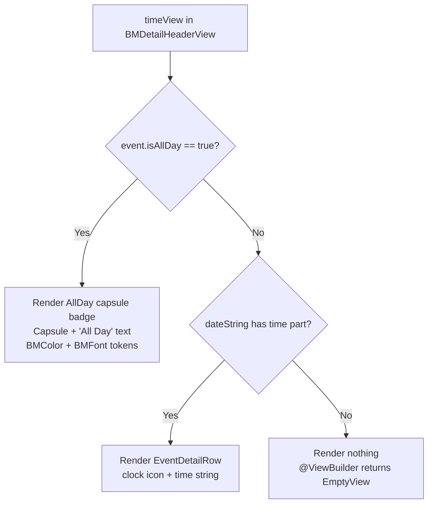

# Technical Specification: GOP-65 - Display "All Day" Indicator on Event Detail Page

**Status:** Draft
**Author:** Tech Lead Agent
**Created:** 2026-07-31

---

## 🎯 Problem

### Context

The Events tab in Berkeley Mobile iOS shows campus-wide events sourced from Firestore. Events may carry an `isAllDay: Bool?` flag (set by the backend scraper) indicating that no specific start/end time applies. This flag is already used in `EventsView` to render all-day events differently (as `AllDayEventBannerView` instead of `EventRowView`), but it is **not** used in `EventDetailView`.

### Current State

`BMDetailHeaderView` (nested in `EventDetailView`) renders a `timeView` computed property that splits `event.dateString` on `" / "` and displays the trailing component. The `dateString` default implementation in `BMCalendarEvent` (protocol extension in `BMCalendarEvent.swift:52-54`) returns `"<date> / All Day"` only when `startDate` has time components `00:00:00` **and** `end` has time components `11:59:59`. If those conditions are not met — which is common for events whose `isAllDay` flag is `true` but whose raw timestamps do not align to exactly midnight/23:59:59 — the time portion falls through to `startDate.getDateString(withFormat: "h:mm a")`, producing a literal `"12:00 AM"` display. Even when `dateString` does return `"… / All Day"`, the time row renders the plain string `"All Day"` inside a generic `EventDetailRow` with a clock icon and no visual distinction.

### Desired State

When `event.isAllDay == true`, the time row in `BMDetailHeaderView` must replace the clock-and-text `EventDetailRow` with a **capsule/pill badge** labelled "All Day". The badge must:
- Be visually distinct from the plain-text time display (a filled capsule shape).
- Reuse design system tokens (`BMColor`, `BMFont`) per `docs/code-conventions.md`.
- Accurately reflect the all-day state regardless of the raw timestamp values (i.e., driven by `isAllDay`, not by timestamp arithmetic).

### Root Cause

`EventDetailView.swift:154-157` — the `timeView` computed property reads from `dateString` and has no branch for `event.isAllDay == true`. The `isAllDay` property exists on `BMEventCalendarEntry` (line 61) but is ignored at the detail view layer.

### Impact

- **User-facing**: All-day events incorrectly show a time (e.g., `12:00 AM`) in the detail header, misleading users into thinking the event has a specific start time.
- **Scope**: One file (`EventDetailView.swift`) and one computed property (`timeView`). No data model, ViewModel, or backend changes are required — `isAllDay` is already decoded and threaded through to `BMEventCalendarEntry`.

---

## 📋 Architectural Decisions

### Decision 1 — Where to implement the "All Day" capsule

**Question:** Should the capsule be a dedicated reusable view, inline SwiftUI code inside `BMDetailHeaderView`, or a modification to `dateString`/`BMCalendarEvent`?

---

**Option A — Inline `@ViewBuilder` branch inside `timeView` in `BMDetailHeaderView`**

Add a `@ViewBuilder` branch inside the existing `timeView` computed property: if `event.isAllDay == true`, render a capsule badge; otherwise render the existing `EventDetailRow`.

- **Pros:** Minimal footprint; change is self-contained in one file and one property; no new types; consistent with how `EventsView` handles `isAllDay` inline (no abstraction there either).
- **Cons:** Reuse is limited — if a second call site ever needs the same badge, it must be copied.
- **Effort:** Low (< 15 lines).
- **Alignment with docs:** `docs/code-conventions.md` — "Break large `body` implementations into `private var` computed properties or `@ViewBuilder` private functions." This is exactly that pattern.

---

**Option B — Extract a dedicated `AllDayIndicatorBadgeView` reusable component**

Create a new `AllDayIndicatorBadgeView.swift` in `berkeley-mobile/Events/` (or `Common/`) that encapsulates the capsule styling.

- **Pros:** Reusable; explicit type name makes it searchable; consistent with how `AllDayEventBannerView.swift` already exists as a standalone file for all-day display on the list row.
- **Cons:** A single-call-site view adds a file with minimal benefit; over-engineering for a one-line visual fix.
- **Effort:** Low-medium (new file + registration, plus wiring).
- **Alignment with docs:** `docs/structure.md` — new reusable components go in `Common/`; but this component is Events-specific, so `Events/` would be the right home, matching `AllDayEventBannerView.swift`.

---

**Option C — Modify `BMCalendarEvent.dateString` default implementation to be capsule-aware**

Remove the `"All Day"` string from `dateString` and instead add a new protocol property `isAllDay: Bool?`; update `timeView` to check `isAllDay`.

- **Pros:** Makes `BMCalendarEvent` the single source of truth for all-day semantics.
- **Cons:** `BMCalendarEvent` is a protocol used by both `BMEventCalendarEntry` and `GymClass`; adding `isAllDay` to the protocol would require conformance changes in `GymClass`. `dateString` is also used by `EventRowView` for regular events — changing its format is a broader, riskier change. This conflates data modeling with UI rendering.
- **Effort:** Medium (protocol change + two conformers + potential regressions in `EventRowView`).
- **Alignment with docs:** Does not align — `docs/code-conventions.md` states never to make Firestore calls from views; analogously, protocol shape should not be driven by view-layer formatting concerns.

---

**Decision: Option A — Inline `@ViewBuilder` branch in `timeView`**

**Rationale:** The scope is a single computed property in one view. Option A makes the change exactly where the symptom is, follows the existing project pattern (SwiftUI `@ViewBuilder` sub-views), and introduces no new files or types. The `AllDayEventBannerView.swift` precedent (Option B) exists because that component is reused across the list; the detail-page badge has no second call site today. If a second call site appears, extracting to a shared component is a straightforward future refactor.

**Trade-off acknowledged:** If a second view needs this badge, the inline code must be extracted. Acceptable given the current scope.

---

### Decision 2 — All-day detection signal: `isAllDay` flag vs. timestamp heuristic

**Question:** Should the "All Day" badge be shown based on `event.isAllDay == true`, or based on the existing timestamp check in `BMCalendarEvent.dateString` (midnight start + 23:59:59 end)?

---

**Option A — Use `event.isAllDay == true` (explicit flag)**

The `BerkeleyEvent` Firestore model already carries `isAllDay: Bool?` (line 31 of `EventsViewModel.swift`) and it is threaded through to `BMEventCalendarEntry.isAllDay` at construction. This is the upstream system's authoritative signal.

- **Pros:** Faithful pass-through from the backend; no re-implementation of logic the backend already owns; handles edge cases where raw timestamps are not exactly midnight/23:59:59.
- **Cons:** If `isAllDay` is `nil` (not present in older Firestore documents), it defaults to `false` — safe.
- **Effort:** Zero additional data work; just read `event.isAllDay`.
- **Alignment with docs:** `docs/api-standards.md` — "prefer pass-through over re-implementation"; `docs/code-conventions.md` Boolean property prefix `is`.

---

**Option B — Derive from timestamp heuristic (midnight / 23:59:59)**

Rely on the existing `dateString` logic which checks `startDate == 00:00:00` and `end == 11:59:59`.

- **Pros:** No dependency on `isAllDay` flag.
- **Cons:** This heuristic is fragile; the issue description explicitly calls it out as producing incorrect results (`12:00 AM` is displayed). The backend `isAllDay` flag is the correct signal.
- **Effort:** Zero additional work, but the bug remains for cases where timestamps don't match the heuristic.
- **Alignment with docs:** Contradicts `docs/api-standards.md` "prefer pass-through" principle.

---

**Decision: Option A — Use `event.isAllDay == true`**

**Rationale:** The backend explicitly provides `isAllDay`. Using the explicit flag is correct, future-proof, and consistent with the project's pass-through principle documented in `docs/api-standards.md`.

---

## 🔄 Decision Flow



---

## 🏗️ Architecture

### Pattern

Pure SwiftUI view-layer change. No new types, no ViewModel changes, no Firestore or data model changes. The change is confined to a single `@ViewBuilder` computed property.

### Key Components

| Component | File | Role |
|---|---|---|
| `BMDetailHeaderView` | `berkeley-mobile/Events/EventDetailView.swift:104` | Header card within `EventDetailView`; contains `timeView` |
| `timeView` (computed property) | `EventDetailView.swift:153-157` | Currently unconditionally renders `EventDetailRow` with time string |
| `BMEventCalendarEntry.isAllDay` | `EventDataSource/BMEventCalendarEntry.swift:61` | Source of truth for all-day state — no changes needed |
| `EventDetailRow` | `EventDetailView.swift:177-189` | Existing icon + text row — no changes needed |

### Data Flow

```
Firestore BerkeleyEvent.isAllDay (Bool?)
    ↓ decoded by EventsDataService.fetchEventsGroupedByDate()
BMEventCalendarEntry.isAllDay (Bool?)
    ↓ passed to EventDetailView as `let event: BMEventCalendarEntry`
BMDetailHeaderView.timeView
    ↓ reads event.isAllDay
    → if true  → renders capsule badge ("All Day")
    → if false → reads event.dateString, splits on " / ", renders EventDetailRow
```

---

## 💻 Implementation

### Step 1 — Modify `timeView` in `BMDetailHeaderView`

**File:** `berkeley-mobile/Events/EventDetailView.swift`

**Current code (lines 153–157):**
```swift
@ViewBuilder
private var timeView: some View {
    if let timePart = event.dateString.components(separatedBy: " / ").last {
         EventDetailRow(systemImageName: "clock", text: timePart)
    }
}
```

**Replacement template:**
```swift
@ViewBuilder
private var timeView: some View {
    if event.isAllDay == true {
        allDayBadge
    } else if let timePart = event.dateString.components(separatedBy: " / ").last {
        EventDetailRow(systemImageName: "clock", text: timePart)
    }
}

private var allDayBadge: some View {
    Text("All Day")
        .font(Font(BMFont.bold(12)))
        .foregroundColor(Color(BMColor.primaryText))
        .padding(.horizontal, 10)
        .padding(.vertical, 4)
        .background(
            Capsule()
                .fill(Color(BMColor.eventDefault).opacity(0.25))
        )
}
```

**Design notes:**
- `BMFont.bold(12)` matches the surrounding info row font size established in `BMDetailHeaderView.body` (line 131: `.font(Font(BMFont.light(12)))`).
- `BMColor.primaryText` and `BMColor.eventDefault` are existing design-system tokens — no raw color literals.
- `Capsule()` with a semi-transparent fill produces the pill/capsule shape requested in the task without adding a stroke.
- The `allDayBadge` sub-view is named as a `private var` per the project's view composition convention (`docs/code-conventions.md`: "Name sub-views descriptively").

### Step 2 — Update `#Preview` macro

**File:** `berkeley-mobile/Events/EventDetailView.swift` (bottom of file, line 212)

Add a second preview exercising `isAllDay = true` so the badge state is visually verifiable:

```swift
#Preview {
    EventDetailView(event: BMEventCalendarEntry.sampleEntry)
}

#Preview("All Day event") {
    let allDayEvent = BMEventCalendarEntry(
        name: "Cal Day",
        date: Date(),
        end: nil,
        isAllDay: true
    )
    return EventDetailView(event: allDayEvent)
}
```

**Note:** `BMEventCalendarEntry.sampleEntry` has `isAllDay` defaulting to `false` (via the `init` default `isAllDay: Bool? = false`) so the existing preview continues to show the time row unchanged.

### Files to Modify

| File | Change |
|---|---|
| `berkeley-mobile/Events/EventDetailView.swift` | Replace `timeView` body; add `allDayBadge` private var; add second `#Preview` |

### Files NOT Modified

| File | Reason |
|---|---|
| `BMEventCalendarEntry.swift` | `isAllDay` already exists and is already set |
| `BMCalendarEvent.swift` | Protocol and `dateString` default unchanged; no timestamp heuristic changes needed |
| `EventsViewModel.swift` | No ViewModel logic change |
| `BerkeleyMobile+Injection.swift` | No new types; no DI wiring needed |
| `AllDayEventBannerView.swift` | Separate component for list rows; unaffected |

---

## ✅ Testing Strategy

Per `docs/testing-standards.md`, the project has **no automated test suite** today. All verification is manual (iOS Simulator) with SwiftUI `#Preview` blocks serving as the primary UI smoke test mechanism.

### SwiftUI Previews (primary verification)

Two `#Preview` blocks must exist in `EventDetailView.swift` after the change:

| Preview label | `isAllDay` | Expected rendering |
|---|---|---|
| (default) | `false` / `nil` | Time row shows clock icon + formatted time string |
| `"All Day event"` | `true` | Time row shows "All Day" capsule badge; no clock icon; no time string |

Both previews must render without crash in Xcode Previews.

### Manual test cases (Simulator)

| ID | Scenario | Steps | Expected |
|---|---|---|---|
| T1 | All-day event detail | Navigate to an event with `isAllDay == true` | Detail header shows "All Day" capsule; no time value |
| T2 | Timed event detail | Navigate to an event with `isAllDay == false` or `nil` | Detail header shows clock icon and formatted time |
| T3 | All-day with no end date | `isAllDay = true`, `end = nil` | Badge shown; no crash |
| T4 | Dark mode | Toggle dark/light appearance | Capsule background colour adapts correctly (uses semantic `BMColor.primaryText` / `BMColor.eventDefault`) |
| T5 | All-day banner in list → detail | Tap an `AllDayEventBannerView` row to open detail | Detail page consistently shows "All Day" badge |

### Future unit test (if test target is added)

When a test target (`berkeley-mobileTests`) is created per `docs/testing-standards.md`, add:

```swift
// File: berkeley-mobileTests/ViewModels/EventDetailViewTests.swift

import XCTest
@testable import berkeley_mobile

final class EventDetailViewTests: XCTestCase {

    func test_timeView_whenIsAllDayTrue_doesNotShowTimeString() {
        // Arrange
        let event = BMEventCalendarEntry(name: "Cal Day", date: Date(), isAllDay: true)
        // Act + Assert
        // (SwiftUI view body logic would be tested via a ViewInspector library if adopted;
        //  currently verified via Previews and Simulator)
        XCTAssertEqual(event.isAllDay, true)
    }

    func test_timeView_whenIsAllDayFalse_dateStringContainsTime() {
        // Arrange
        let start = Calendar.current.date(bySettingHour: 10, minute: 30, second: 0, of: Date())!
        let event = BMEventCalendarEntry(name: "Talk", date: start, isAllDay: false)
        // Act
        let parts = event.dateString.components(separatedBy: " / ")
        // Assert
        XCTAssertEqual(parts.count, 2)
        XCTAssertTrue(parts[1].contains(":"))
    }
}
```

### Coverage targets (per `docs/testing-standards.md`)

| Layer | Target |
|---|---|
| View logic (this change) | Verified via Previews (no coverage measurement today) |
| `BMEventCalendarEntry.isAllDay` decoding | Covered if model decoding tests are added (≥ 70% target) |

---

## 🔒 Security Considerations

- [x] **No user input**: This change renders a static label based on a backend boolean — no user-provided data is rendered through the badge.
- [x] **No new network calls**: Pure view-layer change; no Firestore reads added.
- [x] **No credential handling**: No secrets, tokens, or auth changes.
- [x] **No URL construction**: The capsule renders only a hardcoded string literal `"All Day"`.
- [x] **No `@Display` needed**: `"All Day"` is a string literal constant, not a user-supplied or Firestore-derived string — no sanitisation wrapper is required.
- [x] **Dark mode / accessibility**: `BMColor` tokens use `UIColor` dynamic providers (light/dark variants); `BMFont` ensures consistent sizing. VoiceOver will read the `Text("All Day")` label automatically.

---

## ✅ Definition of Done

### Implementation
- [ ] `timeView` in `BMDetailHeaderView` replaced with `@ViewBuilder` branch on `event.isAllDay`
- [ ] `allDayBadge` private computed property added using `Capsule()`, `BMFont.bold(12)`, `BMColor.primaryText`, `BMColor.eventDefault`
- [ ] No raw color literals introduced; no `UIFont.systemFont`; no `print()` statements
- [ ] Second `#Preview("All Day event")` block added to `EventDetailView.swift`

### Testing
- [ ] Both Xcode Previews render without error or crash
- [ ] Manual T1–T5 test cases pass on iOS Simulator (latest and iOS 13-era simulator)
- [ ] Existing timed-event detail display is visually unchanged (regression check)

### Quality
- [ ] No SwiftLint warnings introduced (project has no linter, but follow conventions)
- [ ] No compiler warnings in `EventDetailView.swift` after the change
- [ ] Code reviewed against `docs/code-conventions.md` (naming, MARK sections, no `DispatchQueue.main.async`)

### Documentation
- [ ] This spec is updated to **Status: Complete** before merging
- [ ] PR description references GOP-65 and includes before/after screenshots

---

## 🚫 Out of Scope

- **`EventRowView` / `AllDayEventBannerView`**: The list-row all-day display is already correct; no changes to those files.
- **`BMCalendarEvent.dateString`**: The protocol's `dateString` default implementation is not modified. The timestamp-based "All Day" heuristic (midnight / 23:59:59) remains as-is and is still used for `GymClass` events.
- **`BMEventCalendarEntry` NSCoding**: `isAllDay` is not persisted via `NSCoding` (it is not encoded/decoded in `encode(with:)` / `init?(coder:)`). Fixing this persistence gap is out of scope.
- **Accessibility enhancements**: Adding `accessibilityLabel` or `accessibilityHint` to the badge is a future enhancement.
- **Animation**: No transition animation between badge and time row is specified.
- **Backend / Firestore schema changes**: `isAllDay` is already present in the backend model.

---

## 📚 References

### Internal documentation consulted
- `docs/tech.md` — Swift 5, SwiftUI primary UI framework, iOS 13+ deployment target, Factory DI
- `docs/structure.md` — Events feature lives in `berkeley-mobile/Events/`; view files use `PascalCase.swift`
- `docs/code-conventions.md` — `@ViewBuilder` sub-view pattern; `BMColor`/`BMFont` usage; no raw color literals; `private var` naming
- `docs/testing-standards.md` — No test target today; Previews as primary UI verification; XCTest structure for future tests
- `docs/api-standards.md` — Pass-through principle: prefer `isAllDay` flag over re-implementing the upstream all-day detection

### Related files
- `berkeley-mobile/Events/EventDetailView.swift` — primary change target
- `berkeley-mobile/Events/EventDataSource/BMEventCalendarEntry.swift` — `isAllDay: Bool?` property
- `berkeley-mobile/Data/ItemProtocols/BMCalendarEvent.swift` — `dateString` default implementation (unchanged)
- `berkeley-mobile/Events/AllDayEventBannerView.swift` — reference design for existing all-day capsule pattern
- `berkeley-mobile/Assets/Colors/Colors+Event.swift` — `BMColor.eventDefault` token used for badge fill
- `berkeley-mobile/Assets/Colors/Colors+Text.swift` — `BMColor.primaryText` token used for badge text
