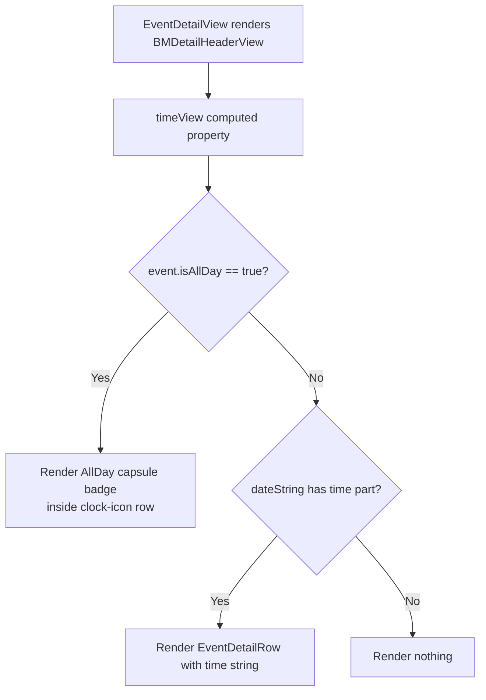

# Technical Specification: GOP-67 - Display "All Day" Capsule on Event Detail Page

**Status:** Draft
**Author:** Tech Lead Agent
**Created:** 2026-07-31

---

## 🎯 Problem

### Context

The Events feature (`berkeley-mobile/Events/`) displays campus events fetched from Firestore. Events may be marked as "All Day" via the `isAllDay: Bool?` field on `BMEventCalendarEntry` (set during mapping in `EventsDataService.fetchEventsGroupedByDate()`). On the events list (`EventsView.swift`), an all-day event is already rendered differently: the row shows `AllDayEventBannerView` instead of `EventRowView`. However, the detail page (`EventDetailView.swift`) does not honour `isAllDay` and always falls through to the time-display path.

### Current State

`BMDetailHeaderView` (nested in `EventDetailView.swift`) renders a `timeView` computed property:

```swift
// EventDetailView.swift:154–158
@ViewBuilder
private var timeView: some View {
    if let timePart = event.dateString.components(separatedBy: " / ").last {
         EventDetailRow(systemImageName: "clock", text: timePart)
    }
}
```

The `dateString` property (defined in `BMCalendarEvent.swift:38–65`) returns `"All Day"` as the time component **only** when the event's `startDate` is midnight (`00:00:00`) and its `end` is `23:59:59`. This heuristic is based on time values alone, not the authoritative `isAllDay` field. Because all-day events are typically stored with a `startTime` of `nil` in Firestore (`BerkeleyEvent.startTime: Date?`), `EventsDataService` substitutes `Date().getStartOfDay()` (midnight) when `startTime` is nil:

```swift
// EventsViewModel.swift:59–60
date: $0.startTime ?? Date().getStartOfDay(),
```

This midnight default means `startDate` is `00:00:00` but `end` is often `nil` (no end time stored). Because `end` is `nil`, the `dateString` guard fails and the method falls through to format `startDate` as `"12:00 AM"` — which is then shown in the time row of the detail page.

Additionally, `BMCalendarEvent.dateString` does not encode the "All Day" state in a machine-readable way; the detail view must re-parse a display string to extract the time part, which is fragile.

### Desired State

When `event.isAllDay == true`, the `timeView` in `BMDetailHeaderView` on `EventDetailView` should display a capsule/pill-shaped "All Day" badge **in place of** the formatted time string. The clock icon row should still be present but its content replaced by the badge, matching the visual language already established by `AllDayEventBannerView`.

### Root Cause

`BMDetailHeaderView.timeView` reads only from `event.dateString` (a lossy, pre-formatted string) and ignores `event.isAllDay`. The model already carries the authoritative flag; it simply is not consulted at the detail-view rendering site.

### Impact

- **User experience**: Users viewing an all-day event see "12:00 AM" as its time, which is incorrect and misleading.
- **Scope**: Only `EventDetailView.swift` (specifically `BMDetailHeaderView.timeView`) requires a change. No data model, ViewModel, or Firestore layer changes are needed.

---

## 📋 Architectural Decisions

### Decision 1: Where to detect "All Day" state in the detail view

The core question is: which signal should `BMDetailHeaderView.timeView` use to decide whether to show the "All Day" badge?

#### Option A — Read `event.isAllDay` directly (recommended)

**Description:** Add a conditional branch in `BMDetailHeaderView.timeView` that checks `event.isAllDay == true` first and, if so, renders the capsule badge rather than the formatted time string.

- **Pros:**
  - Uses the authoritative, upstream-set flag rather than a re-parsed display string.
  - Zero changes outside `EventDetailView.swift` — model, ViewModel, and data layer are untouched.
  - Consistent with how `EventsView` already gates on `event.isAllDay` to pick `AllDayEventBannerView`.
  - Simple, readable conditional; easy to test in preview.
- **Cons:**
  - `isAllDay` is `Bool?` (nullable); `== true` pattern requires a nil-guard, which is a minor verbosity.
- **Effort:** XS (single computed property edit + new inline view)
- **Alignment:** Follows `docs/code-conventions.md` — sub-views as `private var` computed properties; avoids re-parsing logic.

#### Option B — Extend `BMCalendarEvent.dateString` to return a sentinel and parse it

**Description:** Modify `BMCalendarEvent.dateString` to embed a tag (e.g., `"__allday__"`) when `isAllDay` is set, and detect that tag inside `timeView`.

- **Pros:** Centralizes all-day logic in the protocol extension.
- **Cons:**
  - Adds a machine-readable sentinel to a human display string — conflates two concerns.
  - Breaks the `EventRowView.swift` usage of `event.dateString` which calls `.components(separatedBy:)` and relies on well-formed output.
  - Requires changes in two files with higher risk of regression.
- **Effort:** S
- **Alignment:** Violates single-responsibility; `docs/code-conventions.md` cautions against anti-patterns that add hidden coupling.

#### Option C — Add a computed `displayTime: String?` property to `BMCalendarEvent`

**Description:** Add a new protocol requirement (or extension default) `var displayTimeString: String?` that returns `nil` for all-day events, and update `timeView` to unwrap it.

- **Pros:** Cleaner protocol surface; `nil` means "no time to display".
- **Cons:**
  - Wider change — touches the protocol and every conforming type (`BMEventCalendarEntry`, `GymClass`).
  - Overkill for a single view fix; violates the "don't introduce abstractions beyond what the task requires" principle from system instructions.
- **Effort:** M
- **Alignment:** Over-engineered relative to task scope.

### Decision

**Option A** is selected. `event.isAllDay == true` is the authoritative flag and is already propagated end-to-end from Firestore through `BerkeleyEvent` → `BMEventCalendarEntry`. The fix is confined entirely to `BMDetailHeaderView.timeView` in `EventDetailView.swift`.

### Decision 2: Visual design of the "All Day" indicator

#### Option A — Inline SwiftUI capsule badge (recommended)

**Description:** A small `Capsule` shape with a `Text("All Day")` label rendered directly inside the `timeView` computed property, keeping it self-contained within `BMDetailHeaderView`.

- **Pros:**
  - Matches the visual pattern already established by `AllDayEventBannerView` (which uses `Capsule().fill(…)`).
  - No new file; consistent with `docs/code-conventions.md` convention of extracting sub-views as `private var` computed properties within the same type.
  - Full control over sizing to fit within the compact header info block.
- **Cons:**
  - Minor code duplication with `AllDayEventBannerView` (shared concept, different context/size).
- **Effort:** XS
- **Alignment:** Follows `docs/structure.md` Common/reusable pattern only when shared across files.

#### Option B — Extract a shared `AllDayBadgeView` component into `Common/`

**Description:** Create `berkeley-mobile/Common/AllDayBadgeView.swift` and reuse it in both `AllDayEventBannerView` and `BMDetailHeaderView`.

- **Pros:** Eliminates duplication; single source of truth for "All Day" badge styling.
- **Cons:**
  - `AllDayEventBannerView` uses a large full-width capsule with the event name; `BMDetailHeaderView` needs a small inline badge. They are visually distinct enough that sharing may require parameterisation, increasing complexity.
  - Premature abstraction — only two use sites, different layouts. System instructions explicitly caution against abstractions beyond task requirements.
- **Effort:** S
- **Alignment:** `docs/structure.md` Common/ is for reusable UI components; extracting here adds a file for minimal gain.

### Decision

**Option A** is selected. The inline capsule badge is the right fit for the detail header's compact layout. The styling will mirror `AllDayEventBannerView` (gray tinted capsule, bold "All Day" text) but sized appropriately for the header row context. A `Common/AllDayBadgeView` extraction can be done separately if a third use site emerges.

## 🔄 Decision Flow



---

## 🏗️ Architecture

### Pattern

Pure UI-layer change following the existing SwiftUI passive-rendering pattern documented in `docs/structure.md`. The View reads from the model (`BMEventCalendarEntry`) and branches on `isAllDay`; no ViewModel logic or data-layer changes are involved.

### Key Components

| Component | Path | Role | Change? |
|---|---|---|---|
| `BMDetailHeaderView` | `berkeley-mobile/Events/EventDetailView.swift:104` | Renders the event header card including the time row | **Modified** |
| `timeView` (computed property) | `EventDetailView.swift:154` | Renders the clock-icon + time info row | **Modified** |
| `BMEventCalendarEntry` | `berkeley-mobile/Events/EventDataSource/BMEventCalendarEntry.swift` | Model; carries `isAllDay: Bool?` | No change |
| `BerkeleyEvent` | `berkeley-mobile/Events/EventDataSource/EventsViewModel.swift:24` | Firestore DTO; carries `isAllDay: Bool?` | No change |
| `EventsDataService` | `EventsViewModel.swift:40` | Maps `BerkeleyEvent → BMEventCalendarEntry`, passes `isAllDay` through | No change |
| `AllDayEventBannerView` | `berkeley-mobile/Events/AllDayEventBannerView.swift` | Reference for capsule styling | No change |

### Data Flow

```
Firestore "Events" collection
  └── BerkeleyEventsDaySnapshot.events[].isAllDay: Bool?    (upstream, authoritative)
        └── EventsDataService.fetchEventsGroupedByDate()
              └── BMEventCalendarEntry.isAllDay: Bool?       (passed through, stored)
                    └── EventDetailView → BMDetailHeaderView
                          └── timeView                       ← CHANGE HERE
                                ├── isAllDay == true → AllDay capsule badge
                                └── else             → EventDetailRow with time string
```

---

## 💻 Implementation

### Step 1: Modify `BMDetailHeaderView.timeView` in `EventDetailView.swift`

**File:** `berkeley-mobile/Events/EventDetailView.swift`

**Location:** `BMDetailHeaderView` struct, `timeView` computed property (lines 154–158).

Replace the existing `timeView` with a branching implementation:

```swift
@ViewBuilder
private var timeView: some View {
    HStack {
        Image(systemName: "clock")
            .font(.system(size: 16))
        if event.isAllDay == true {
            allDayBadge
        } else if let timePart = event.dateString.components(separatedBy: " / ").last {
            Text(timePart)
                .font(Font(BMFont.regular(12)))
        }
    }
}

private var allDayBadge: some View {
    Text("All Day")
        .font(Font(BMFont.bold(12)))
        .padding(.horizontal, 10)
        .padding(.vertical, 3)
        .background(
            Capsule()
                .fill(Color.gray.opacity(0.3))
        )
}
```

**Key notes:**

- The clock `Image` is lifted out of the conditional so the icon is always visible when the time row is shown. This keeps the icon aligned with the date row above and location row below, maintaining visual consistency.
- `event.isAllDay == true` handles the `Bool?` nullability: `nil` and `false` both fall through to the time string path, preserving current behaviour for non-all-day events.
- The `allDayBadge` private computed property follows `docs/code-conventions.md` convention of extracting sub-views as `private var` within the owning type.
- `Color.gray.opacity(0.3)` provides a subtle, neutral fill analogous to `AllDayEventBannerView`'s `.gray.opacity(0.5)` but lighter to suit the small inline badge context.
- `BMFont.bold(12)` matches the font size used in surrounding `EventDetailRow` text while using bold weight to visually distinguish the badge label.

### Step 2: Update the `#Preview` to cover the all-day state

**File:** `berkeley-mobile/Events/EventDetailView.swift`

The existing `#Preview` macro uses `BMEventCalendarEntry.sampleEntry` which does not set `isAllDay`. Add a second preview variant to validate the all-day badge rendering:

```swift
#Preview("All Day Event") {
    EventDetailView(event: BMEventCalendarEntry(
        name: "Cal Day",
        date: Calendar.current.startOfDay(for: Date()),
        end: nil,
        descriptionText: "Annual open campus day.",
        location: "UC Berkeley Campus",
        isAllDay: true
    ))
}
```

This uses the existing `sampleEntry` (first preview, unchanged) plus the new preview — no other files are modified.

### No DI / ViewModel changes required

`BMDetailHeaderView` already receives `event: BMEventCalendarEntry` as a plain value via `let event: BMEventCalendarEntry`. The `isAllDay` property is already set on the model by `EventsDataService`. No FactoryKit registration changes are needed.

### No model changes required

`BMEventCalendarEntry.isAllDay` is already defined as `var isAllDay: Bool?` and already passed through by `EventsDataService`. The `NSCoding` serialisation in `BMEventCalendarEntry` does not encode `isAllDay` (it was added after the `NSCoding` implementation), but this is pre-existing behaviour, not in scope for this ticket.

---

## ✅ Testing Strategy

Per `docs/testing-standards.md`: there are currently no test targets in the repository. The testing strategy below defines what should be added when a test target exists, and mandates manual/preview verification now.

### Manual verification (required before merge)

Because this is a pure UI change with no test target, all verification is done via Xcode Previews and on-device / Simulator testing:

| Scenario | Expected result |
|---|---|
| `isAllDay == true`, no start/end time | Clock icon row shows "All Day" capsule badge |
| `isAllDay == false` (or `nil`), event has start + end time | Clock icon row shows formatted time range (e.g. `10:00 AM - 11:00 AM`) |
| `isAllDay == false`, event has start time, no end time | Clock icon row shows start time only |
| `isAllDay == false`, event start is midnight, end is nil | Clock icon row shows `12:00 AM` (not "All Day") — confirms `isAllDay` flag is the gate, not time heuristic |
| `isAllDay == true`, in dark mode | Capsule badge is legible; `Color.gray.opacity(0.3)` renders acceptably |

### Xcode Previews

The two `#Preview` macros in `EventDetailView.swift` (one for a regular event, one for the all-day event added in Step 2) provide live canvas verification without running a simulator.

### Unit tests (when test target is added)

Per `docs/testing-standards.md`, view rendering is lower-priority for unit tests. If snapshot testing (`swift-snapshot-testing`) is added, a snapshot test for `BMDetailHeaderView` in both states (all-day and timed) would be appropriate:

```swift
// berkeley-mobileTests/Events/EventDetailViewTests.swift (future)
// Uses swift-snapshot-testing

func test_bmDetailHeaderView_allDay_showsBadge() {
    // Arrange
    let event = BMEventCalendarEntry(
        name: "Cal Day",
        date: Calendar.current.startOfDay(for: Date()),
        isAllDay: true
    )
    let view = BMDetailHeaderView(event: event)

    // Assert — snapshot comparison
    assertSnapshot(matching: view, as: .image(layout: .fixed(width: 330, height: 330)))
}

func test_bmDetailHeaderView_timed_showsTimeString() {
    // Arrange
    var comps = DateComponents()
    comps.hour = 10; comps.minute = 0; comps.second = 0
    let start = Calendar.current.date(from: comps)!
    let event = BMEventCalendarEntry(name: "Lecture", date: start, isAllDay: false)

    // Assert — snapshot comparison
    assertSnapshot(matching: view, as: .image(layout: .fixed(width: 330, height: 330)))
}
```

---

## 🔒 Security Considerations

- [ ] **No user input** — `isAllDay` originates from Firestore (read-only, server-side data), not user input. No input validation required.
- [ ] **No network calls** — purely a UI rendering change; no new API surface.
- [ ] **No credentials or secrets** — no configuration or environment variables involved.
- [ ] **No data stored or transmitted** — read-only access to an already-fetched model value.
- [ ] **No URL or deep-link handling** — the "All Day" badge has no interactive action.

No security concerns are introduced by this change.

---

## ✅ Definition of Done

### Implementation
- [ ] `BMDetailHeaderView.timeView` in `EventDetailView.swift` branched on `event.isAllDay == true`
- [ ] `allDayBadge` private computed property added to `BMDetailHeaderView`
- [ ] All-day preview variant (`#Preview("All Day Event")`) added to `EventDetailView.swift`
- [ ] No changes to `BMEventCalendarEntry`, `BerkeleyEvent`, `EventsDataService`, `EventsViewModel`, or any other file

### Visual verification
- [ ] Xcode Preview canvas shows capsule badge when `isAllDay = true`
- [ ] Xcode Preview canvas shows time string when `isAllDay = false`
- [ ] Verified on iOS Simulator (iPhone, iOS 18+) in light mode
- [ ] Verified on iOS Simulator in dark mode — badge legible
- [ ] Verified that `isAllDay = false` with midnight start time still shows `12:00 AM` (regression guard)

### Code quality
- [ ] No `print()` calls; logging via `os.Logger` if any diagnostic is added
- [ ] Follows 4-space indentation and K&R brace style (`docs/code-conventions.md`)
- [ ] `private var allDayBadge: some View` follows sub-view-as-computed-property convention
- [ ] No hardcoded Firestore strings or configuration values introduced

### Documentation
- [ ] No new doc comments required (change is self-explanatory from the property name)

---

## 🚫 Out of Scope

- **`NSCoding` serialisation of `isAllDay`** — `BMEventCalendarEntry.encode(with:)` / `init?(coder:)` do not currently encode `isAllDay`. Fixing this is a separate concern unrelated to the display bug.
- **`EventRowView` list row** — already handled correctly via `EventsView`'s `isAllDay` gate showing `AllDayEventBannerView`. No change needed.
- **`BMCalendarEvent.dateString` heuristic** — the midnight/23:59:59 time-comparison logic in `BMCalendarEvent.swift` is not modified. Refactoring it to use `isAllDay` directly would be a broader change and is not required for this fix.
- **`AllDayEventBannerView` refactor** — sharing a component between the banner and the detail badge is explicitly deferred (see Decision 2).
- **Accessibility (VoiceOver)** — adding an `accessibilityLabel` to the badge for VoiceOver users is good practice but is a separate follow-up task.
- **`GymClass`** — also conforms to `BMCalendarEvent` but does not have an `isAllDay` field; this change does not affect `GymClass` rendering.

---

## 📚 References

### Internal docs consulted
- `docs/tech.md` — Swift 5.0+ / SwiftUI primary; iOS 18.0+ deployment target
- `docs/structure.md` — Feature-first layout; Events feature at `berkeley-mobile/Events/`; sub-views as `private var` computed properties
- `docs/code-conventions.md` — SwiftUI view body decomposition; `private var` sub-views; `#Preview` macro required; `BMFont` usage
- `docs/testing-standards.md` — No test target currently; XCTest + optional `swift-snapshot-testing` when added; view rendering is lower-priority

### Source files reviewed
- `berkeley-mobile/Events/EventDetailView.swift` — file under change
- `berkeley-mobile/Events/EventDataSource/BMEventCalendarEntry.swift` — model with `isAllDay`
- `berkeley-mobile/Events/EventDataSource/EventsViewModel.swift` — `BerkeleyEvent` DTO + mapping
- `berkeley-mobile/Data/ItemProtocols/BMCalendarEvent.swift` — `dateString` protocol extension
- `berkeley-mobile/Events/AllDayEventBannerView.swift` — visual reference for capsule style
- `berkeley-mobile/Events/EventsView.swift` — existing `isAllDay` gate in list view
- `berkeley-mobile/Utils/Date+Extension.swift` — `doesDateComponentsAreEqualTo` used in dateString heuristic
- `berkeley-mobile/Assets/Colors/Colors+Event.swift` — event colour definitions

### Related issue
- GOP-67 (this ticket)
