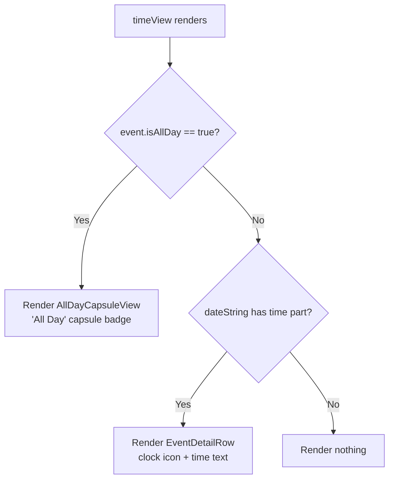

# Technical Specification: GOP-82 - Display "All Day" Capsule on Event Detail Page

**Status:** Draft
**Author:** Tech Lead Agent
**Created:** 2026-07-31

---

## 🎯 Problem

### Context

The Events feature (`berkeley-mobile/Events/`) displays campus-wide events fetched from Firestore. Events can be either timed (with specific start/end times) or all-day. The `BerkeleyEvent` Firestore model (`EventsViewModel.swift:23-33`) includes an `isAllDay: Bool?` field that is stored by the scraper backend, and this is propagated into `BMEventCalendarEntry.isAllDay: Bool?` during mapping (`EventsViewModel.swift:67`).

### Current State

`BMDetailHeaderView` (defined inside `EventDetailView.swift:104-172`) renders a time row via its `timeView` computed property (`EventDetailView.swift:154-157`):

```swift
@ViewBuilder
private var timeView: some View {
    if let timePart = event.dateString.components(separatedBy: " / ").last {
         EventDetailRow(systemImageName: "clock", text: timePart)
    }
}
```

This always renders an `EventDetailRow` (icon + plain text), parsing the time portion from `event.dateString`. The `dateString` property is provided by the `BMCalendarEvent` protocol extension (`BMCalendarEvent.swift:38-65`). That extension applies a **heuristic** to detect all-day events: it checks whether `startDate` has hour/minute/second all equal to zero AND `end` has hour=11, minute=59, sec=59 (`BMCalendarEvent.swift:52-54`). If those conditions hold, it appends `"All Day"` to `dateString` — so the time row shows the text "All Day".

**The bug:** when `isAllDay == true` comes from Firestore but the time components do not satisfy the heuristic (e.g., `startTime` is `nil` in Firestore so it defaults to `Date().getStartOfDay()` which is midnight, but `end` is also `nil` — failing the `end.doesDateComponentsAreEqualTo(hour: 11, minute: 59, sec: 59)` check), the heuristic returns `false` and the time row formats and displays `"12:00 AM"` instead. This is misleading for users: a true all-day event appears to start at midnight.

### Existing All-Day Design Pattern

`AllDayEventBannerView.swift` already implements a capsule/pill-shaped "All Day" label used in the events list (`EventsView.swift:25-26`). This establishes the visual convention for the all-day indicator in the Events feature.

### Desired State

On the Event Detail Page (`EventDetailView.swift`), when `event.isAllDay == true`, the time row should display an "All Day" capsule/badge (consistent with the existing `AllDayEventBannerView` aesthetic) instead of a time string. When `event.isAllDay` is `false` or `nil`, the existing time formatting behavior is preserved.

### Impact

- **User trust:** Showing "12:00 AM" for an all-day event is confusing and inaccurate.
- **Consistency:** The events list already uses the `AllDayEventBannerView` capsule; the detail view should match.
- **Scope:** UI-only change, no data model changes, no Firestore schema changes.

---

## 📋 Architectural Decisions

### Decision 1: Where to place the all-day detection logic

**Question:** Should `timeView` check `event.isAllDay` directly in the View, delegate to a ViewModel computed property, or fix the `BMCalendarEvent.dateString` heuristic?

---

**Option A — Fix the `BMCalendarEvent.dateString` heuristic to also check `isAllDay`**

The `dateString` computed property in `BMCalendarEvent.swift` already tries to detect all-day events heuristically. We could add an `isAllDay` property to the `BMCalendarEvent` protocol and include it in the guard:

```swift
// In BMCalendarEvent protocol: add `var isAllDay: Bool? { get }`
// In BMCalendarEvent extension dateString:
if (self.isAllDay == true) ||
   (startDate.doesDateComponentsAreEqualTo(hour: 0, minute: 0, sec: 0),
    let end, end.doesDateComponentsAreEqualTo(hour: 11, minute: 59, sec: 59)) {
    return dateString + "All Day"
}
```

- **Pros:** Single source of truth; works for `EventRowView` (which also renders `event.dateString`) automatically; aligns the text-based path with reality.
- **Cons:** `BMCalendarEvent` is a protocol shared across `BMEventCalendarEntry` and `GymClass`; adding `isAllDay` to the protocol requires updating `GymClass` (which has no all-day concept). The `dateString` text path produces the same string `"All Day"` but does not produce the capsule/badge visual the task requires.
- **Effort:** Medium — protocol change + two conforming types.
- **Alignment:** Modifies a protocol in `Data/ItemProtocols/` per `docs/structure.md`; no visual spec match for capsule UI.

**Verdict: Rejected.** The task requires a visual capsule/badge, not plain text. Widening the protocol for a badge that only `BMEventCalendarEntry` needs creates unnecessary coupling.

---

**Option B — Check `event.isAllDay` directly in `timeView` inside `BMDetailHeaderView` (View layer)**

Modify the `timeView` computed property in `EventDetailView.swift` to branch on `event.isAllDay`:

```swift
@ViewBuilder
private var timeView: some View {
    if event.isAllDay == true {
        // render capsule badge
    } else if let timePart = event.dateString.components(separatedBy: " / ").last {
        EventDetailRow(systemImageName: "clock", text: timePart)
    }
}
```

- **Pros:** Minimal footprint — one file touched; directly uses the authoritative `isAllDay` field from the model; no protocol changes needed; consistent with `EventsView.swift:25` which also checks `event.isAllDay == true` directly in the View.
- **Cons:** Presentation logic inside the View; however per `docs/code-conventions.md`, "Keep `View` structs focused on layout" — a single boolean branch is layout, not business logic.
- **Effort:** Low — one `@ViewBuilder` modification + small new sub-view.
- **Alignment:** Matches the pattern already used in `EventsView.swift:25` (`if event.isAllDay == true { AllDayEventBannerView(...) }`). Consistent with `docs/structure.md` feature-first layering.

**Verdict: Selected.** Minimal, focused, follows the exact pattern already established in `EventsView.swift`.

---

**Option C — Add a computed property to `EventsViewModel` that returns whether an event is all-day**

Add a `func isAllDay(for event: BMEventCalendarEntry) -> Bool` on `EventsViewModel` and call it from the View.

- **Pros:** Keeps logic off the View; testable.
- **Cons:** The function would be a trivial pass-through of `event.isAllDay == true` — zero added value; over-engineering for a one-liner check. Introduces ViewModel injection overhead for a boolean that's already on the model.
- **Effort:** Medium — ViewModel change + View change.
- **Alignment:** Violates the principle from `docs/code-conventions.md`: "Move business logic into the ViewModel" — this isn't business logic, it's a model property read.

**Verdict: Rejected.** Unnecessary indirection.

---

### Decision 2: Visual design of the "All Day" capsule in the detail view

**Question:** Should we reuse `AllDayEventBannerView` directly, extract a shared sub-view, or create a minimal inline capsule?

---

**Option A — Reuse `AllDayEventBannerView` directly**

`AllDayEventBannerView` renders a full-width capsule with event name alongside the "All Day" label. Its layout (`frame(height: 30)` expanding to fill width with event name) is designed for the events list row, not for a detail header row next to a clock icon.

- **Pros:** No new component.
- **Cons:** The component shows `event.name` text inside the capsule — redundant on the detail page where the name is already prominent. The height/width assumptions are tuned for list rows, not for an inline header row.
- **Verdict: Rejected.**

**Option B — Create a compact `AllDayCapsuleView` sub-view in `EventDetailView.swift`**

A small, self-contained private `View` (or `@ViewBuilder` function) inside `EventDetailView.swift` that renders only the "All Day" label in a capsule, sized to align with the other `EventDetailRow` items in the header.

- **Pros:** Fits the detail page layout precisely; consistent visual language (capsule shape) with `AllDayEventBannerView`; simple, no extra file, no public API surface.
- **Cons:** Not reusable outside the detail view — acceptable since this is the only place it's needed.
- **Effort:** Low — ~10 lines.
- **Alignment:** Matches `docs/code-conventions.md` pattern of breaking complex `body` into named computed properties / `@ViewBuilder` functions.
- **Verdict: Selected.**

**Option C — Render a plain `Text("All Day")` styled as a badge inline**

Directly embed the capsule styling inline in `timeView` without a named sub-view.

- **Pros:** Fewest lines.
- **Cons:** Mixes layout detail into `timeView`; harder to read; violates `docs/code-conventions.md`'s "Break complex body into named computed properties".
- **Verdict: Rejected.**

---

### Decision Summary

| Decision | Selected Option | Rationale |
|---|---|---|
| Where to detect all-day | Option B: check `event.isAllDay` in `timeView` | Matches existing pattern in `EventsView.swift:25`; no protocol changes |
| Visual component | Option B: private `AllDayCapsuleView` in `EventDetailView.swift` | Right size for detail header; consistent capsule language; minimal footprint |

---

## 🔄 Decision Flow



---

## 🏗️ Architecture and Implementation

### Architectural Pattern

This is a **View-layer UI fix** within the existing SwiftUI MVVM architecture (`docs/structure.md` — feature-first, layered). No new layers, no new files, no ViewModel changes. The fix touches a single file: `berkeley-mobile/Events/EventDetailView.swift`.

### Key Components

| Component | File | Role |
|---|---|---|
| `BMDetailHeaderView` | `Events/EventDetailView.swift:104` | Host view; contains `timeView` that needs branching |
| `timeView` (`@ViewBuilder`) | `Events/EventDetailView.swift:154` | Renders clock row — needs all-day guard |
| `AllDayCapsuleView` (new) | `Events/EventDetailView.swift` (new private struct) | Compact capsule badge for all-day events |
| `BMEventCalendarEntry.isAllDay` | `Events/EventDataSource/BMEventCalendarEntry.swift:61` | Authoritative source; `Bool?` passed from Firestore |
| `EventDetailRow` | `Events/EventDetailView.swift:177` | Existing reusable row (clock icon + text); used for non-all-day path |
| `AllDayEventBannerView` | `Events/AllDayEventBannerView.swift` | Reference for capsule visual language; NOT reused directly |

### Data Flow

```
Firestore (isAllDay field)
    └── BerkeleyEvent.isAllDay: Bool?        [EventsViewModel.swift:31]
           └── BMEventCalendarEntry.isAllDay  [EventsViewModel.swift:67, BMEventCalendarEntry.swift:90]
                  └── EventDetailView → BMDetailHeaderView → timeView
                         ├── isAllDay == true  → AllDayCapsuleView ("All Day" pill)
                         └── isAllDay != true  → EventDetailRow (clock + time string)
```

### Integration Points

No DI wiring changes needed. `EventDetailView` already receives the `BMEventCalendarEntry` as a `let` parameter (`EventDetailView.swift:11`). No new registrations in `BerkeleyMobile+Injection.swift`.

---

## 💻 Implementation

### Step 1 — Add `AllDayCapsuleView` private struct in `EventDetailView.swift`

Add the following private struct after the `EventDetailRow` struct (around line 189), before `BMDetailDescriptionView`:

```swift
// MARK: - AllDayCapsuleView

private struct AllDayCapsuleView: View {
    var body: some View {
        HStack(spacing: 6) {
            Image(systemName: "clock")
                .font(.system(size: 16))
            Text("All Day")
                .font(Font(BMFont.regular(12)))
                .padding(.horizontal, 8)
                .padding(.vertical, 4)
                .background(
                    Capsule()
                        .fill(.gray.opacity(0.5))
                )
        }
    }
}
```

**Design notes:**
- Uses `.gray.opacity(0.5)` fill — same tint as `AllDayEventBannerView` (`AllDayEventBannerView.swift:19`), maintaining visual consistency across the Events feature.
- Keeps the `Image(systemName: "clock")` icon to align visually with the adjacent `dateView` row (which uses `"calendar"` icon via `EventDetailRow`) — this preserves the icon-column alignment in the header VStack.
- Font `BMFont.regular(12)` matches the existing `EventDetailRow` text font (`EventDetailView.swift:185`).

### Step 2 — Modify `timeView` in `BMDetailHeaderView`

Replace the current `timeView` computed property (`EventDetailView.swift:154-157`) with:

```swift
@ViewBuilder
private var timeView: some View {
    if event.isAllDay == true {
        AllDayCapsuleView()
    } else if let timePart = event.dateString.components(separatedBy: " / ").last {
        EventDetailRow(systemImageName: "clock", text: timePart)
    }
}
```

**Before (lines 154-157):**
```swift
@ViewBuilder
private var timeView: some View {
    if let timePart = event.dateString.components(separatedBy: " / ").last {
         EventDetailRow(systemImageName: "clock", text: timePart)
    }
}
```

**Rationale for the guard order:**
- `isAllDay == true` takes precedence over the time-string heuristic. This correctly handles the case where `isAllDay` is `true` from Firestore but the time components don't satisfy the heuristic in `BMCalendarEvent.dateString` (the root cause of the bug).
- The `else if` preserves the existing time display for all timed events unchanged.

### Step 3 — Update `sampleEntry` to support Preview testing

The existing `#Preview` for `EventDetailView` uses `BMEventCalendarEntry.sampleEntry` which does not set `isAllDay`. To validate the new branch in Xcode Previews, add a second preview case. This is a preview-only change.

In `EventDetailView.swift`, update or extend the `#Preview` macro:

```swift
#Preview("Timed Event") {
    EventDetailView(event: BMEventCalendarEntry.sampleEntry)
}

#Preview("All Day Event") {
    EventDetailView(event: BMEventCalendarEntry(
        name: "All Day Sample",
        date: Date().getStartOfDay(),
        isAllDay: true
    ))
}
```

**Note:** No changes to `BMEventCalendarEntry.sampleEntry` itself — adding a named preview is non-breaking and follows `docs/testing-standards.md`'s guidance that "`#Preview` macros serve the role of UI verification".

### Files to Modify

| File | Change |
|---|---|
| `berkeley-mobile/Events/EventDetailView.swift` | Add `AllDayCapsuleView` private struct; modify `timeView` to branch on `isAllDay`; add all-day `#Preview` |

### Files NOT Modified

| File | Reason |
|---|---|
| `BMCalendarEvent.swift` | Protocol extension unchanged; heuristic still handles legacy cases |
| `BMEventCalendarEntry.swift` | Model unchanged; `isAllDay: Bool?` already present |
| `EventsViewModel.swift` | No logic change needed |
| `AllDayEventBannerView.swift` | Not reused directly; serves as visual reference only |
| `BerkeleyMobile+Injection.swift` | No new DI registrations |

---

## ✅ Testing Strategy

Per `docs/testing-standards.md`, the project currently has **no automated test target**. All verification is manual (simulator + device). The spec records the recommended test coverage to be implemented when a test target is added.

### Manual Verification (required before merge)

| Scenario | Steps | Expected Result |
|---|---|---|
| All-day event on detail page | Navigate to an all-day event from the events list | Time row shows "All Day" capsule badge, NOT "12:00 AM" |
| Timed event on detail page | Navigate to a timed event (non-all-day) | Time row shows clock icon + time range (e.g., "2:00 PM - 4:00 PM") |
| All-day event with no end time | Navigate to an all-day event where `end` is `nil` | Time row shows "All Day" capsule badge |
| Timed event with no end time | Navigate to a timed event where `end` is `nil` | Time row shows start time only (e.g., "10:00 AM") |
| Xcode Preview | Open `EventDetailView.swift` #Preview "All Day Event" | Header shows capsule badge on the time row |
| Visual regression — list view | Open Events list | All-day events still show `AllDayEventBannerView` (no regression in list) |

### Recommended Unit Tests (when test target is added)

**File:** `berkeley-mobileTests/ViewModels/EventDetailViewTests.swift`

Follow the `test_<subject>_<condition>_<expectedOutcome>` naming convention from `docs/testing-standards.md`.

```swift
// Arrange: create an all-day entry
func test_timeView_whenIsAllDayTrue_rendersAllDayCapsule() {
    // Arrange
    let event = BMEventCalendarEntry(
        name: "Test Event",
        date: Date().getStartOfDay(),
        isAllDay: true
    )
    // Act / Assert
    // Use ViewInspector or manual snapshot if available;
    // at minimum verify event.isAllDay == true to guard view branching
    XCTAssertEqual(event.isAllDay, true)
}

func test_timeView_whenIsAllDayFalse_usesDateString() {
    let event = BMEventCalendarEntry(
        name: "Test Event",
        date: Date(),
        end: Date().addingTimeInterval(3600),
        isAllDay: false
    )
    XCTAssertEqual(event.isAllDay, false)
    XCTAssertTrue(event.dateString.contains(":"))
}

func test_timeView_whenIsAllDayNil_usesDateString() {
    let event = BMEventCalendarEntry(
        name: "Test Event",
        date: Date(),
        isAllDay: nil
    )
    XCTAssertNil(event.isAllDay)
}
```

**Coverage target:** `Utils/` and ViewModel transformation logic ≥80% per `docs/testing-standards.md`. This fix is a View-layer guard — unit tests cover the model state that drives branching; View rendering is validated via `#Preview` macros per project standards.

---

## 🔒 Security Considerations

| Item | Status | Notes |
|---|---|---|
| No user input handled | ✅ N/A | This is a display-only change; no user-controlled data enters the capsule label |
| No new network calls | ✅ N/A | `isAllDay` is read from the already-fetched `BMEventCalendarEntry` model |
| No new URL or deep-link handling | ✅ N/A | No URL opens introduced |
| No new persistence | ✅ N/A | No UserDefaults, Keychain, or Firestore writes |
| No new Firebase Analytics events | ✅ N/A | Existing analytics events unchanged |
| `isAllDay: Bool?` nullability | ✅ Handled | `event.isAllDay == true` guard safely handles `nil` as false |

---

## ✅ Definition of Done

### Implementation

- [ ] `AllDayCapsuleView` private struct added to `EventDetailView.swift` after `EventDetailRow`
- [ ] `timeView` in `BMDetailHeaderView` updated to branch on `event.isAllDay == true`
- [ ] Named `#Preview` for all-day event added to `EventDetailView.swift`
- [ ] No changes to `BMEventCalendarEntry`, `BMCalendarEvent`, or `EventsViewModel`
- [ ] No new files created (change is contained to `EventDetailView.swift`)

### Testing

- [ ] Manual: All-day event detail page shows "All Day" capsule (not "12:00 AM")
- [ ] Manual: Timed event detail page still shows correct time range
- [ ] Manual: Events list all-day events still show `AllDayEventBannerView` (no regression)
- [ ] Xcode Preview "All Day Event" renders capsule badge correctly
- [ ] Xcode Preview "Timed Event" renders unchanged time row

### Quality

- [ ] No `print()` statements introduced (use `os.Logger` if logging added)
- [ ] No force unwraps (`!`) introduced
- [ ] No hardcoded color values outside `BMColor` — gray opacity matches `AllDayEventBannerView`
- [ ] Indentation: 4 spaces (Xcode default per `docs/code-conventions.md`)
- [ ] File compiles without warnings in Xcode

### Documentation

- [ ] This tech spec committed to `specs/GOP-82/tech-spec.md`

---

## 🚫 Out of Scope

- **`EventRowView` / events list:** The list already correctly shows `AllDayEventBannerView` for all-day events. No changes needed there.
- **`BMCalendarEvent.dateString` heuristic:** The existing heuristic (midnight start + 11:59:59 end) is not modified. It handles legacy cases where `isAllDay` may not be set. This spec intentionally leaves it in place.
- **`AllDayEventBannerView` refactor:** The banner view is not modified or extracted into a shared component. Its layout is specific to the list row.
- **`GymClass` or other `BMCalendarEvent` conformers:** No changes to other event types. `GymClass` does not have an `isAllDay` concept.
- **Academic Calendar tab:** The academic calendar (`CalendarView.swift`, `CalendarSectionView.swift`) is a separate tab and separate display path — not in scope.
- **Dark/light mode color tokens:** No new `BMColor` tokens are introduced; `.gray.opacity(0.5)` is inline per the existing `AllDayEventBannerView` approach.
- **Accessibility labels:** Not introduced in this pass; the capsule inherits SwiftUI default accessibility.

---

## 📚 References

### Internal Docs Consulted

- `docs/tech.md` — Swift/SwiftUI stack, iOS 18 target, Factory DI
- `docs/structure.md` — Feature-first layout, Events directory, MVVM pattern, `Common/` shared components
- `docs/code-conventions.md` — `@ViewBuilder` pattern for computed view properties, `BMFont` usage, no `print()`, MARK sections
- `docs/testing-standards.md` — No current test target; `#Preview` macros for UI verification; AAA test pattern; `test_<subject>_<condition>_<outcome>` naming

### Key Files Referenced

- `berkeley-mobile/Events/EventDetailView.swift` — primary file to modify
- `berkeley-mobile/Events/EventDataSource/BMEventCalendarEntry.swift` — model with `isAllDay: Bool?`
- `berkeley-mobile/Events/EventDataSource/EventsViewModel.swift` — Firestore mapping of `isAllDay`
- `berkeley-mobile/Events/AllDayEventBannerView.swift` — visual reference for capsule design
- `berkeley-mobile/Events/EventsView.swift:25` — precedent for `if event.isAllDay == true` guard in View layer
- `berkeley-mobile/Data/ItemProtocols/BMCalendarEvent.swift` — `dateString` protocol extension (heuristic; not modified)
- `berkeley-mobile/Assets/Colors/Colors+Event.swift` — event color tokens

### Related Issues

- GOP-82 (this issue) — Events Page: Display "All Day" indicator instead of time on Event Detail Page
