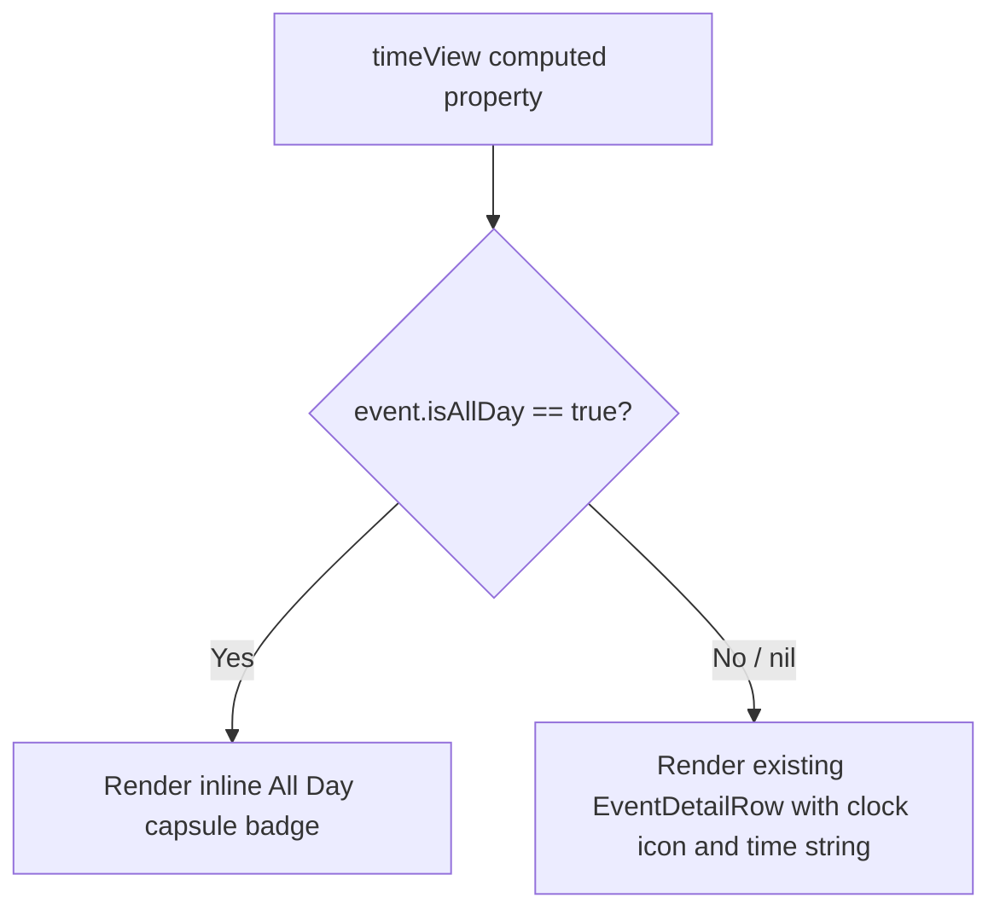

# Technical Specification: LOC-556 - Display "All Day" Indicator on Event Detail Page

**Status:** Draft
**Author:** Tech Lead Agent
**Created:** 2026-08-04

---

## 🎯 Problem

### Context

The Events tab in Berkeley Mobile iOS displays a list of campus events (academic calendar and campuswide) sourced from Firestore. Tapping an event opens `EventDetailView`, which renders a `BMDetailHeaderView` card containing the event name, date row, time row, and optional location row.

### Current State

`BMEventCalendarEntry` carries an `isAllDay: Bool?` field populated from the Firestore model `BerkeleyEvent.isAllDay`. The `BMCalendarEvent` protocol's default `dateString` implementation checks for all-day semantics via a **time-component heuristic** (start at 00:00:00 and end at 23:59:59). When this condition is met it returns `"<date> / All Day"`.

However, `BMDetailHeaderView.timeView` extracts the time part by splitting `dateString` on `" / "` and taking `.last`:

```swift
// EventDetailView.swift:155
private var timeView: some View {
    if let timePart = event.dateString.components(separatedBy: " / ").last {
        EventDetailRow(systemImageName: "clock", text: timePart)
    }
}
```

This split-based extraction **does** produce "All Day" for the subset of events whose `startTime` is exactly midnight and `endTime` is exactly 23:59:59. But:

1. **`isAllDay` is not consulted.** The model's authoritative `isAllDay` flag from Firestore is ignored in the display path entirely. Events flagged `isAllDay: true` but whose timestamps deviate from the heuristic thresholds (e.g., `startTime` is `nil` and defaults to `Date().getStartOfDay()` — i.e. midnight — while `endTime` is `nil`, meaning `end == nil`) will fall through to the time formatter, which then shows `12:00 AM` (the midnight start time formatted with `"h:mm a"`).

2. **The "All Day" text, when it does appear, is a plain string inside `EventDetailRow`** — styled identically to a time string. The design call asks for a distinct capsule/badge visual treatment.

### Root Cause

In `EventsViewModel.fetchEventsGroupedByDate()` the mapping to `BMEventCalendarEntry` passes `isAllDay: $0.isAllDay`, storing the flag on the model. However `BMDetailHeaderView.timeView` relies exclusively on `dateString` string parsing, which uses the midnight/23:59 heuristic — not the `isAllDay` property. When an event is truly all-day but lacks matching exact timestamps, the heuristic fails and "12:00 AM" is displayed.

### Desired State

When `event.isAllDay == true`, the time row in `BMDetailHeaderView` should:
- **Hide** the plain `EventDetailRow` clock-and-text display.
- **Show** a capsule/pill-shaped `"All Day"` badge in its place, consistent with the existing `AllDayEventBannerView` visual language already present in the codebase.

### Impact

- **User-facing:** Misleading time value ("12:00 AM") shown for all-day events is replaced with a clear "All Day" badge.
- **Scope:** Pure UI change inside `EventDetailView.swift` (specifically `BMDetailHeaderView`). No data model changes, no Firestore changes, no ViewModel logic changes.
- **Risk:** Low. The change is additive and localized to a single computed sub-view.

---

## 📋 Architectural Decisions

### Decision 1 — How to detect "all-day" in the view

Three options were considered for how `BMDetailHeaderView` determines whether to show the "All Day" badge.

---

#### Option A — Use `event.isAllDay` directly (recommended)

**Description:** Read `BMEventCalendarEntry.isAllDay: Bool?` in the view, treating `nil` as `false`. Render the capsule badge when `isAllDay == true`; render the existing `EventDetailRow` time display otherwise.

**Pros:**
- Uses the authoritative, intent-carrying field populated from Firestore.
- Eliminates the fragile midnight/23:59 heuristic that causes the bug.
- No changes to `BMCalendarEvent.dateString`, `EventsViewModel`, or any model.
- Consistent with how `EventsDataService` already passes `isAllDay` into the model.

**Cons:**
- `isAllDay` is `Bool?` (optional). Must handle `nil` defensively (`?? false`).
- If Firestore data is missing the field, behavior silently degrades to showing time (acceptable; matches existing behavior for non-all-day events).

**Estimated effort:** < 1 hour (single view file edit).
**Alignment:** Follows `docs/code-conventions.md` — views are thin, they read from model state, no logic belongs in the view beyond simple conditionals.

---

#### Option B — Fix the `dateString` heuristic to consult `isAllDay`

**Description:** Modify the `BMCalendarEvent.dateString` default implementation to also check `isAllDay` (via a protocol extension constraint or by adding `isAllDay` to the protocol).

**Pros:**
- Centralizes "all-day" string formatting in one place.
- `dateString` becomes correct for `EventRowView` (list row) as well.

**Cons:**
- Requires protocol changes to `BMCalendarEvent` (adding `isAllDay` as a protocol requirement).
- Forces all conforming types to expose `isAllDay`.
- The time row in `BMDetailHeaderView` still parses the string — the string "All Day" still needs to be detected and swapped for the badge UI. Does not solve the visual requirement on its own.
- `dateString` is also consumed by `EventRowView` (text label) — changing it has wider blast radius.
- Scope creep: the issue is a UI display problem in `EventDetailView`, not a data-formatting problem.

**Estimated effort:** 2–3 hours (protocol change + migration of conforming types + regression risk).
**Alignment:** Wider blast radius than warranted per `docs/code-conventions.md` principle of minimal change.

---

#### Option C — String-match "All Day" in `timeView`

**Description:** Keep existing `dateString` split logic; add a guard that if `timePart == "All Day"`, render the badge; otherwise render `EventDetailRow`.

**Pros:**
- No model property access; works purely from the existing string.

**Cons:**
- Brittle: relies on the exact string `"All Day"` being produced by the heuristic — which is precisely what fails for the bug case (when `isAllDay: true` but timestamps deviate).
- Does not fix the root cause; merely improves the display for the subset of events already handled by the heuristic.

**Estimated effort:** 30 minutes — but does not fully solve the issue.
**Alignment:** Anti-pattern — parsing a display string to recover semantic meaning that is already available on the model.

---

### Decision: Option A

**Rationale:** `isAllDay: Bool?` already exists on `BMEventCalendarEntry`, populated from Firestore via `EventsDataService`. Reading it directly in `BMDetailHeaderView.timeView` is the minimal, semantically correct fix. It requires changing exactly one computed sub-view in one file, with zero risk to other screens. Options B and C are either over-scoped or fragile.

**Trade-offs accepted:**
- `nil` treated as `false` — correct default for events that don't carry the field (legacy data).
- The `dateString` property still contains the old heuristic path; it is not removed (out of scope — removal would affect `EventRowView` and requires separate verification).

---

### Decision 2 — Visual treatment for "All Day" in the time row

#### Option A — Inline capsule shape in `BMDetailHeaderView` (recommended)

**Description:** Replace the `EventDetailRow` in `timeView` with an inline SwiftUI `Capsule` + `Text("All Day")` matching the style of `AllDayEventBannerView`.

**Pros:**
- Reuses the established visual language from `AllDayEventBannerView` (already in `Events/`).
- Self-contained; no new shared component needed.
- Matches the "capsule/pill" shape requested in the issue.

**Cons:**
- Slight style duplication with `AllDayEventBannerView` — but that banner serves a different layout (list row banner with event name; this is a compact badge inside a detail card).

**Estimated effort:** 30 minutes.

#### Option B — Extract a shared `AllDayBadgeView` to `Common/`

**Description:** Create `berkeley-mobile/Common/AllDayBadgeView.swift` as a reusable capsule badge, used both here and in future contexts.

**Pros:**
- DRY; reusable across list rows and detail views.

**Cons:**
- Over-engineering for a single call-site. `docs/code-conventions.md` warns against premature abstraction.
- Requires a new file, `Common/` addition, and wiring.

**Estimated effort:** 1 hour.

#### Option C — Reuse `AllDayEventBannerView` directly

**Description:** Place `AllDayEventBannerView` inside the time row.

**Pros:**
- Zero new code.

**Cons:**
- `AllDayEventBannerView` renders a full-width banner with the event name. It is semantically and visually wrong for a compact detail row (it also requires `@InjectedObservable(\.eventsViewModel)` for no reason in this context).

**Estimated effort:** 5 minutes — but wrong result.

---

### Decision: Option A (inline capsule inside `timeView`)

**Rationale:** A compact, inline capsule is the correct visual for the detail card's time row. The full-width `AllDayEventBannerView` is inappropriate here. Extracting a shared component is premature given there is currently only one other use-site. The inline approach matches existing SwiftUI patterns in the codebase (computed sub-views returning `some View`).

---

## 🔄 Decision Flow



---

## 🏗️ Architecture and Implementation

## 🏗️ Architecture

### Pattern

**MVVM — View-only change.** No ViewModel or data layer modifications are required. `BMDetailHeaderView` is a pure SwiftUI view struct that receives a `BMEventCalendarEntry` value. The fix reads `event.isAllDay` and conditionally renders one of two sub-views. No state, no bindings, no DI wiring changes.

### Key Components

| Component | Path | Role |
|-----------|------|------|
| `BMDetailHeaderView` | `berkeley-mobile/Events/EventDetailView.swift:104` | Host view — contains the `timeView` computed property that needs updating |
| `timeView` | `EventDetailView.swift:153` | Computed sub-view — currently always renders `EventDetailRow` with the time string; will branch on `isAllDay` |
| `BMEventCalendarEntry.isAllDay` | `berkeley-mobile/Events/EventDataSource/BMEventCalendarEntry.swift:61` | Model field — authoritative all-day flag, populated from Firestore |
| `AllDayEventBannerView` | `berkeley-mobile/Events/AllDayEventBannerView.swift` | Existing style reference — provides the `Capsule().fill(.gray.opacity(0.5))` visual language to match |
| `EventDetailRow` | `EventDetailView.swift:177` | Existing row component used for date/time/location — unchanged |

### Data Flow

```
Firestore "Events" collection
  └─ BerkeleyEvent.isAllDay: Bool?
       └─ EventsDataService.fetchEventsGroupedByDate()
            └─ BMEventCalendarEntry(isAllDay: $0.isAllDay)   ← already wired
                 └─ EventDetailView(event:)
                      └─ BMDetailHeaderView(event:)
                           └─ timeView  ← CHANGE HERE
                                ├─ isAllDay == true  → AllDayCapsuleView (new inline view)
                                └─ isAllDay != true  → EventDetailRow (existing, unchanged)
```

No new data flows, no new DI registrations, no new model fields.

---

## 💻 Implementation

### Step 1 — Modify `BMDetailHeaderView.timeView` in `EventDetailView.swift`

**File:** `berkeley-mobile/Events/EventDetailView.swift`
**Lines to modify:** 153–158 (the `timeView` computed property inside `BMDetailHeaderView`)

**Current code:**
```swift
@ViewBuilder
private var timeView: some View {
    if let timePart = event.dateString.components(separatedBy: " / ").last {
         EventDetailRow(systemImageName: "clock", text: timePart)
    }
}
```

**Replacement template:**
```swift
@ViewBuilder
private var timeView: some View {
    if event.isAllDay == true {
        allDayCapsuleView
    } else if let timePart = event.dateString.components(separatedBy: " / ").last {
        EventDetailRow(systemImageName: "clock", text: timePart)
    }
}

private var allDayCapsuleView: some View {
    Capsule()
        .fill(.gray.opacity(0.5))
        .frame(height: 24)
        .overlay(
            Text("All Day")
                .font(Font(BMFont.bold(12)))
                .foregroundStyle(.primary)
                .padding(.horizontal, 8)
        )
        .fixedSize(horizontal: true, vertical: false)
}
```

**Notes:**
- `allDayCapsuleView` follows `docs/code-conventions.md` — extracted as a private computed property with a `View` suffix.
- `fixedSize(horizontal: true, vertical: false)` ensures the capsule hugs its text content rather than stretching to the full width of the parent `VStack`.
- `frame(height: 24)` is slightly smaller than `AllDayEventBannerView`'s `30` pt height, appropriate for the compact detail-card context.
- `BMFont.bold(12)` matches the font size used by `EventDetailRow`'s `BMFont.regular(12)`, keeping vertical rhythm consistent.
- `isAllDay == true` guard: treats `nil` as `false` (non-optional equality check on `Bool?`), matching the project's anti-force-unwrap convention from `docs/code-conventions.md`.
- No new imports needed — `SwiftUI` is already imported.

### Step 2 — Update the Preview's sample entry (optional, recommended)

**File:** `berkeley-mobile/Events/EventDataSource/BMEventCalendarEntry.swift`

Add a second sample entry for all-day events to support `#Preview` validation:

```swift
extension BMEventCalendarEntry {
    static let sampleAllDayEntry = BMEventCalendarEntry(
        name: "Campus Holiday",
        date: Date().getStartOfDay(),
        end: nil,
        descriptionText: "The campus is closed for the holiday.",
        location: nil,
        registerLink: nil,
        imageURL: nil,
        sourceLink: nil,
        type: "Holiday",
        isAllDay: true
    )
}
```

Then in `EventDetailView.swift`, add a second preview:

```swift
#Preview("All Day Event") {
    EventDetailView(event: BMEventCalendarEntry.sampleAllDayEntry)
}
```

This is the only additional file touched. The sample entry's `isAllDay: true` will exercise the new capsule path in the SwiftUI canvas without running the simulator.

### Integration Points

- **No DI changes:** `BMDetailHeaderView` is a struct initialized directly in `EventDetailView`; it is not registered in `BerkeleyMobile+Injection.swift`.
- **No ViewModel changes:** `EventsViewModel` already stores `isAllDay` on the model entry; no new ViewModel logic is needed.
- **No Firestore schema changes:** `BerkeleyEvent.isAllDay` is already decoded from Firestore documents.
- **`dateString` unchanged:** The `BMCalendarEvent.dateString` heuristic in `BMCalendarEvent.swift` is left as-is. It continues to work correctly for `EventRowView` (list display), which shows a full `"date / time"` string. The detail view now bypasses `dateString`'s time component entirely when `isAllDay` is `true`.

---

## ✅ Testing, Security, and Definition of Done

## ✅ Testing Strategy

As noted in `docs/testing-standards.md`, the repository currently has **no automated test target**. Testing for this change therefore has two tiers:

### Tier 1 — SwiftUI Preview (immediate, zero-setup)

Add the all-day sample preview described in Implementation Step 2. In Xcode's Canvas:
1. Verify the "All Day Event" preview shows the capsule badge in the time row.
2. Verify the default preview (non-all-day) continues to show the time string unchanged.

### Tier 2 — Manual Simulator Testing

Build and run on an iPhone 18+ simulator per `docs/testing-standards.md` manual testing guidelines:

| Scenario | `isAllDay` | Expected Result |
|----------|------------|-----------------|
| All-day event (`isAllDay: true`) | `true` | Capsule "All Day" badge in time row; no clock time shown |
| All-day event (`isAllDay: nil`, old data) | `nil` | Time row shows formatted time (existing behavior, no regression) |
| Timed event (`isAllDay: false`) | `false` | Time row shows start time (and end time if present) |
| Event with no end time | `false` | Time row shows start time only |
| Event where `dateString` heuristic produces "All Day" but `isAllDay` is `false` | `false` | Shows "All Day" string via `EventDetailRow` (existing behavior preserved) |

### Tier 3 — Unit Tests (if test target is added in future)

If an `XCTest` target is created per `docs/testing-standards.md`, the following tests should be added in `berkeley-mobileTests/Features/Events/BMDetailHeaderViewTests.swift`:

```swift
// Pattern: test_<scenario>_<expectedOutcome>
final class BMDetailHeaderViewTests: XCTestCase {

    func test_timeView_whenIsAllDayTrue_showsCapsuleBadge() {
        // Arrange
        let event = BMEventCalendarEntry(
            name: "Holiday", date: Date(), isAllDay: true
        )
        // Act / Assert: render BMDetailHeaderView and assert allDayCapsuleView is present
        // (Using ViewInspector library if added, or manual snapshot test)
    }

    func test_timeView_whenIsAllDayFalse_showsTimeRow() {
        // Arrange
        let event = BMEventCalendarEntry(
            name: "Lecture", date: Date(), isAllDay: false
        )
        // Assert EventDetailRow with clock icon is present
    }

    func test_timeView_whenIsAllDayNil_showsTimeRow() {
        // Arrange: nil isAllDay (legacy event)
        let event = BMEventCalendarEntry(name: "Legacy", date: Date(), isAllDay: nil)
        // Assert time row is shown (not the capsule)
    }
}
```

**Coverage target** (per `docs/testing-standards.md` model/value-type logic): ≥ 90% on the `timeView` branching logic once a test target exists.

---

## 🔒 Security Considerations

| Item | Status |
|------|--------|
| Input validation | N/A — `isAllDay` is a `Bool?` decoded from Firestore by the Firebase SDK; no user input involved |
| XSS / injection | N/A — no web rendering; pure SwiftUI Text views |
| Authentication | N/A — no auth-gated data change |
| Secrets | N/A — no secrets touched |
| Firestore rules | N/A — no new read/write paths |
| Force-unwrap | None introduced — `isAllDay == true` safely handles `nil` as `false` |

This change is a pure SwiftUI view modification with no security surface.

---

## ✅ Definition of Done

### Implementation
- [ ] `BMDetailHeaderView.timeView` updated to branch on `event.isAllDay == true`
- [ ] `allDayCapsuleView` private computed property added to `BMDetailHeaderView`
- [ ] `BMEventCalendarEntry.sampleAllDayEntry` static property added for previews
- [ ] `#Preview("All Day Event")` added to `EventDetailView.swift`
- [ ] No force-unwraps introduced
- [ ] No new imports added beyond what is already present

### Testing
- [ ] SwiftUI Preview "All Day Event" shows capsule badge
- [ ] SwiftUI Preview default (non-all-day) shows time row unchanged
- [ ] Manual simulator test: all-day event detail shows "All Day" capsule
- [ ] Manual simulator test: timed event detail shows time string (no regression)
- [ ] Manual simulator test: `isAllDay: nil` event shows time string (no regression)

### Quality
- [ ] Code follows `docs/code-conventions.md`: `PascalCase` types, `camelCase` properties, private computed sub-view with `View` suffix
- [ ] No `print()` logging added (use `os.Logger` if any logging is needed — none expected here)
- [ ] No new `// MARK:` sections needed (change is within existing `BMDetailHeaderView`)

### Documentation
- [ ] This tech spec is complete and reviewed
- [ ] PR description references LOC-556 and describes the visual change with before/after screenshots

---

## 🚫 Out of Scope

- **`EventRowView` (list row):** The time display in the event list row uses `event.dateString` as a plain text label. Updating it to show an "All Day" badge is a separate UX decision and is not part of this issue.
- **`BMCalendarEvent.dateString` refactor:** The midnight/23:59 heuristic is not removed. It still works for events whose timestamps happen to match, and changing it risks regressions in `EventRowView`.
- **`AllDayEventBannerView`:** Not modified. It serves a different layout context (scrollable list banner with event name).
- **Firestore data backfill:** Events with incorrect `isAllDay` values in Firestore are a backend concern, not in scope here.
- **Widget extension:** The `BerkeleyMobileWidget` target does not display event detail views.
- **`isAllDay` propagation to EventKit:** `BMEventManager.addEventToCalendar` is not modified; whether the exported calendar event is marked all-day is a separate concern.
- **Accessibility audit:** VoiceOver behavior for the capsule badge (e.g., adding `.accessibilityLabel("All Day")`) is recommended but not required for the initial fix.

---

## 📚 References

### Internal Docs Consulted
- `docs/tech.md` — SwiftUI as primary UI framework, Swift 5.9+ `@Observable` macro, iOS 18 deployment target
- `docs/structure.md` — Events feature location (`berkeley-mobile/Events/`), MVVM pattern, Common component conventions
- `docs/code-conventions.md` — Private computed sub-views with `View` suffix, `@ViewBuilder`, `MARK` usage, no force-unwrap, `camelCase` properties
- `docs/testing-standards.md` — No existing test target; manual simulator testing + XCTest structure for future

### Source Files Reviewed
- `berkeley-mobile/Events/EventDetailView.swift` — host view, `BMDetailHeaderView`, `timeView`
- `berkeley-mobile/Events/EventDataSource/BMEventCalendarEntry.swift` — `isAllDay: Bool?` model field
- `berkeley-mobile/Events/EventDataSource/EventsViewModel.swift` — `BerkeleyEvent.isAllDay` Firestore mapping
- `berkeley-mobile/Events/AllDayEventBannerView.swift` — existing capsule style reference
- `berkeley-mobile/Data/ItemProtocols/BMCalendarEvent.swift` — `dateString` default implementation and heuristic
- `berkeley-mobile/Utils/Date+Extension.swift` — `doesDateComponentsAreEqualTo`, `getDateString`

### Related Issues
- LOC-556 (this issue) — Events Page: Display "All Day" indicator instead of time on Event Detail Page
