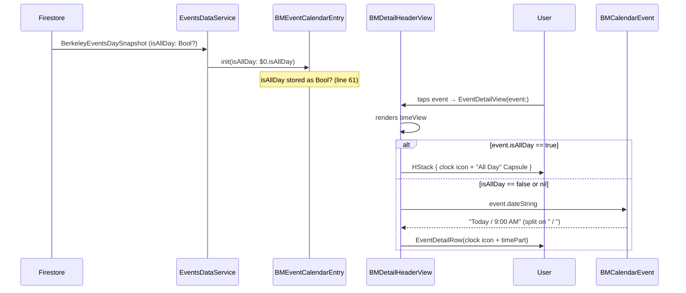

# Technical Specification: TDLOKI-124 — Events Page: Display "All Day" Indicator Instead of Time on Event Detail Page

**Status:** Draft
**Author:** B3 Tech Lead Agent
**Created:** 2026-07-08
**Stack:** Swift / SwiftUI (iOS only)
**Platform Tag:** [MOBILE]

---

## 🎯 Problem

### Summary

The `BMDetailHeaderView` inside `EventDetailView.swift` renders a time row by splitting the `dateString` property on `" / "` and showing the right-hand fragment. The `BMCalendarEvent.dateString` default implementation only returns `"All Day"` as the time fragment when `startDate` is exactly midnight **and** `end` is exactly 11:59:59 PM (a date-component heuristic). When the backend populates `isAllDay = true` but the stored `startDate` is not precisely midnight (a common data-quality variance), the heuristic falls through and `dateString` returns `"12:00 AM"`. The result is that all-day events display a misleading clock time.

### Root Cause

**File:** `berkeley-mobile/Events/EventDetailView.swift` — `BMDetailHeaderView.timeView` (lines 153–158)

```swift
@ViewBuilder
private var timeView: some View {
    if let timePart = event.dateString.components(separatedBy: " / ").last {
         EventDetailRow(systemImageName: "clock", text: timePart)
    }
}
```

The `timeView` property derives the time to display **entirely from string-parsing** of `dateString`. It is unaware of `BMEventCalendarEntry.isAllDay: Bool?` (defined at line 61 of `BMEventCalendarEntry.swift`). Because `isAllDay` is the authoritative all-day signal (populated directly from the Firestore field `BerkeleyEvent.isAllDay`), ignoring it produces the bug.

### Existing All-Day Design Pattern (Precedent)

`AllDayEventBannerView.swift` — already used on the Events list (`EventsView.swift`, line 25–26) — renders a `Capsule()` filled with `.gray.opacity(0.5)` containing a bold "All Day" label (font `BMFont.bold(15)`). This is the established design token for all-day visual language.

### Affected Files

| File | Role |
|------|------|
| `berkeley-mobile/Events/EventDetailView.swift` | **Change target** — `BMDetailHeaderView.timeView` computed property |
| `berkeley-mobile/Events/AllDayEventBannerView.swift` | Visual reference for capsule style |
| `berkeley-mobile/Events/EventDataSource/BMEventCalendarEntry.swift` | Authoritative `isAllDay: Bool?` flag (line 61) — **no changes needed** |
| `berkeley-mobile/Data/ItemProtocols/BMCalendarEvent.swift` | `dateString` protocol default — **no changes needed** |

### Business Rules Driving the Fix

| Rule | Constraint |
|------|-----------|
| BR-001 | `isAllDay == true` → show capsule, never a clock time |
| BR-002 | `isAllDay == false` or `nil` → show `dateString` time fragment unchanged |
| BR-004 | Use `isAllDay` as the authoritative flag, not `dateString` string content |
| BR-006 | Clock icon (`"clock"`) must remain visible alongside the capsule |
| BR-007 | `nil` isAllDay falls back to timed behavior |

---

## 📋 Architectural Decisions

### AD-01: Where to apply the all-day gate

**Decision**: Apply the `isAllDay` check **inside `BMDetailHeaderView.timeView`** in `EventDetailView.swift`.

| Option | Description | Trade-off |
|--------|-------------|-----------|
| A — Gate in `timeView` (selected) | `if event.isAllDay == true { capsule } else { EventDetailRow(...) }`. Minimal scope, single file change. | Slightly longer `timeView` property, but the branching logic is self-contained. |
| B — Subclass/extend `EventDetailRow` | Add a variant row that accepts an optional `isAllDay` flag and handles capsule rendering internally. | Unnecessary abstraction; `EventDetailRow` is used for date and location rows too, so adding all-day logic there would be a leaky concern. |
| C — Inject `isAllDay` into a new dedicated wrapper view | Create a `TimeRowView` that wraps both cases. | Over-engineering for a two-branch conditional that lives entirely in one view struct. |

**Rationale**: The change is local to `BMDetailHeaderView`; no other view consumes the time row. Option A matches the codebase's existing pattern where `@ViewBuilder` computed properties use `if/else` branching (`descriptionSection`, `locationView` in the same file). `docs/code-conventions.md` confirms the "no premature abstraction" principle.

---

### AD-02: Capsule visual implementation strategy

**Decision**: Inline a `Capsule`-based SwiftUI view directly inside `timeView`, **not** reusing `AllDayEventBannerView`.

| Option | Description | Trade-off |
|--------|-------------|-----------|
| A — Inline capsule in `timeView` (selected) | `Capsule().fill(.gray.opacity(0.5))` with `Text("All Day")` overlaid, styled to match `AllDayEventBannerView`. Width constrained so it doesn't flood the `HStack`. | Minimal size; no new reusable component needed. |
| B — Reuse `AllDayEventBannerView` directly | Import the banner verbatim. | `AllDayEventBannerView` displays the **event name** alongside "All Day" (designed for the list row context); embedding it in the detail header's time row would duplicate the name and break the layout. Out of scope to refactor it. |
| C — Extract a shared `AllDayCapsuleLabel` component | Create a new reusable component consumed by both the banner and the detail header. | Good long-term, but the business requirement only touches the detail header. The banner is out of scope (BR, section 4). Adding a shared component now would be premature; that refactor belongs in a separate task. |

**Rationale**: The detail header's time row must retain the `HStack` + clock icon structure (`EventDetailRow` pattern). The capsule here is a **label-only** capsule (no event name, no horizontal padding to fill a list row). Inlining keeps the change local and avoids refactoring `AllDayEventBannerView`'s layout contract.

**Visual specification for the inline capsule:**

| Token | Value | Source |
|-------|-------|--------|
| Fill | `.gray.opacity(0.5)` | Matches `AllDayEventBannerView.swift` line 19 |
| Text | `"All Day"` | Matches `AllDayEventBannerView.swift` line 23 |
| Text font | `Font(BMFont.bold(12))` | Matches the 12pt light font used for other rows in the header; bold weight for badge contrast |
| Text color | `.primary` (adaptive) | Standard for label text on semi-transparent fills |
| Capsule height | `24` pt (fixed) | Compact enough to fit the time row height |
| Capsule width | `.fit` (content-driven via `fixedSize`) | Avoids overflow on small screens |

---

### AD-03: `isAllDay` nil-safety strategy

**Decision**: Treat `isAllDay == true` as the **only** condition that shows the capsule. Both `false` and `nil` fall through to the existing time-string path.

Swift's optional boolean pattern `event.isAllDay == true` already short-circuits on `nil`, satisfying BR-007 with no extra guard needed. This is consistent with how `EventsView.swift` line 25 already uses the same `== true` pattern to select `AllDayEventBannerView`.

---

### AD-04: Accessibility strategy

**Decision**: Wrap the capsule in an `HStack` parallel to the existing `EventDetailRow` structure. The `HStack` carries `.accessibilityLabel("All Day")` on the `Text` element — no separate `accessibilityElement(children:)` modifier required.

Because `EventDetailRow` renders `Image + Text` as a natural `HStack`, the replacement `HStack(Image + Capsule)` for the all-day row uses the same structural pattern. VoiceOver will read the clock image's system accessibility label followed by "All Day" from the `Text` view's label, satisfying NFR-002.

---

### Decision Summary

```
timeView @ViewBuilder:
  if isAllDay == true
    → HStack { clock-icon | inline Capsule("All Day") }
  else
    → EventDetailRow(systemImageName: "clock", text: timePart-from-dateString)
```

The `dateView` property, `locationView`, `eventNameView`, and all other `BMDetailHeaderView` subviews remain **unchanged**.

---

## 🏗️ Architecture and Implementation

### Change Scope

This is a **single-file, single-property change**. No new files, no new types, no dependency-injection changes, no data-model changes.

```
berkeley-mobile/Events/EventDetailView.swift
  └─ struct BMDetailHeaderView
       └─ @ViewBuilder private var timeView  ← only this property changes
```

---

### Data Flow



---

### Implementation Template

**File:** `berkeley-mobile/Events/EventDetailView.swift`

Replace the `timeView` computed property in `BMDetailHeaderView` (currently lines 153–158):

**Before:**
```swift
@ViewBuilder
private var timeView: some View {
    if let timePart = event.dateString.components(separatedBy: " / ").last {
         EventDetailRow(systemImageName: "clock", text: timePart)
    }
}
```

**After:**
```swift
@ViewBuilder
private var timeView: some View {
    if event.isAllDay == true {
        HStack(spacing: 6) {
            Image(systemName: "clock")
                .font(.system(size: 16))
            Text("All Day")
                .font(Font(BMFont.bold(12)))
                .padding(.horizontal, 8)
                .padding(.vertical, 3)
                .background(Capsule().fill(.gray.opacity(0.5)))
                .accessibilityLabel("All Day")
        }
    } else if let timePart = event.dateString.components(separatedBy: " / ").last {
        EventDetailRow(systemImageName: "clock", text: timePart)
    }
}
```

**Key implementation notes:**

1. `event.isAllDay == true` — uses Swift's safe optional-boolean equality; `nil` evaluates to `false`, satisfying BR-007 without any guard.
2. The clock `Image` in the all-day branch uses `.font(.system(size: 16))` to match the identical modifier in `EventDetailRow.body` (line 183) and `locationView` (line 164). This keeps icon sizes visually consistent across all rows.
3. `BMFont.bold(12)` — uses the 12pt size matching the surrounding row fonts (`BMFont.regular(12)` in `EventDetailRow`, `BMFont.light(12)` on the outer `VStack`) to keep the badge visually compact rather than oversized.
4. `Capsule().fill(.gray.opacity(0.5))` — identical fill to `AllDayEventBannerView` line 19; satisfies BR-003 and AC-005.
5. `.accessibilityLabel("All Day")` — placed on the `Text` view; VoiceOver reads the clock system image's implicit label then "All Day", satisfying NFR-002.
6. No `fixedSize()` modifier needed; `Text` inside a `Capsule` background sizes to content by default in SwiftUI.
7. The `else if` preserves the original guard behavior: if `dateString` has no `" / "` separator (a degenerate edge case), neither branch renders anything — same null-safe behavior as before.

---

### No Other Files Require Changes

| File | Status | Reason |
|------|--------|--------|
| `BMEventCalendarEntry.swift` | Unchanged | `isAllDay: Bool?` already exists (line 61) and is correctly populated from Firestore |
| `BMCalendarEvent.swift` | Unchanged | `dateString` continues to serve timed events; its "All Day" heuristic is now bypassed for flagged events |
| `AllDayEventBannerView.swift` | Unchanged | Out of scope; used only on the list page |
| `EventsView.swift` | Unchanged | Already correctly gates on `isAllDay` for list display |
| `BerkeleyMobile+Injection.swift` | Unchanged | No new dependencies or VM registration needed |

---

### Preview Update

The existing `#Preview` macro at the bottom of `EventDetailView.swift` uses `BMEventCalendarEntry.sampleEntry`, which does **not** set `isAllDay`. To allow developers to visually verify the all-day path, an additional preview entry should be added:

```swift
#Preview("All Day Event") {
    EventDetailView(event: BMEventCalendarEntry(
        name: "Exhibit | A Storied Campus: Cal in Fiction",
        date: Date(),
        end: nil,
        descriptionText: "An all-day exhibit.",
        location: "Doe Library",
        isAllDay: true
    ))
}
```

This is a development convenience and does not affect production behavior.

---

## ✅ Testing, Security, and Definition of Done

### Testing Strategy

> **Note:** Per `docs/testing-standards.md`, the repository currently contains **no XCTest targets** and no automated test suite. The testing strategy below defines the work needed to validate this change given that baseline, using a combination of Swift Preview verification and manual functional testing on a simulator/device.

#### 1. SwiftUI Preview Validation (Development-time)

Add a multi-scenario preview block to `EventDetailView.swift`:

```swift
#Preview("Timed Event") {
    EventDetailView(event: BMEventCalendarEntry.sampleEntry)
}

#Preview("All Day — isAllDay true") {
    EventDetailView(event: BMEventCalendarEntry(
        name: "Academic Deadline",
        date: Calendar.current.startOfDay(for: Date()),
        end: nil,
        descriptionText: "Enrollment period opens.",
        location: "Online",
        isAllDay: true
    ))
}

#Preview("All Day — isAllDay true, end non-nil") {
    EventDetailView(event: BMEventCalendarEntry(
        name: "Campus Holiday",
        date: Calendar.current.startOfDay(for: Date()),
        end: Calendar.current.startOfDay(for: Date()),
        descriptionText: nil,
        location: nil,
        isAllDay: true
    ))
}

#Preview("Nil isAllDay — fallback to timed") {
    EventDetailView(event: BMEventCalendarEntry(
        name: "Library Study Hours",
        date: Date(),
        end: Date().addingTimeInterval(3600),
        isAllDay: nil
    ))
}
```

Each preview must be visually verified in Xcode's canvas:

| Preview | Expected Outcome |
|---------|-----------------|
| Timed Event | Time row shows formatted time string (e.g., "9:00 AM - 11:00 AM"); no capsule visible |
| All Day — true | Time row shows clock icon + gray capsule with "All Day" label |
| All Day — true, end non-nil | Same capsule; end date does not interfere |
| Nil isAllDay | Time row shows time string from `dateString`; no capsule |

#### 2. Manual Functional Testing (Simulator)

Test against a device or iOS Simulator running the app pointed at real Firestore data or the debug fixture:

| AC | Test Case | Steps | Expected Result |
|----|-----------|-------|-----------------|
| AC-001 | All-day event opens detail page | 1. Find an event in the list displayed as `AllDayEventBannerView`. 2. Tap to open `EventDetailView`. | Time row shows capsule "All Day" badge; no clock time visible. |
| AC-002 | Timed event opens detail page | 1. Find a standard `EventRowView` event. 2. Tap to open detail. | Time row shows formatted time (e.g., "10:00 AM - 12:00 PM"). |
| AC-003 | Date row unaffected | Open any all-day event detail. | Date row (calendar icon) shows correct date ("Today", "Tomorrow", or MM/DD/YYYY). |
| AC-004 | nil isAllDay falls back | Use debug fixture with `isAllDay: nil`. | Same as timed event; no capsule shown. |
| AC-005 | Capsule visual style | Open all-day event detail. | Capsule has rounded ends, gray fill, matches the list-page "All Day" visual language. |
| AC-006 | All-day with nil end date | Open all-day event where `end == nil`. | Capsule still renders; no crash. |
| AC-007 | Timed event with start+end | Open event with both dates. | Range string shown (e.g., "9:00 AM - 5:00 PM"); no capsule. |

#### 3. VoiceOver Accessibility Test

On a physical device or simulator with VoiceOver enabled:

1. Navigate to an all-day event's detail page.
2. Focus on the time row element.
3. **Expected**: VoiceOver announces "All Day" (or "clock, All Day" depending on grouping).
4. **Not acceptable**: VoiceOver announces "12:00 AM" or is silent.

#### 4. Dark Mode / Light Mode Visual Test

The capsule fill `.gray.opacity(0.5)` is not a `BMColor` adaptive token; it is adaptive by nature (gray adapts automatically to both light and dark appearances in SwiftUI). Verify:

- Light mode: capsule is a soft gray, text is legible.
- Dark mode: capsule remains visible, text contrast is adequate.

---

### Security Checklist

This change is a **pure UI rendering fix** with no backend, network, authentication, or data-persistence implications. The abbreviated checklist below confirms no security-sensitive surface is touched:

- [x] **No PII in logs** — no new logging added; `isAllDay` is a boolean, not user-identifying data.
- [x] **No network calls added** — change is entirely in the view layer; no new Firestore reads, API calls, or URLSession usage.
- [x] **No storage writes** — no `UserDefaults`, `flutter_secure_storage`, or Keychain interactions.
- [x] **No authentication surface changes** — `EventDetailView` has no auth gating; this change does not alter access controls.
- [x] **No injection risk** — the capsule renders a hardcoded `"All Day"` string literal, not any server-provided string.

---

### Definition of Done

- [ ] `timeView` in `BMDetailHeaderView` (`EventDetailView.swift`) updated per the implementation template above.
- [ ] All five SwiftUI preview scenarios pass visual verification in Xcode canvas.
- [ ] All seven acceptance criteria (AC-001 through AC-007) manually verified on iOS Simulator.
- [ ] VoiceOver test passed: "All Day" is announced for the time row on all-day events.
- [ ] Light mode and dark mode capsule appearance verified.
- [ ] No regression on timed events: `EventDetailRow` with formatted time continues to render as before.
- [ ] `flutter analyze` equivalent — Xcode build succeeds with zero warnings introduced by this change.
- [ ] Code reviewed and approved by at least one team member.
- [ ] PR description references TDLOKI-124 and links to the business requirements spec.

---

### Out of Scope

- Changes to `AllDayEventBannerView.swift` or the Events list page.
- Changes to `BMCalendarEvent.dateString` protocol default.
- Changes to `isAllDay` data sourcing in `EventsDataService` or Firestore schema.
- Android platform (repository is iOS-only).
- Localization of the "All Day" string (matches existing pattern in `AllDayEventBannerView`).
- Calendar add/edit flow changes.
- Extracting a shared `AllDayCapsuleLabel` reusable component (future task if needed).

---

### References

| Resource | Path |
|----------|------|
| Change target — `BMDetailHeaderView.timeView` | `berkeley-mobile/Events/EventDetailView.swift` lines 153–158 |
| Visual precedent — `AllDayEventBannerView` | `berkeley-mobile/Events/AllDayEventBannerView.swift` |
| Authoritative flag — `BMEventCalendarEntry.isAllDay` | `berkeley-mobile/Events/EventDataSource/BMEventCalendarEntry.swift` line 61 |
| Protocol default — `BMCalendarEvent.dateString` | `berkeley-mobile/Data/ItemProtocols/BMCalendarEvent.swift` lines 38–65 |
| Design tokens — `BMFont`, `BMColor` | `berkeley-mobile/Assets/Fonts.swift`, `berkeley-mobile/Assets/Colors/` |
| Events list all-day gate | `berkeley-mobile/Events/EventsView.swift` lines 25–26 |
| Business requirements | `specs/TDLOKI-124/business-requirements.md` |
