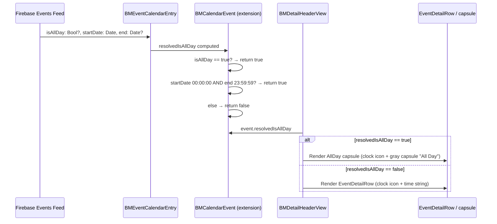
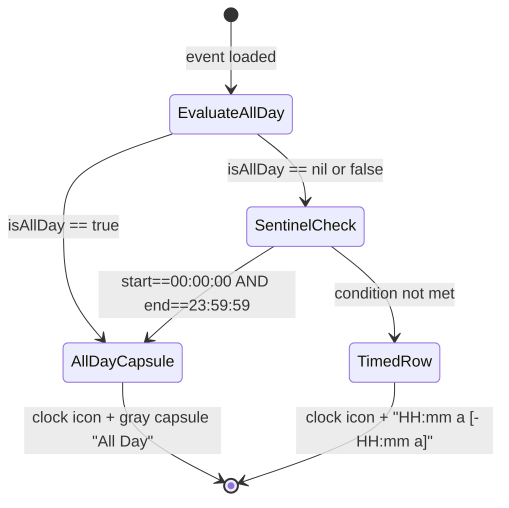

# Technical Specification: TDLOKI-222 - Display "All Day" Indicator on Event Detail Page

**Status:** Draft
**Author:** B3 Tech Lead Agent
**Created:** 2026-07-14
**Stack:** iOS (Swift / UIKit / SwiftUI) — Mobile Only

---

## 🎯 Problem

### Context

Berkeley Mobile iOS is a native Swift/SwiftUI application serving UC Berkeley students via a campus events feature. The `Events/` module displays event details via `EventDetailView` → `BMDetailHeaderView`, which renders three informational rows: date, time, and location.

### Root-Cause Analysis

Two compounding defects produce the "12:00 AM" display for all-day events:

**Defect 1 — Incorrect sentinel value in `BMCalendarEvent.dateString` (`BMCalendarEvent.swift:52-55`)**

```swift
// Current (BUGGY)
if startDate.doesDateComponentsAreEqualTo(hour: 0, minute: 0, sec: 0), let end,
    end.doesDateComponentsAreEqualTo(hour: 11, minute: 59, sec: 59) {   // ← hour 11 = 11 AM, not 11 PM
    return dateString + "All Day"
}
```

The guard checks `hour: 11` (11:59:59 AM in a 24-hour calendar component) but all-day events from the Berkeley events feed store end time as **23:59:59** (11 PM in 24-hour). The sentinel never matches, so `dateString` always falls through to formatting `startDate` as a time — yielding `"12:00 AM"` when start is midnight.

**Defect 2 — `timeView` in `BMDetailHeaderView` ignores `isAllDay` flag (`EventDetailView.swift:154-158`)**

```swift
// Current — always renders text regardless of isAllDay
@ViewBuilder
private var timeView: some View {
    if let timePart = event.dateString.components(separatedBy: " / ").last {
        EventDetailRow(systemImageName: "clock", text: timePart)   // plain text, no capsule
    }
}
```

Even if `event.isAllDay == true`, `timeView` renders whatever the last component of `dateString` is. There is no capsule/badge treatment. The `isAllDay: Bool?` field on `BMEventCalendarEntry` is completely unused in the UI layer.

### Why It Matters

All-day events — holidays, enrollment deadlines, academic calendar events — represent a significant share of Berkeley events feed content. Showing "12:00 AM" erodes user trust and implies attendees must arrive at midnight.

### Affected Files

| File | Location | Role |
|------|----------|------|
| `berkeley-mobile/Data/ItemProtocols/BMCalendarEvent.swift` | Line 53 | Buggy sentinel value (`hour: 11` should be `hour: 23`) |
| `berkeley-mobile/Events/EventDetailView.swift` | Lines 154–158 | `timeView` must conditionally render capsule vs. plain text |
| `berkeley-mobile/Events/AllDayEventBannerView.swift` | Reference only | Existing capsule pattern to follow |

### Platform Tag

`[MOBILE]` — iOS only. No backend, no API, no data model changes.

---

## 📋 Architectural Decisions

### Decision 1: Where to resolve all-day status

**Question**: Should all-day detection live in the model/protocol layer (`BMCalendarEvent.dateString`), a new computed property, or in the view layer (`BMDetailHeaderView`)?

| Option | Description | Trade-offs |
|--------|-------------|------------|
| A — Fix sentinel in `BMCalendarEvent.dateString` only | Correct `hour: 11` → `hour: 23`; `timeView` reads the string "All Day" and renders capsule | String-based coupling; view must parse a magic string to decide styling |
| B — Add `isAllDay` computed property to `BMCalendarEvent` protocol (preferred) | Add `var resolvedIsAllDay: Bool` to the protocol extension; `timeView` reads this Bool directly | Clean separation; view logic is explicit, not string-parsing |
| C — All detection in `BMDetailHeaderView` only | `timeView` directly inspects `event.isAllDay` and date components inline | Duplicates protocol knowledge in the view; harder to test |

**Decision: Option B** — Add `var resolvedIsAllDay: Bool` as a default protocol extension on `BMCalendarEvent`. It checks `isAllDay == true` first (flag precedence per BR-001), then falls back to the corrected sentinel (BR-002). `timeView` switches on this Bool — no magic string parsing. Additionally fix the buggy sentinel in `dateString` (needed for correctness of other consumers and the `dateString`-based "All Day" fallback path).

**Rationale**: Aligns with the project's protocol-extension pattern (`docs/code-conventions.md` — "Shared behaviors are expressed as protocols in `Data/ItemProtocols/`"). The Bool is the natural type for a binary state; keeps view code free of string matching.

---

### Decision 2: Where to place the "All Day" capsule view

**Question**: Reuse `AllDayEventBannerView` directly, extract a shared sub-component, or inline a new capsule in `timeView`?

| Option | Description | Trade-offs |
|--------|-------------|------------|
| A — Reuse `AllDayEventBannerView` | Import and embed the existing component | `AllDayEventBannerView` includes the event name text and uses `@InjectedObservable(\.eventsViewModel)` — overengineered for this context |
| B — Inline capsule in `timeView` (preferred) | A small `Capsule().fill(.gray.opacity(0.5))` + `Text("All Day")` directly inside `BMDetailHeaderView.timeView` | Self-contained, minimal, follows existing local view composition style |
| C — New shared `AllDayCapsuleView` | Extract a standalone reusable view | Premature abstraction for a single call-site change |

**Decision: Option B** — Inline a small capsule inside `timeView`. The styling matches `AllDayEventBannerView` (gray opacity capsule, same font family) but does not carry the banner's event-name overlay or ViewModel injection. Per `docs/code-conventions.md`, "three similar lines is better than a premature abstraction."

---

### Decision 3: Capsule sizing strategy

**Question**: Fixed-height capsule (matching `AllDayEventBannerView`'s `frame(height: 30)`) or content-hugging?

| Option | Description | Trade-offs |
|--------|-------------|------------|
| A — Fixed height 30 pt | Matches `AllDayEventBannerView` | May be taller than neighboring `EventDetailRow` text, causing visual imbalance in the compact header |
| B — `.fixedSize()` + `.padding(.vertical, 4).padding(.horizontal, 10)` (preferred) | Capsule sizes to text intrinsic content | Consistent visual weight with surrounding 12 pt rows; avoids hardcoded magic numbers |

**Decision: Option B** — Content-driven sizing. VoiceOver and Dynamic Type both benefit from not constraining height to a fixed value.

---

### Decision 4: Sentinel correction — 24-hour vs 12-hour

**Question**: Fix `BMCalendarEvent.dateString` sentinel from `hour: 11` to `hour: 23`?

**Yes.** `Calendar.component(.hour, from:)` returns 24-hour values (0–23). The current value `11` matches 11:00 AM, not 11:59 PM. The fix is a single-character change (`11` → `23`). This is needed for correctness of the existing `dateString` path, and for any future consumers that depend on `dateString` returning "All Day" for sentinel-detected events.

---

### B3-Specific Checklist (adapted for campus-app context)

- [x] **Financial operations / idempotency**: N/A — display-only change, no mutations
- [x] **Audit trail**: N/A — no state-changing operations
- [x] **LGPD/PII**: No personal data touched; event name is public content
- [x] **Offline**: All-day resolution is local computation on already-loaded data (per NFR 7.1)
- [x] **Error handling**: No new error paths; `resolvedIsAllDay` is a pure computed Bool, cannot throw
- [x] **Accessibility**: VoiceOver `.accessibilityLabel("All Day")` must be set on the capsule container (BR-006, NFR 7.2)
- [x] **Dark mode**: Use `.gray.opacity(0.5)` which adapts automatically — no hardcoded `UIColor` (NFR 7.3)

---

## 🏗️ Architecture and Implementation

### Data Flow Diagram



### State Machine — timeView rendering



---

### Change 1 — Fix sentinel in `BMCalendarEvent.dateString`

**File**: `berkeley-mobile/Data/ItemProtocols/BMCalendarEvent.swift`  
**Lines**: 52–55

**Before**:
```swift
if startDate.doesDateComponentsAreEqualTo(hour: 0, minute: 0, sec: 0), let end,
    end.doesDateComponentsAreEqualTo(hour: 11, minute: 59, sec: 59) {
    return dateString + "All Day"
}
```

**After**:
```swift
if startDate.doesDateComponentsAreEqualTo(hour: 0, minute: 0, sec: 0), let end,
    end.doesDateComponentsAreEqualTo(hour: 23, minute: 59, sec: 59) {
    return dateString + "All Day"
}
```

**Rationale**: `Calendar.component(.hour, from:)` returns 24-hour integers (0–23). The value `23` correctly identifies 11:59:59 PM. This is a one-character fix that unblocks `dateString` from ever returning "All Day" for sentinel-detected events.

---

### Change 2 — Add `resolvedIsAllDay` to `BMCalendarEvent` protocol extension

**File**: `berkeley-mobile/Data/ItemProtocols/BMCalendarEvent.swift`  
**Location**: After the closing brace of `var dateString: String { ... }` in the `extension BMCalendarEvent` block (approximately line 65+).

**Template**:
```swift
/// Returns `true` when this event should be treated as spanning the entire day.
/// Checks the explicit `isAllDay` flag first (BR-001), then falls back to
/// evaluating start/end sentinel time components (BR-002).
var resolvedIsAllDay: Bool {
    // Flag takes precedence (BR-001)
    if let isAllDay, isAllDay {
        return true
    }
    // Sentinel fallback (BR-002): start at midnight, end at 23:59:59
    guard let end else { return false }
    return startDate.doesDateComponentsAreEqualTo(hour: 0, minute: 0, sec: 0)
        && end.doesDateComponentsAreEqualTo(hour: 23, minute: 59, sec: 59)
}
```

**Notes**:
- Add `var isAllDay: Bool? { get }` to the `BMCalendarEvent` protocol alongside `var name`, `var startDate`, etc. `BMEventCalendarEntry` already declares `var isAllDay: Bool?` as a stored property, so no conformance changes are needed on the concrete type — it satisfies the requirement automatically. The protocol extension `resolvedIsAllDay` can then reference `isAllDay` directly without casting to the concrete type. This is consistent with how the protocol aggregates all event-describing properties.

---

### Change 3 — Rewrite `timeView` in `BMDetailHeaderView`

**File**: `berkeley-mobile/Events/EventDetailView.swift`  
**Lines**: 153–158 (current `timeView` computed property)

**Before**:
```swift
@ViewBuilder
private var timeView: some View {
    if let timePart = event.dateString.components(separatedBy: " / ").last {
         EventDetailRow(systemImageName: "clock", text: timePart)
    }
}
```

**After**:
```swift
@ViewBuilder
private var timeView: some View {
    if event.resolvedIsAllDay {
        allDayTimeRow
    } else if let timePart = event.dateString.components(separatedBy: " / ").last {
        EventDetailRow(systemImageName: "clock", text: timePart)
    }
}

private var allDayTimeRow: some View {
    HStack(alignment: .center, spacing: 8) {
        Image(systemName: "clock")
            .font(.system(size: 16))
        Text("All Day")
            .font(Font(BMFont.bold(12)))
            .padding(.horizontal, 10)
            .padding(.vertical, 4)
            .background(Capsule().fill(.gray.opacity(0.5)))
            .accessibilityLabel("All Day")
            .layoutPriority(1)
    }
}
```

**Notes on `allDayTimeRow`**:
- Clock icon (`"clock"` system image at 16 pt) is preserved per BR-006.
- **Text-first, background-second composition**: `Text("All Day")` carries the intrinsic content size; `.background(Capsule().fill(...))` fills behind it automatically. This is the standard SwiftUI content-hugging pattern — a `Capsule` Shape on its own has no intrinsic size and would collapse without a frame constraint, which is why the prior Capsule-first/`.overlay()` approach was incorrect.
- `HStack(alignment: .center, spacing: 8)` guarantees the clock icon baseline and capsule center align consistently across all Dynamic Type sizes.
- `BMFont.bold(12)` matches the `BMFont.light(12)` baseline used in the header but uses bold weight to visually distinguish the badge from plain text — consistent with the 15 pt bold in `AllDayEventBannerView`.
- `.accessibilityLabel("All Day")` ensures VoiceOver announces the state, not the shape (NFR 7.2).
- `.layoutPriority(1)` on the capsule ensures that when the parent `BMDetailHeaderView` HStack competes for horizontal space (e.g., long event names in the header card per BR-008 edge case table §8), the time row resists compression and the "All Day" label is never clipped.
- Both light and dark modes are handled automatically by `.gray.opacity(0.5)`, which adapts to the system appearance.

**Placement**: `allDayTimeRow` is added as a `private var` in the `BMDetailHeaderView` scope, below `timeView`, within the existing `// MARK: - BMDetailHeaderView` section.

---

### SwiftUI Preview Update

**File**: `berkeley-mobile/Events/EventDetailView.swift` — bottom `#Preview` block

Add an all-day preview alongside the existing timed-event preview:

```swift
#Preview("All Day Event") {
    EventDetailView(
        event: BMEventCalendarEntry(
            name: "Cal Day (Campus Holiday)",
            date: Calendar.current.startOfDay(for: Date()),
            end: Calendar.current.date(
                bySettingHour: 23, minute: 59, second: 59,
                of: Calendar.current.startOfDay(for: Date())
            ),
            isAllDay: true
        )
    )
}
```

---

### File Change Summary

| File | Type of Change | Lines Affected |
|------|---------------|----------------|
| `berkeley-mobile/Data/ItemProtocols/BMCalendarEvent.swift` | Fix sentinel `11` → `23`; add `isAllDay: Bool? { get }` to protocol; add `resolvedIsAllDay` computed var to extension | ~5 lines changed + ~12 lines added |
| `berkeley-mobile/Events/EventDetailView.swift` | Replace `timeView` body; add `allDayTimeRow` helper | ~4 lines replaced + ~16 lines added |

No new files are created. No other modules (`EventsView`, `EventRowView`, `AllDayEventBannerView`, `CalendarView`, data layer) are touched.

---

## ✅ Testing, Security, and Definition of Done

### Testing Infrastructure State

Per `docs/testing-standards.md`, this repository has **no existing XCTest target or automated test suite**. All verification at present uses Xcode Previews and manual device testing. This specification defines the testing that should be performed, including establishing a new XCTest target if the team chooses to begin automated testing, and the required Xcode Preview verification that can be done immediately.

---

### Required Xcode Preview Verification (Immediate — no new test target needed)

The following preview scenarios must be created and validated in Xcode's canvas before the PR is merged. These map directly to the acceptance criteria:

| Preview Label | `isAllDay` | `startDate` time | `end` time | Expected Result |
|---|---|---|---|---|
| `"All Day via Flag"` | `true` | 00:00:00 | 23:59:59 | Gray capsule "All Day" |
| `"All Day via Flag, irregular time"` | `true` | 10:00:00 | 18:00:00 | Gray capsule "All Day" (flag takes precedence) |
| `"All Day via Sentinel"` | `nil` | 00:00:00 | 23:59:59 | Gray capsule "All Day" |
| `"Timed Event"` | `false` | 10:00:00 | 11:30:00 | `"10:00 AM - 11:30 AM"` text |
| `"Timed, No End"` | `false` | 14:00:00 | nil | `"2:00 PM"` text |
| `"Ambiguous — both midnight"` | `nil` | 00:00:00 | 00:00:00 | `"12:00 AM"` text (BR-008 fallback) |
| `"isAllDay false, irregular time"` | `false` | 12:00:00 | nil | `"Noon"` (existing `getDateString` behavior) |

Each preview must be inspected on both Light and Dark mode using Xcode's preview color scheme toggle.

---

### Unit Tests (Required — establish XCTest target as part of this PR)

Establishing a minimal `berkeley-mobileTests/` XCTest target is a **required deliverable** of TDLOKI-222. `resolvedIsAllDay` is a pure computed property with no UI dependencies, async operations, or external state — it is directly unit-testable at minimal cost. The following test cases must be implemented and passing before the PR is merged:

#### `BMCalendarEventTests.swift` — Testing `resolvedIsAllDay`

```swift
// Test: isAllDay flag true → resolvedIsAllDay true
func testResolvedIsAllDay_flagTrue_returnsTrue() {
    let entry = BMEventCalendarEntry(
        name: "Holiday",
        date: makeDate(hour: 0, minute: 0, second: 0),
        end: makeDate(hour: 10, minute: 0, second: 0), // irregular end
        isAllDay: true
    )
    XCTAssertTrue(entry.resolvedIsAllDay)
}

// Test: isAllDay nil, sentinel matches → resolvedIsAllDay true
func testResolvedIsAllDay_nilFlag_sentinelMatch_returnsTrue() {
    let entry = BMEventCalendarEntry(
        name: "Enrollment Deadline",
        date: makeDate(hour: 0, minute: 0, second: 0),
        end: makeDate(hour: 23, minute: 59, second: 59),
        isAllDay: nil
    )
    XCTAssertTrue(entry.resolvedIsAllDay)
}

// Test: isAllDay false, sentinel matches → resolvedIsAllDay true (BR-002)
func testResolvedIsAllDay_falseFlag_sentinelMatch_returnsTrue() {
    let entry = BMEventCalendarEntry(
        name: "Event",
        date: makeDate(hour: 0, minute: 0, second: 0),
        end: makeDate(hour: 23, minute: 59, second: 59),
        isAllDay: false
    )
    XCTAssertTrue(entry.resolvedIsAllDay)
}

// Test: isAllDay nil, end is nil → resolvedIsAllDay false (BR-008)
func testResolvedIsAllDay_nilFlag_nilEnd_returnsFalse() {
    let entry = BMEventCalendarEntry(
        name: "Deadline",
        date: makeDate(hour: 0, minute: 0, second: 0),
        end: nil,
        isAllDay: nil
    )
    XCTAssertFalse(entry.resolvedIsAllDay)
}

// Test: timed event → resolvedIsAllDay false
func testResolvedIsAllDay_timedEvent_returnsFalse() {
    let entry = BMEventCalendarEntry(
        name: "Lecture",
        date: makeDate(hour: 10, minute: 0, second: 0),
        end: makeDate(hour: 11, minute: 30, second: 0),
        isAllDay: false
    )
    XCTAssertFalse(entry.resolvedIsAllDay)
}

// Test: sentinel fix — old buggy value hour:11 does NOT trigger all-day
func testResolvedIsAllDay_oldBuggyEndTime_returnsFalse() {
    // end at 11:59:59 AM (hour=11) should NOT be treated as all-day
    let entry = BMEventCalendarEntry(
        name: "Event",
        date: makeDate(hour: 0, minute: 0, second: 0),
        end: makeDate(hour: 11, minute: 59, second: 59),
        isAllDay: nil
    )
    XCTAssertFalse(entry.resolvedIsAllDay)
}

// Test: BR-007 — resolvedIsAllDay true does not produce an empty/hidden timeView
// (verifies that timeView always renders a visible element for all-day events,
// not EmptyView or a nil branch that would silently hide the row)
func testResolvedIsAllDay_flagTrue_isNeverFalseNorNil() {
    let allDayEntries: [BMEventCalendarEntry] = [
        BMEventCalendarEntry(name: "E1", date: makeDate(hour: 0, minute: 0, second: 0), end: makeDate(hour: 23, minute: 59, second: 59), isAllDay: true),
        BMEventCalendarEntry(name: "E2", date: makeDate(hour: 0, minute: 0, second: 0), end: makeDate(hour: 23, minute: 59, second: 59), isAllDay: nil),
    ]
    for entry in allDayEntries {
        XCTAssertTrue(entry.resolvedIsAllDay, "Expected resolvedIsAllDay to be true for \(entry.name)")
    }
}
```

#### `BMCalendarEventDateStringTests.swift` — Testing `dateString` sentinel fix

```swift
// Test: start midnight + end 23:59:59 → dateString contains "All Day"
func testDateString_sentinelValues_containsAllDay() {
    let entry = BMEventCalendarEntry(
        name: "Holiday",
        date: makeDate(hour: 0, minute: 0, second: 0),
        end: makeDate(hour: 23, minute: 59, second: 59),
        isAllDay: nil
    )
    XCTAssertTrue(entry.dateString.hasSuffix("All Day"))
}

// Test: start midnight + end 11:59:59 (old buggy) → dateString does NOT contain "All Day"
func testDateString_oldBuggySentinel_doesNotContainAllDay() {
    let entry = BMEventCalendarEntry(
        name: "Event",
        date: makeDate(hour: 0, minute: 0, second: 0),
        end: makeDate(hour: 11, minute: 59, second: 59),
        isAllDay: nil
    )
    XCTAssertFalse(entry.dateString.hasSuffix("All Day"))
}
```

Helper used by both test classes:
```swift
private func makeDate(hour: Int, minute: Int, second: Int) -> Date {
    var components = Calendar.current.dateComponents([.year, .month, .day], from: Date())
    components.hour = hour
    components.minute = minute
    components.second = second
    return Calendar.current.date(from: components)!
}
```

---

### Manual QA Checklist (Device / Simulator)

The following must be manually verified before closing TDLOKI-222:

- [ ] Open an all-day event sourced from the Berkeley events feed → time row is **present** (not hidden or collapsed) and shows gray capsule with "All Day" text (BR-007)
- [ ] Open a timed event → time row shows formatted time range (no capsule)
- [ ] Open a timed event with no end date → time row shows start time only
- [ ] Verify on iPhone SE (smallest) — capsule does not clip or overflow
- [ ] Verify on iPhone Pro Max (largest) — capsule scales correctly
- [ ] Toggle Dark Mode — capsule remains legible (gray opacity adapts)
- [ ] Enable VoiceOver → focus on time row → announces "All Day" (not "capsule" or shape description)
- [ ] Navigate to event list (`EventsView`) → `EventRowView` unaffected (no capsule in list rows)
- [ ] Navigate to calendar view → `CalendarView` unaffected

---

### Security Checklist (Adapted for Campus App Context)

| Control | Status | Notes |
|---------|--------|-------|
| Authentication (Firebase Auth) | Not affected | Display-only change; existing auth guards unmodified |
| No PII in code | Compliant | Event name is public; no personal data in new code paths |
| No hardcoded secrets | Compliant | No keys, tokens, or credentials introduced |
| Input sanitization | N/A | `resolvedIsAllDay` is computed from typed `Bool?` and `Date` — no user input |
| No force-unwraps in new code | Compliant | `guard let end else { return false }` pattern; no `!` in new code |
| Dark mode / accessibility | Required | `.accessibilityLabel("All Day")` must be present (NFR 7.2) |
| No new `os.Logger` calls introduced | Compliant | `resolvedIsAllDay` is a pure computed property with no side effects or logging; no event metadata is logged in new code paths |
| Minimum deployment target (iOS 18.0 per `docs/tech.md`) | Compliant | `Capsule`, `.fill`, `.background`, `HStack(alignment:spacing:)` are all available on iOS 16+ |

---

### Definition of Done

- [ ] `BMCalendarEvent.swift`: sentinel corrected (`hour: 11` → `hour: 23`), `isAllDay: Bool? { get }` added to protocol, `resolvedIsAllDay` computed var added to extension
- [ ] `EventDetailView.swift`: `timeView` updated; `allDayTimeRow` helper added with clock icon, capsule, and `.accessibilityLabel("All Day")`
- [ ] Xcode Previews: all 7 scenarios from the table above render correctly in both light and dark mode
- [ ] Manual QA checklist above fully checked on at least one simulator (iPhone SE recommended for minimum-size test)
- [ ] VoiceOver reads "All Day" on the time row for all-day events
- [ ] PR description references TDLOKI-222 and lists changed files
- [ ] `xcodebuild build` (or Xcode Build) passes with no new warnings or errors

---

### Out of Scope

- Backend / API / Firestore data model changes
- Localization of the "All Day" string (English only per business spec §9)
- `EventsView` / `EventRowView` list changes
- `AllDayEventBannerView` modifications
- Android (repository is iOS-only)
- Push notification content for all-day events
- Any event creation or editing flows

---

### References

| Resource | Path |
|----------|------|
| Business Requirements | `specs/TDLOKI-222/business-requirements.md` |
| Event detail view (defect location) | `berkeley-mobile/Events/EventDetailView.swift` |
| Protocol with `dateString` + sentinel bug | `berkeley-mobile/Data/ItemProtocols/BMCalendarEvent.swift` |
| Event model with `isAllDay` field | `berkeley-mobile/Events/EventDataSource/BMEventCalendarEntry.swift` |
| Existing capsule reference | `berkeley-mobile/Events/AllDayEventBannerView.swift` |
| Date component utility | `berkeley-mobile/Utils/Date+Extension.swift` |
| Color system | `berkeley-mobile/Assets/Colors/Colors.swift` |
| Code conventions | `docs/code-conventions.md` |
| Project structure | `docs/structure.md` |
| Tech stack | `docs/tech.md` |
